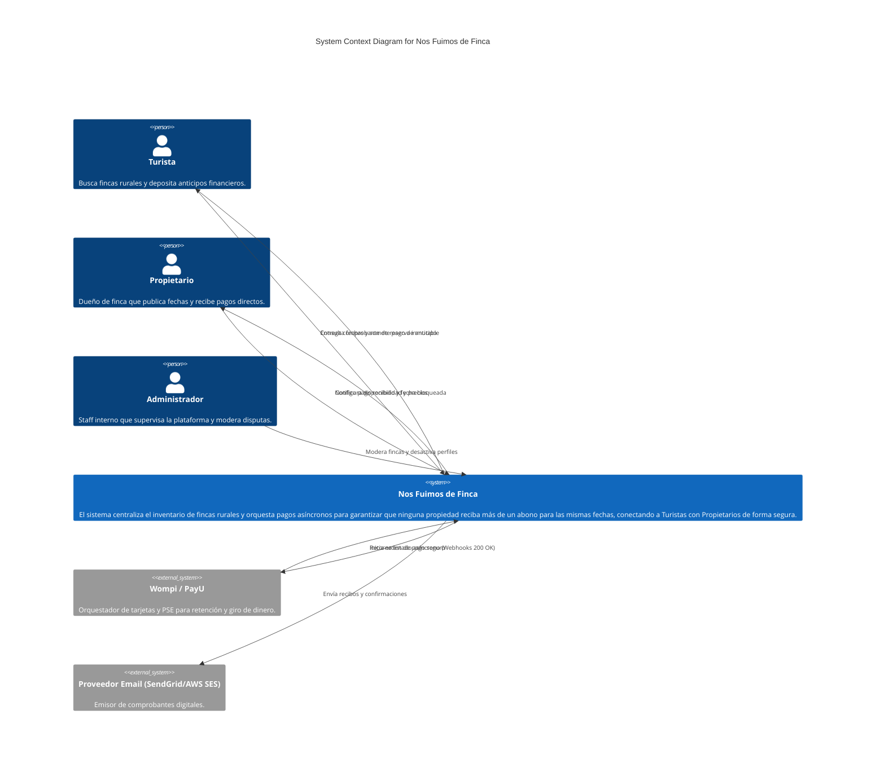

# Entregable 1 (D1): Diagrama de Contexto del Sistema

**Proyecto:** Nos Fuimos de Finca
**Fase:** 3 — Ingeniería de Requisitos
**Estado:** Aprobado

### 2. Tablas de Definición de Interacciones

#### Clasificación de Actores
| Parte Interesada | Decisión | Razón |
| --- | --- | --- |
| **Turista** | Actor | Interactúa directamente con la pasarela de pago pública para reservar fechas. |
| **Propietario** | Actor | Interactúa con el panel de administración privado para configurar fechas, precios y aprobar/bloquear disponibilidad. |
| **Administrador** | Actor | Moderador del sistema que suspende cuentas fraudulentas y atiende disputas. |

#### Canales de Interacción
| Actor | Canales |
| --- | --- |
| **Turista** | Interfaz Web Pública (Mobile-First) / Emails Transaccionales. |
| **Propietario** | Panel de Control Privado PWA / Notificaciones in-app. |
| **Administrador** | Panel Backoffice (Escritorio). |

#### Clasificación de Sistemas Externos
| Servicio | Decisión | Razón | Descripción de Función | Dirección |
| --- | --- | --- | --- | --- |
| **Wompi / PayU** | Incluido | Esencial para procesar el abono y emitir webhooks de confirmación. | Procesa el pago del turista y notifica la liquidación al sistema. | Bidireccional |
| **Proveedor Email (SendGrid/AWS SES)** | Incluido | Crítico para emitir comprobantes inmutables. | Envía PDFs y recibos al correo del Turista. | Saliente |

#### Flujos de Datos (Flechas de Interacción)
| Origen | Destino | Etiqueta |
| --- | --- | --- |
| Turista | Sistema | Consulta fechas y somete pago de anticipo |
| Sistema | Turista | Entrega comprobante de reserva inmutable |
| Propietario | Sistema | Configura disponibilidad y precios |
| Sistema | Propietario | Notifica pago recibido y fecha bloqueada |
| Administrador | Sistema | Modera fincas y desactiva perfiles |
| Sistema | Wompi / PayU | Inicia orden de pago seguro |
| Wompi / PayU | Sistema | Retorna estado asíncrono (Webhooks 200 OK) |
| Sistema | Proveedor Email (SendGrid/AWS SES) | Envía recibos y confirmaciones |

### 3. Renderizado de Diagrama

Source file location: `docs/03-requirements-engineering/system-context-diagram.mmd`
