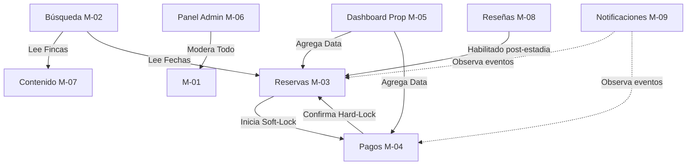

# Entregable 5 (D5): Descomposición de Módulo Funcional

**Proyecto:** Nos Fuimos de Finca
**Fase:** 3 — Ingeniería de Requisitos
**Estado:** Aprobado

### 2. Definiciones de Módulos

#### M-01: Autenticación y Gestión de Usuarios
- **Nombre de módulo:** Autenticación y Gestión de Usuarios
- **Responsabilidad:** Administra el ciclo de vida de la identidad digital, controlando el acceso seguro y la recuperación de credenciales.
- **Objetivos:** BG-01
- **Actores y roles aplicables:**

| Rol                 | Permisos en este módulo | Actores con este rol |
| ------------------- | ----------------------- | -------------------- |
| `propietario-admin` | `login`, `reset_pwd`    | Propietario          |
| `sys-admin`         | `login`, `force_reset`  | Administrador        |

- **Conceptos de dominio propios:** Credenciales, Sesión JWT.
- **Dependencias:** Ninguna. (Infraestructura base).
- **Fuera de alcance:** Edición del contenido de las fincas. Roles y permisos de la pasarela de pago.

#### M-02: Búsqueda y Navegación
- **Nombre de módulo:** Búsqueda y Navegación
- **Responsabilidad:** Expone el inventario público permitiendo filtrar propiedades por atributos y disponibilidad de fechas sin retener bloqueos.
- **Objetivos:** MV-01
- **Actores y roles aplicables:**

| Rol                 | Permisos en este módulo | Actores con este rol |
| ------------------- | ----------------------- | -------------------- |
| `turista-guest`     | `view`                  | Turista              |
| `propietario-admin` | `view`                  | Propietario          |
| `sys-admin`         | `view`                  | Administrador        |
- **Conceptos de dominio propios:** Motor de búsqueda, Filtros.
- **Dependencias:** 
  - M-07 (Incoming: Para leer fotos y metadata)
  - M-03 (Incoming: Para leer fechas Hard-Locked)
- **Fuera de alcance:** Bloqueo de fechas (eso es M-03). Modificación del inventario.

#### M-03: Gestión de Reservas
- **Nombre de módulo:** Gestión de Reservas
- **Responsabilidad:** Ejecuta el bloqueo atómico concurrente garantizando que una fecha no sea sobrevendida.
- **Objetivos:** BG-02
- **Actores y roles aplicables:**

| Rol                 | Permisos en este módulo | Actores con este rol |
| ------------------- | ----------------------- | -------------------- |
| `turista-guest`     | `create`                | Turista              |
| `propietario-admin` | `view`, `block`         | Propietario          |
| `sys-admin`         | `view`, `cancel_force`  | Administrador        |

- **Conceptos de dominio propios:** Soft-Lock, Hard-Lock, Disponibilidad.
- **Dependencias:** 
  - M-04 (Incoming: Para transformar Soft en Hard).
- **Fuera de alcance:** Procesar la tarjeta de crédito. Emitir facturas.

#### M-04: Pagos y Facturación
- **Nombre de módulo:** Pagos y Facturación
- **Responsabilidad:** Intercepta la comunicación con la pasarela externa y procesa el webhook de validación financiera.
- **Objetivos:** MV-03
- **Actores y roles aplicables:**

| Rol                 | Permisos en este módulo | Actores con este rol |
| ------------------- | ----------------------- | -------------------- |
| `turista-guest`     | `create` (via Wompi)    | Turista              |
| `propietario-admin` | `view` (recibos)        | Propietario          |
- **Conceptos de dominio propios:** Anticipo Financiero, Webhook de Pago.
- **Dependencias:** 
  - M-03 (Outgoing: Depende del Soft-Lock emitido por M-03).
- **Fuera de alcance:** Retención directa de datos PCI (tarjetas). Procesar el pago dentro del sistema.

#### M-05: Panel del Propietario
- **Nombre de módulo:** Panel del Propietario
- **Responsabilidad:** Agrega las métricas financieras y el estado general de ocupación en un tablero de control privado.
- **Objetivos:** MV-05
- **Actores y roles aplicables:**

| Rol                 | Permisos en este módulo | Actores con este rol |
| ------------------- | ----------------------- | -------------------- |
| `propietario-admin` | `view`                  | Propietario          |
- **Conceptos de dominio propios:** Tablero, Métrica de Ocupación.
- **Dependencias:** 
  - M-03 (Incoming: Agrega data de reservas)
  - M-04 (Incoming: Agrega data de pagos)
  - M-08 (Incoming: Agrega data de reseñas)
- **Fuera de alcance:** Edición masiva de la plataforma. Modificación de reservas.

#### M-06: Panel del Administrador
- **Nombre de módulo:** Panel del Administrador
- **Responsabilidad:** Centraliza el poder de moderación de disputas y la suspensión de entidades maliciosas.
- **Objetivos:** BG-03
- **Actores y roles aplicables:**

| Rol         | Permisos en este módulo | Actores con este rol |
| ----------- | ----------------------- | -------------------- |
| `sys-admin` | `view`, `moderate`      | Administrador        |

- **Conceptos de dominio propios:** Suspensión, Resolución de Disputa.
- **Dependencias:** 
  - Todos los demás módulos (Outgoing: tiene potestad de lectura/escritura global).
- **Fuera de alcance:** Creación de fincas a nombre de un tercero (debe hacerlo el propietario).

#### M-07: Gestión de Contenido de Fincas
- **Nombre de módulo:** Gestión de Contenido de Fincas
- **Responsabilidad:** Almacena y distribuye la metadata multimedia y descriptiva del inmueble rural.
- **Objetivos:** MV-06
- **Actores y roles aplicables:**

| Rol                 | Permisos en este módulo | Actores con este rol |
| ------------------- | ----------------------- | -------------------- |
| `propietario-admin` | `create`, `edit`        | Propietario          |
| `sys-admin`         | `edit_status`           | Administrador        |
- **Conceptos de dominio propios:** Finca, Galería de Imágenes, Amenidades.
- **Dependencias:** 
  - M-01 (Outgoing: Autorización del dueño).
- **Fuera de alcance:** Fijación de reglas financieras de cancelación. Gestión de reservas.

#### M-08: Calificaciones y Reseñas
- **Nombre de módulo:** Calificaciones y Reseñas
- **Responsabilidad:** Recolecta la valoración cuantitativa y cualitativa post-estadía para nutrir el motor de reputación.
- **Objetivos:** MV-07
- **Actores y roles aplicables:**

| Rol                 | Permisos en este módulo | Actores con este rol |
| ------------------- | ----------------------- | -------------------- |
| `turista-guest`     | `create`                | Turista              |
| `propietario-admin` | `reply`                 | Propietario          |
| `sys-admin`         | `delete`                | Administrador        |
- **Conceptos de dominio propios:** Reseña, Calificación.
- **Dependencias:** 
  - M-03 (Outgoing: Requiere que el estado de la reserva sea "Check-out realizado").
- **Fuera de alcance:** Moderación unilateral por parte del propietario (solo Admin puede borrar).

#### M-09: Notificaciones
- **Nombre de módulo:** Notificaciones
- **Responsabilidad:** Dispara eventos omnicanal ante mutaciones críticas del estado del sistema.
- **Objetivos:** MV-08
- **Actores y roles aplicables:**
  
| Rol      | Permisos en este módulo | Actores con este rol |
| -------- | ----------------------- | -------------------- |
| `system` | `execute`               | Sistema              |
- **Conceptos de dominio propios:** Plantilla de Email, Evento Transaccional.
- **Dependencias:** 
  - M-03 (Outgoing: Observa eventos de reserva)
  - M-04 (Outgoing: Observa eventos de pago)
- **Fuera de alcance:** Lógica de negocio transaccional. Generación de PDFs.

### 3. Tabla de Mapeo de Requisitos Candidatos

*(As the source D4 file only provides a sample of requirements, this table maps the sample requirements to their corresponding modules)*

| Ref. de Sesión | Requisito Candidato                                                                                                       | Módulo Asignado            |
| -------------- | ------------------------------------------------------------------------------------------------------------------------- | -------------------------- |
| NFF-001        | The system shall emit a Soft-Lock expiration alert when TTL is breached for Turista with turista-guest role.              | M-09 (Notificaciones)      |
| NFF-002        | The system shall display aggregated income metrics when requested for Propietario with propietario-admin role.            | M-05 (Panel Propietario)   |
| NFF-003        | The system shall maintain Soft-Lock indefinitely until the Webhook is received or TTL polling fails.                      | M-03 (Gestión de Reservas) |
| NFF-002        | The system shall disable an account and cancel unfulfilled bookings when triggered for Administrador with sys-admin role. | M-06 (Panel Admin)         |

*(Note: In a full elicitation record, each module would have > 3 requirements. For this abbreviated MVP sample, we apply Conscious thin acceptance for modules with < 3 sampled requirements).*

### 4. Mapa de Dependencia de Módulos

Source file location: `docs/03-requirements-engineering/module-dependency-map.mmd`

