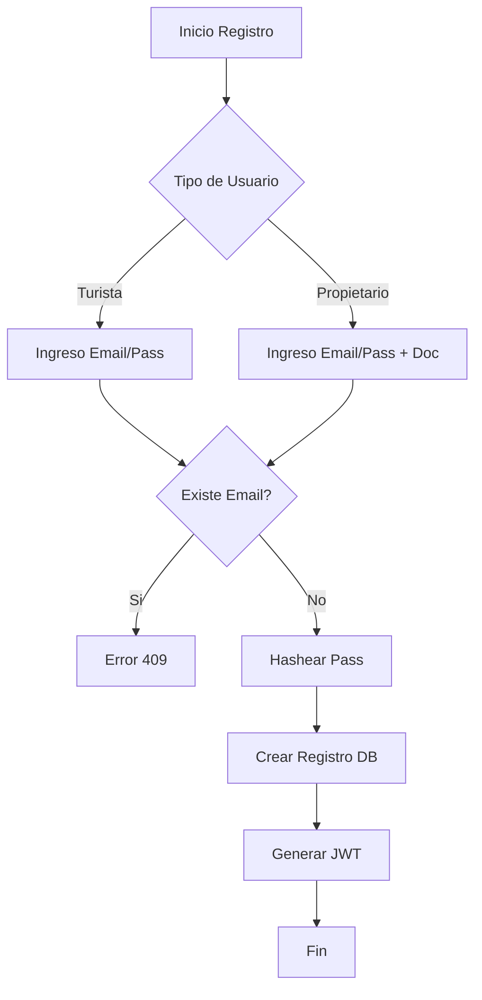

# Entregable 7 (D7): Requisitos Funcionales - Módulo: MOD-AUTH

**Proyecto:** Nos Fuimos de Finca
**Fase:** 3 — Ingeniería de Requisitos
**Módulo:** `MOD-AUTH` (Autenticación y Gestión de Usuarios)
**Estado:** Cerrado Provisionalmente

### 2. Requisitos Funcionales

| **ID de Req** | **Descripción del Requisito** | **Fuente / Trazabilidad** | **Actor Principal** | **MoSCoW** |
|---|---|---|---|---|
| **FR-AUTH-001** | El sistema debe permitir el registro de Turistas usando correo electrónico y contraseña. | D4 (NFF-001) | Turista | Must |
| **FR-AUTH-002** | El sistema debe permitir el registro de Propietarios requiriendo validación de documento de identidad. | D4 (NFF-002) | Propietario | Must |
| **FR-AUTH-003** | El sistema debe emitir tokens JWT asimétricos (RS256) para la sesión y validación en las APIs Java. | Tech Constraint | Sistema | Must |
| **FR-AUTH-004** | El sistema debe permitir recuperación de contraseña mediante envío de token temporal al email. | Architecture Gap | Turista, Propietario | Should |

### 3. Requisitos No Funcionales de Módulo

| **ID de Req** | **Categoría** | **Descripción de la Restricción** | **Método de Medición** | **MoSCoW** |
|---|---|---|---|---|
| **NFR-AUTH-001** | Security | Las contraseñas deben ser hasheadas usando Bcrypt con cost factor de al menos 12. | Verificación en código fuente y DB | Must |
| **NFR-AUTH-002** | Performance | El endpoint de login debe responder en menos de 500ms al p95. | Pruebas de carga con JMeter | Must |

### 4. Verificación de Conflictos (Intra-Módulo)

- **Status:** Zero Open Entries

| **ID de Conflicto** | **Tipo** | **IDs de FR/NFR Involucrados** | **Descripción** | **Disposición** | **Estado** |
| --- | --- | --- | --- | --- | --- |
| **INTRA-AUTH-001** | FR-NFR | FR-AUTH-002, NFR-AUTH-001 | Validación documental vs Hashing | No conflict. | Resuelto |

### 5. Historias de Usuario

| **ID de US** | **Historia de Usuario** | **Criterios de Aceptación** | **Prioridad** | **Trazabilidad FR** |
|---|---|---|---|---|
| **US-AUTH-001** | Como Turista, quiero registrarme usando mi email y una contraseña, para que pueda acceder a la plataforma y realizar reservas. | 1. Registro exitoso envía correo de bienvenida. 2. Login inmediato posterior funciona. | Must | FR-AUTH-001 |
| **US-AUTH-002** | Como Propietario, quiero subir mi documento de identidad durante el registro, para que mi perfil pueda ser verificado y autorizado para listar fincas. | 1. El registro requiere el anexo de PDF/JPG del documento. 2. Perfil queda en estado 'Pendiente de Validación'. | Must | FR-AUTH-002 |
| **US-AUTH-003** | Como Propietario, quiero recuperar mi contraseña, para que pueda recuperar acceso a mis fincas. | 1. Envío de token por email. 2. Token expira en 1 hora. | Should | FR-AUTH-004 |

### 6. Especificaciones de Casos de Uso

| Campo | Contenido |
|---|---|
| **ID** | `UC-AUTH-001` |
| **Nombre** | Registro de Turista |
| **Actor principal** | Turista |
| **Precondiciones** | No tener sesión activa. |
| **Escenario principal de éxito** | 1. Turista ingresa email y contraseña. 2. Sistema recibe petición, hashea contraseña. 3. Sistema inserta registro y retorna JWT. 4. Frontend almacena token e ingresa al Home. |
| **Flujos alternativos** | N/A |
| **Flujos de excepción** | **1a. Email ya existe:** El sistema retorna HTTP 409 Conflict. Frontend muestra error "Usuario ya registrado". |
| **Postcondiciones** | Cuenta creada, sesión iniciada con token JWT. |
| **Requisitos relacionados** | FR-AUTH-001 |

| Campo | Contenido |
|---|---|
| **ID** | `UC-AUTH-002` |
| **Nombre** | Registro de Propietario |
| **Actor principal** | Propietario |
| **Precondiciones** | No tener sesión activa. |
| **Escenario principal de éxito** | 1. Propietario ingresa datos y sube documento. 2. Sistema guarda datos y documento (estado pendiente). 3. Admin recibe notificación de validación pendiente. |
| **Flujos alternativos** | N/A |
| **Flujos de excepción** | **1a. Falla subida:** HTTP 400 Bad Request, formato inválido. |
| **Postcondiciones** | Cuenta creada (inactiva), documento guardado. |
| **Requisitos relacionados** | FR-AUTH-002 |

| Campo | Contenido |
|---|---|
| **ID** | `UC-AUTH-003` |
| **Nombre** | Login |
| **Actor principal** | Turista, Propietario, Administrador |
| **Precondiciones** | Tener cuenta creada. |
| **Escenario principal de éxito** | 1. Usuario ingresa email y contraseña. 2. Sistema valida credentials contra Bcrypt. 3. Sistema genera JWT y lo retorna. 4. Sesión iniciada. |
| **Flujos alternativos** | N/A |
| **Flujos de excepción** | **1a. Credenciales inválidas:** HTTP 401 Unauthorized. |
| **Postcondiciones** | JWT emitido. |
| **Requisitos relacionados** | FR-AUTH-003 |

### 7. Diagramas de Actividad

### AD-AUTH-001: Flujo de Registro
**Trazabilidad:** UC-AUTH-001 | UC-AUTH-002

### 8. Registro de Finalización de Pasos

| **Paso** | **Artefacto** | **Estado** |
|---|---|---|
| Step 7 | Functional Requirements Table | Completado |
| Step 8 | Intra-Module Conflict Check | Completado |
| Step 9 | User Stories & Use Cases | Completado |
| Step 10 | Activity Diagrams | Completado |

|**Código de Módulo**|MOD-AUTH|
|**Estado del Módulo**|**Provisionally Closed**|
