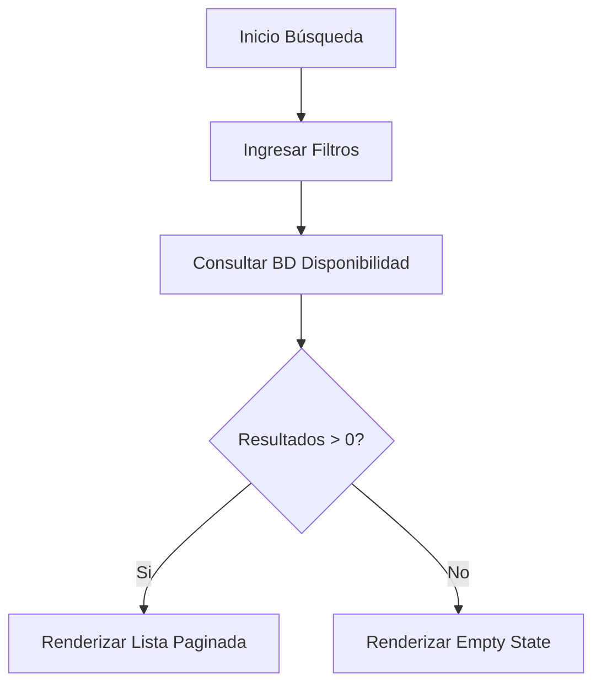

# Entregable 7 (D7): Requisitos Funcionales - Módulo: MOD-SRCH

**Proyecto:** Nos Fuimos de Finca
**Fase:** 3 — Ingeniería de Requisitos
**Módulo:** `MOD-SRCH` (Búsqueda y Navegación)
**Estado:** Cerrado Provisionalmente

### 2. Requisitos Funcionales

| **ID de Req** | **Descripción del Requisito** | **Fuente / Trazabilidad** | **Actor Principal** | **MoSCoW** |
|---|---|---|---|---|
| **FR-SRCH-001** | El sistema debe permitir listar todas las fincas activas en orden aleatorio o de calificación. | D4 (NFF-001) | Turista | Must |
| **FR-SRCH-002** | El sistema debe permitir filtrar fincas por rango de fechas, verificando disponibilidad (excluyendo fechas Hard-Locked). | D4 (NFF-001) | Turista | Must |
| **FR-SRCH-003** | El sistema debe permitir filtrar por cantidad de huéspedes y amenidades (piscina, wifi, etc). | D4 (NFF-001) | Turista | Must |
| **FR-SRCH-004** | El sistema debe permitir ver el perfil público de la finca con galería de fotos. | D4 (NFF-001) | Turista | Must |
| **FR-SRCH-005** | El sistema debe proveer paginación de los resultados de búsqueda (Offset/Limit o Keyset). | Tech Constraint | Sistema | Must |

### 3. Requisitos No Funcionales de Módulo

| **ID de Req** | **Categoría** | **Descripción de la Restricción** | **Método de Medición** | **MoSCoW** |
|---|---|---|---|---|
| **NFR-SRCH-001** | Performance | El catálogo de búsqueda cargará visualmente en menos de 2.5s (LCP). | Lighthouse / Core Web Vitals (3G) | Must |
| **NFR-SRCH-002** | Performance | Las consultas a BD para búsquedas por fecha deben resolverse en < 200ms. | APM Metrics / Slow Query Log | Must |

### 4. Verificación de Conflictos (Intra-Módulo)

- **Status:** Zero Open Entries

| **ID de Conflicto** | **Tipo** | **IDs de FR/NFR Involucrados** | **Descripción** | **Disposición** | **Estado** |
| --- | --- | --- | --- | --- | --- |
| **INTRA-SRCH-001** | FR-FR | FR-SRCH-001, FR-SRCH-002 | Búsqueda aleatoria vs filtrado de fechas complejas. | No conflict, son ramas separadas en la query. | Resuelto |

### 5. Historias de Usuario

| **ID de US** | **Historia de Usuario** | **Criterios de Aceptación** | **Prioridad** | **Trazabilidad FR** |
|---|---|---|---|---|
| **US-SRCH-001** | Como Turista, quiero ver un catálogo de fincas, para que pueda explorar opciones sin filtros iniciales. | 1. Las fincas se muestran en tarjetas con foto y precio. 2. Se paginan de a 10. | Must | FR-SRCH-001, FR-SRCH-005 |
| **US-SRCH-002** | Como Turista, quiero filtrar por fechas, para que solo vea las fincas disponibles en el puente festivo. | 1. El filtro excluye fincas con "Hard-Lock" o "Soft-Lock" activo en esas fechas. | Must | FR-SRCH-002 |
| **US-SRCH-003** | Como Turista, quiero filtrar por cantidad de huéspedes, para que encuentre una finca de mi tamaño. | 1. El filtro es numérico. | Must | FR-SRCH-003 |
| **US-SRCH-004** | Como Turista, quiero filtrar por amenidades, para que asegure tener piscina. | 1. Checkboxes para comodidades clave. | Must | FR-SRCH-003 |
| **US-SRCH-005** | Como Turista, quiero ver el perfil completo de una finca, para que vea fotos, descripción y precios. | 1. Carga de página individual de Finca (PDP). | Must | FR-SRCH-004 |

### 6. Especificaciones de Casos de Uso

| Campo | Contenido |
|---|---|
| **ID** | `UC-SRCH-001` |
| **Nombre** | Búsqueda General |
| **Actor principal** | Turista |
| **Precondiciones** | Ninguna. |
| **Escenario principal de éxito** | 1. Turista accede al index. 2. Sistema retorna primeras 10 fincas activas. 3. Turista navega catálogo. |
| **Flujos alternativos** | N/A |
| **Flujos de excepción** | N/A |
| **Postcondiciones** | N/A |
| **Requisitos relacionados** | FR-SRCH-001, FR-SRCH-005 |

| Campo | Contenido |
|---|---|
| **ID** | `UC-SRCH-002` |
| **Nombre** | Búsqueda Filtrada |
| **Actor principal** | Turista |
| **Precondiciones** | Ninguna. |
| **Escenario principal de éxito** | 1. Turista ingresa fechas, huéspedes y aplica. 2. Sistema ejecuta query de disponibilidad excluyendo Soft/Hard locks. 3. Sistema retorna lista filtrada. |
| **Flujos alternativos** | N/A |
| **Flujos de excepción** | **1a. Sin resultados:** Retornar estado "Empty" amigable con CTA de cambiar filtros. |
| **Postcondiciones** | N/A |
| **Requisitos relacionados** | FR-SRCH-002, FR-SRCH-003 |

| Campo | Contenido |
|---|---|
| **ID** | `UC-SRCH-003` |
| **Nombre** | Ver Detalle Finca |
| **Actor principal** | Turista |
| **Precondiciones** | Finca debe existir y estar activa. |
| **Escenario principal de éxito** | 1. Turista clickea finca. 2. Sistema consulta detalles completos (fotos, precios, calendario). 3. UI renderiza Property Detail Page (PDP). |
| **Flujos alternativos** | N/A |
| **Flujos de excepción** | **1a. Finca inactiva:** 404 Not Found / Redirect Home. |
| **Postcondiciones** | N/A |
| **Requisitos relacionados** | FR-SRCH-004 |

### 7. Diagramas de Actividad

### AD-SRCH-001: Flujo de Búsqueda
**Trazabilidad:** UC-SRCH-002

### 8. Registro de Finalización de Pasos

| **Paso** | **Artefacto** | **Estado** |
|---|---|---|
| Step 7 | Functional Requirements Table | Completado |
| Step 8 | Intra-Module Conflict Check | Completado |
| Step 9 | User Stories & Use Cases | Completado |
| Step 10 | Activity Diagrams | Completado |

|**Código de Módulo**|MOD-SRCH|
|**Estado del Módulo**|**Provisionally Closed**|
