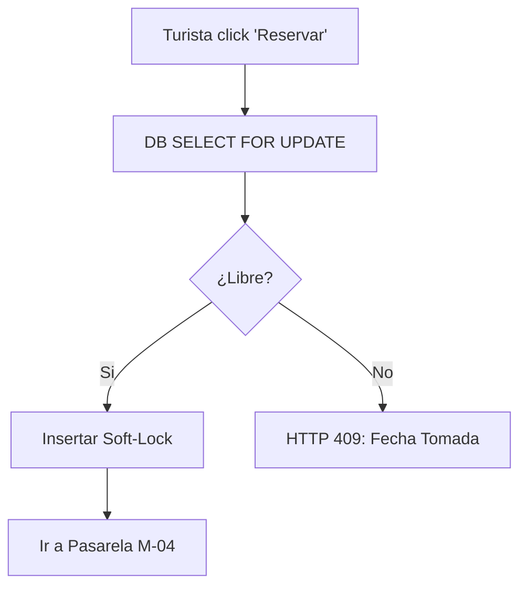

# Entregable 7 (D7): Requisitos Funcionales - Módulo: MOD-RSV

**Proyecto:** Nos Fuimos de Finca
**Fase:** 3 — Ingeniería de Requisitos
**Módulo:** `MOD-RSV` (Gestión de Reservas)
**Estado:** Cerrado Provisionalmente

### 2. Requisitos Funcionales

| **ID de Req** | **Descripción del Requisito** | **Fuente / Trazabilidad** | **Actor Principal** | **MoSCoW** |
|---|---|---|---|---|
| **FR-RSV-001** | El sistema debe ejecutar un `SELECT FOR UPDATE` para garantizar bloqueo concurrente en base de datos. | D2 Constraint | Sistema | Must |
| **FR-RSV-002** | El sistema debe generar un 'Soft-Lock' temporal (TTL 15 min) cuando el turista inicie el flujo de pago. | D4 (NFF-001) | Turista | Must |
| **FR-RSV-003** | El sistema debe rechazar nuevos intentos de Soft-Lock sobre fechas que ya tengan un Soft-Lock o Hard-Lock activo. | D4 (NFF-001) | Turista | Must |
| **FR-RSV-004** | El sistema debe revertir automáticamente el Soft-Lock si el TTL expira sin confirmación de pago. | D4 (NFF-003) | Sistema | Must |
| **FR-RSV-005** | El sistema debe promover un Soft-Lock a Hard-Lock (permanente) cuando reciba confirmación de M-04. | D4 (NFF-003) | Sistema | Must |
| **FR-RSV-006** | El sistema debe permitir al propietario bloquear fechas manualmente (por ejemplo, para uso personal). | D4 (NFF-002) | Propietario | Must |
| **FR-RSV-007** | El sistema debe permitir al propietario cancelar un Hard-Lock (emitiendo orden de reembolso a M-04). | D4 (NFF-002) | Propietario | Should |
| **FR-RSV-008** | El sistema debe permitir al Administrador cancelar cualquier reserva forzosamente en caso de disputa. | D4 (NFF-002) | Administrador | Must |

### 3. Requisitos No Funcionales de Módulo

| **ID de Req** | **Categoría** | **Descripción de la Restricción** | **Método de Medición** | **MoSCoW** |
|---|---|---|---|---|
| **NFR-RSV-001** | Integrity | Máximo 1 HTTP 201; resto HTTP 409 Conflict ante peticiones concurrentes idénticas. | Stress Test (JMeter) con 100 requests simultáneos. | Must |

### 4. Verificación de Conflictos (Intra-Módulo)

- **Status:** Zero Open Entries

| **ID de Conflicto** | **Tipo** | **IDs de FR/NFR Involucrados** | **Descripción** | **Disposición** | **Estado** |
| --- | --- | --- | --- | --- | --- |
| **INTRA-RSV-001** | FR-FR | FR-RSV-002, FR-RSV-006 | Soft-Lock colisiona con bloqueo manual del propietario. | El Soft-Lock temporal tiene precedencia si fue creado antes de la petición del propietario. El dueño recibe error temporal. | Resuelto |

### 5. Historias de Usuario

| **ID de US** | **Historia de Usuario** | **Criterios de Aceptación** | **Prioridad** | **Trazabilidad FR** |
|---|---|---|---|---|
| **US-RSV-001** | Como Turista, quiero que al seleccionar fechas nadie más pueda tomarlas, para que pueda pagar tranquilo. | 1. Bloqueo 15 min al iniciar checkout.<br>2. Otros usuarios ven fechas grises. | Must | FR-RSV-001, FR-RSV-002 |
| **US-RSV-002** | Como Turista, quiero que el sistema me avise si alguien me ganó la fecha, para que no pague en vano. | 1. Mensaje de error HTTP 409 amistoso si llego tarde. | Must | FR-RSV-003 |
| **US-RSV-003** | Como Sistema, quiero expirar los bloqueos temporales abandonados, para que las fincas vuelvan al mercado. | 1. TTL 15 min borra bloqueo si no hay pago. | Must | FR-RSV-004 |
| **US-RSV-004** | Como Sistema, quiero fijar la reserva permanentemente al recibir pago, para que quede asegurada. | 1. Soft-Lock -> Hard-Lock tras confirmación. | Must | FR-RSV-005 |
| **US-RSV-005** | Como Propietario, quiero bloquear fechas manualmente, para que no reciba reservas si voy a ir con mi familia. | 1. Bloqueo sin transacción de pago. | Must | FR-RSV-006 |
| **US-RSV-006** | Como Propietario, quiero cancelar una reserva de un turista, para que pueda lidiar con imprevistos graves de la finca. | 1. Cancela reserva y notifica reembolso. | Should | FR-RSV-007 |
| **US-RSV-007** | Como Administrador, quiero cancelar reservas a la fuerza, para que pueda resolver disputas o fraudes. | 1. Overrides cualquier política del propietario. | Must | FR-RSV-008 |

### 6. Especificaciones de Casos de Uso

| Campo | Contenido |
|---|---|
| **ID** | `UC-RSV-001` |
| **Nombre** | Iniciar Soft-Lock (Reserva Inicial) |
| **Actor principal** | Turista |
| **Precondiciones** | Fechas disponibles en DB. |
| **Escenario principal de éxito** | 1. Turista elige fechas y da click a Reservar.<br>2. DB hace `SELECT FOR UPDATE`.<br>3. Sistema genera Soft-Lock (15m).<br>4. Retorna éxito y Turista pasa a Pasarela. |
| **Flujos alternativos** | N/A |
| **Flujos de excepción** | **2a. Falla de concurrencia:** DB rechaza lock. HTTP 409. |
| **Postcondiciones** | Fechas temporalmente bloqueadas. |
| **Requisitos relacionados** | FR-RSV-001, FR-RSV-002, FR-RSV-003 |

| Campo | Contenido |
|---|---|
| **ID** | `UC-RSV-002` |
| **Nombre** | Bloqueo Manual |
| **Actor principal** | Propietario |
| **Precondiciones** | Fechas disponibles. |
| **Escenario principal de éxito** | 1. Propietario selecciona bloque de fechas y da Bloquear.<br>2. DB hace `SELECT FOR UPDATE`.<br>3. Sistema genera Hard-Lock (Tipo: Manual).<br>4. Fechas salen de mercado. |
| **Flujos alternativos** | N/A |
| **Flujos de excepción** | **2a. Ya reservado/Soft-Lock:** HTTP 409, no puede bloquear. |
| **Postcondiciones** | Fechas bloqueadas sin costo. |
| **Requisitos relacionados** | FR-RSV-006 |

| Campo | Contenido |
|---|---|
| **ID** | `UC-RSV-003` |
| **Nombre** | Expiración Automática TTL |
| **Actor principal** | Sistema (Cron / Scheduler) |
| **Precondiciones** | Soft-Lock existente sin pagar tras 15 mins. |
| **Escenario principal de éxito** | 1. Sistema detecta Soft-Locks expirados.<br>2. Elimina registro de bloqueo.<br>3. Fechas regresan al mercado. |
| **Flujos alternativos** | N/A |
| **Flujos de excepción** | N/A |
| **Postcondiciones** | Fechas liberadas. |
| **Requisitos relacionados** | FR-RSV-004 |

### 7. Diagramas de Actividad

### AD-RSV-001: Iniciar Soft-Lock y Concurrencia
**Trazabilidad:** UC-RSV-001



### AD-RSV-002: Expiración vs Confirmación
**Trazabilidad:** UC-RSV-003 | FR-RSV-005

```mermaid
flowchart TD
    A[Soft-Lock Creado] --> B{Timer 15 min}
    B -->|Expira| C[Liberar Fecha]
    B -->|Webhook Llega (M-04)| D[Promover a Hard-Lock]
    D --> E[Finca Asegurada]
```

### 8. Registro de Finalización de Pasos

| **Paso** | **Artefacto** | **Estado** |
|---|---|---|
| Step 7 | Functional Requirements Table | Completado |
| Step 8 | Intra-Module Conflict Check | Completado |
| Step 9 | User Stories & Use Cases | Completado |
| Step 10 | Activity Diagrams | Completado |

|**Código de Módulo**|MOD-RSV|
|**Estado del Módulo**|**Provisionally Closed**|
