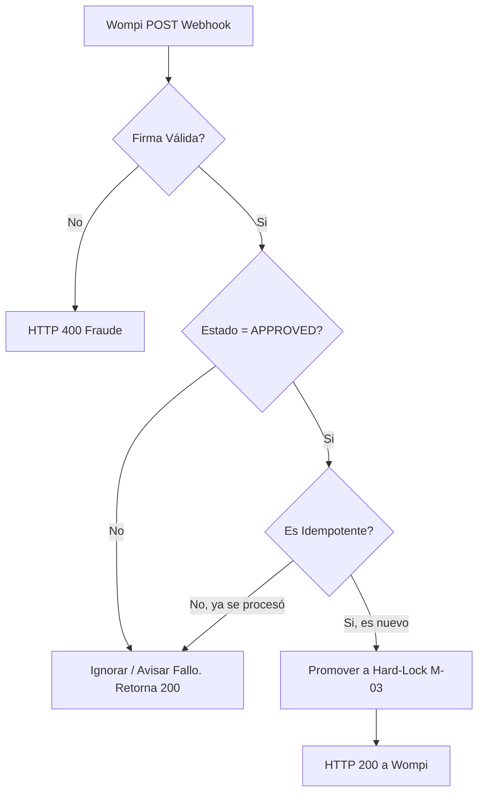

# Entregable 7 (D7): Requisitos Funcionales - Módulo: MOD-PAY

**Proyecto:** Nos Fuimos de Finca
**Fase:** 3 — Ingeniería de Requisitos
**Módulo:** `MOD-PAY` (Pagos y Facturación)
**Estado:** Cerrado Provisionalmente

### 2. Requisitos Funcionales

| **ID de Req** | **Descripción del Requisito** | **Fuente / Trazabilidad** | **Actor Principal** | **MoSCoW** |
|---|---|---|---|---|
| **FR-PAY-001** | El sistema debe iniciar una orden de pago en Wompi (Widget o API) enviando el monto del anticipo y la referencia de la reserva (Soft-Lock ID). | D4 (NFF-001) | Turista | Must |
| **FR-PAY-002** | El sistema debe calcular el anticipo (e.g. 50%) basado en el precio total de las fechas bloqueadas. | D4 (NFF-001) | Sistema | Must |
| **FR-PAY-003** | El sistema debe exponer un endpoint (Webhook) público para recibir confirmaciones asíncronas de Wompi. | D4 (NFF-003) | Sistema | Must |
| **FR-PAY-004** | El sistema debe validar criptográficamente la firma del Webhook (Integrity Check) antes de procesarlo. | D4 (Wompi Docs) | Sistema | Must |
| **FR-PAY-005** | El sistema debe enviar la orden de Hard-Lock a M-03 si el webhook reporta transacción `APPROVED`. | D4 (NFF-003) | Sistema | Must |
| **FR-PAY-006** | El sistema debe permitir al Turista visualizar el recibo de pago de su reserva. | D4 (NFF-001) | Turista | Must |

### 3. Requisitos No Funcionales de Módulo

| **ID de Req** | **Categoría** | **Descripción de la Restricción** | **Método de Medición** | **MoSCoW** |
|---|---|---|---|---|
| **NFR-PAY-001** | Reliability | El endpoint del webhook debe ser idempotente para soportar reintentos de red de Wompi sin crear bloqueos duplicados. | Unit/Integration Tests | Must |

### 4. Verificación de Conflictos (Intra-Módulo)

- **Status:** Zero Open Entries

| **ID de Conflicto** | **Tipo** | **IDs de FR/NFR Involucrados** | **Descripción** | **Disposición** | **Estado** |
| --- | --- | --- | --- | --- | --- |
| **INTRA-PAY-001** | FR-NFR | FR-PAY-005, NFR-PAY-001 | Recepción múltiple del mismo Webhook `APPROVED`. | Idempotencia: El sistema ignorará el webhook si el Soft-Lock ID ya pasó a Hard-Lock. | Resuelto |

### 5. Historias de Usuario

| **ID de US** | **Historia de Usuario** | **Criterios de Aceptación** | **Prioridad** | **Trazabilidad FR** |
|---|---|---|---|---|
| **US-PAY-001** | Como Turista, quiero pagar el 50% de anticipo vía PSE o Tarjeta, para que mi reserva quede segura. | 1. Integración con Widget Wompi activa. | Must | FR-PAY-001, FR-PAY-002 |
| **US-PAY-002** | Como Sistema, quiero validar el webhook criptográficamente, para que prevenga fraudes y pagos falsos. | 1. Firma (checksum) validada contra secret de Wompi. | Must | FR-PAY-004 |
| **US-PAY-003** | Como Sistema, quiero procesar el webhook exitoso asincrónicamente, para que convierta la reserva temporal en permanente. | 1. Webhook Approved hace Hard-Lock. | Must | FR-PAY-003, FR-PAY-005 |
| **US-PAY-004** | Como Turista, quiero ver mi recibo de pago, para que tenga constancia de mi reserva. | 1. Recibo PDF o HTML disponible tras pago exitoso. | Must | FR-PAY-006 |

### 6. Especificaciones de Casos de Uso

| Campo | Contenido |
|---|---|
| **ID** | `UC-PAY-001` |
| **Nombre** | Procesar Webhook Wompi |
| **Actor principal** | Sistema (Pasarela) |
| **Precondiciones** | Turista pagó en el gateway, pasarela envía POST. |
| **Escenario principal de éxito** | 1. Wompi envía POST webhook a endpoint. 2. Sistema valida firma criptográfica. 3. Sistema verifica si el payload es `APPROVED`. 4. Sistema llama a M-03 para Hard-Lock. 5. Sistema retorna HTTP 200 a Wompi. |
| **Flujos alternativos** | **3a. Pago `DECLINED`:** Sistema ignora el payload o avisa al turista, no hace Hard-Lock. Retorna 200 a Wompi para detener reintentos. |
| **Flujos de excepción** | **2a. Firma inválida:** HTTP 400 Bad Request, loggea intento de fraude. |
| **Postcondiciones** | Reserva asegurada (Hard-Lock). |
| **Requisitos relacionados** | FR-PAY-003, FR-PAY-004, FR-PAY-005 |

| Campo | Contenido |
|---|---|
| **ID** | `UC-PAY-002` |
| **Nombre** | Iniciar Transacción de Pago |
| **Actor principal** | Turista |
| **Precondiciones** | Turista logró Soft-Lock en M-03. |
| **Escenario principal de éxito** | 1. M-03 transfiere control a M-04. 2. Sistema calcula anticipo. 3. Sistema renderiza widget de Wompi con monto y referencia. 4. Turista ingresa datos y finaliza. |
| **Flujos alternativos** | N/A |
| **Flujos de excepción** | N/A |
| **Postcondiciones** | Orden enviada a Wompi. Esperando Webhook. |
| **Requisitos relacionados** | FR-PAY-001, FR-PAY-002 |

### 7. Diagramas de Actividad

### AD-PAY-001: Recepción Webhook
**Trazabilidad:** UC-PAY-001

### 8. Registro de Finalización de Pasos

| **Paso** | **Artefacto** | **Estado** |
|---|---|---|
| Step 7 | Functional Requirements Table | Completado |
| Step 8 | Intra-Module Conflict Check | Completado |
| Step 9 | User Stories & Use Cases | Completado |
| Step 10 | Activity Diagrams | Completado |

|**Código de Módulo**|MOD-PAY|
|**Estado del Módulo**|**Provisionally Closed**|
