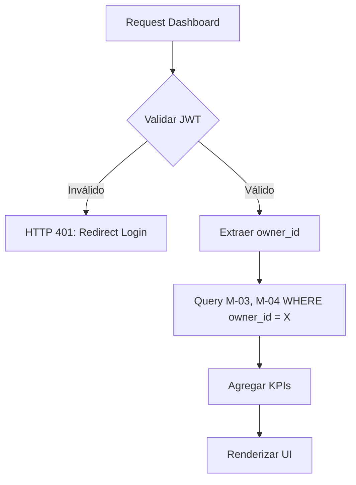

# Entregable 7 (D7): Requisitos Funcionales - Módulo: MOD-POWN

**Proyecto:** Nos Fuimos de Finca
**Fase:** 3 — Ingeniería de Requisitos
**Módulo:** `MOD-POWN` (Panel del Propietario)
**Estado:** Cerrado Provisionalmente

### 2. Requisitos Funcionales

| **ID de Req** | **Descripción del Requisito** | **Fuente / Trazabilidad** | **Actor Principal** | **MoSCoW** |
|---|---|---|---|---|
| **FR-POWN-001** | El sistema debe proveer un dashboard consolidado mostrando ingresos totales, reservas futuras y tasa de ocupación. | D4 (NFF-002) | Propietario | Must |
| **FR-POWN-002** | El sistema debe mostrar el listado de reservas activas (Hard-Locked) con detalles de los turistas. | D4 (NFF-002) | Propietario | Must |
| **FR-POWN-003** | El sistema debe permitir al propietario exportar su historial de reservas y pagos (CSV). | D4 (NFF-002) | Propietario | Should |
| **FR-POWN-004** | El sistema debe proveer una vista de calendario mensual para administrar disponibilidad visualmente (invocando M-03). | D4 (NFF-002) | Propietario | Must |

### 3. Requisitos No Funcionales de Módulo

| **ID de Req** | **Categoría** | **Descripción de la Restricción** | **Método de Medición** | **MoSCoW** |
|---|---|---|---|---|
| **NFR-POWN-001** | Security | Toda petición al panel debe estar validada por JWT y restringida únicamente a los recursos (Fincas) pertenecientes al ID del propietario autenticado. | Row-Level Security Policies / Unit Tests | Must |

### 4. Verificación de Conflictos (Intra-Módulo)

- **Status:** Zero Open Entries

| **ID de Conflicto** | **Tipo** | **IDs de FR/NFR Involucrados** | **Descripción** | **Disposición** | **Estado** |
| --- | --- | --- | --- | --- | --- |
| **INTRA-POWN-001** | FR-NFR | FR-POWN-002, NFR-POWN-001 | Acceso a reservas de otros dueños. | NFR-POWN-001 impone filtrado estricto `WHERE owner_id = jwt.sub` en todas las lecturas de FR-POWN-002. | Resuelto |

### 5. Historias de Usuario

| **ID de US** | **Historia de Usuario** | **Criterios de Aceptación** | **Prioridad** | **Trazabilidad FR** |
|---|---|---|---|---|
| **US-POWN-001** | Como Propietario, quiero ver un resumen de mis ingresos y ocupación, para que pueda analizar mi negocio. | 1. Dashboard carga métricas del mes actual. 2. Solo de mis fincas. | Must | FR-POWN-001 |
| **US-POWN-002** | Como Propietario, quiero ver el listado de turistas próximos a llegar, para que pueda prepararme. | 1. Tabla con nombre y fechas. | Must | FR-POWN-002 |
| **US-POWN-003** | Como Propietario, quiero ver el calendario visual de mi finca, para que pueda bloquear fines de semana personales rápido. | 1. Render de calendario. 2. Clickeable para bloquear fechas (Llama a M-03). | Must | FR-POWN-004 |
| **US-POWN-004** | Como Propietario, quiero descargar un Excel de mis reservas, para que pueda entregarlo al contador. | 1. Botón Export CSV. | Should | FR-POWN-003 |

### 6. Especificaciones de Casos de Uso

| Campo | Contenido |
|---|---|
| **ID** | `UC-POWN-001` |
| **Nombre** | Visualizar Dashboard Propietario |
| **Actor principal** | Propietario |
| **Precondiciones** | Sesión activa, tiene fincas creadas. |
| **Escenario principal de éxito** | 1. Propietario ingresa al Panel. 2. Sistema consulta reservas y pagos (M-03, M-04) filtrando por su `owner_id`. 3. Sistema agrega métricas (Sumas). 4. Interfaz renderiza Dashboard. |
| **Flujos alternativos** | N/A |
| **Flujos de excepción** | N/A |
| **Postcondiciones** | Múltiples KPIs mostrados. |
| **Requisitos relacionados** | FR-POWN-001, FR-POWN-002 |

### 7. Diagramas de Actividad

### AD-POWN-001: Carga de Panel Seguro
**Trazabilidad:** UC-POWN-001

### 8. Registro de Finalización de Pasos

| **Paso** | **Artefacto** | **Estado** |
|---|---|---|
| Step 7 | Functional Requirements Table | Completado |
| Step 8 | Intra-Module Conflict Check | Completado |
| Step 9 | User Stories & Use Cases | Completado |
| Step 10 | Activity Diagrams | Completado |

|**Código de Módulo**|MOD-POWN|
|**Estado del Módulo**|**Provisionally Closed**|
