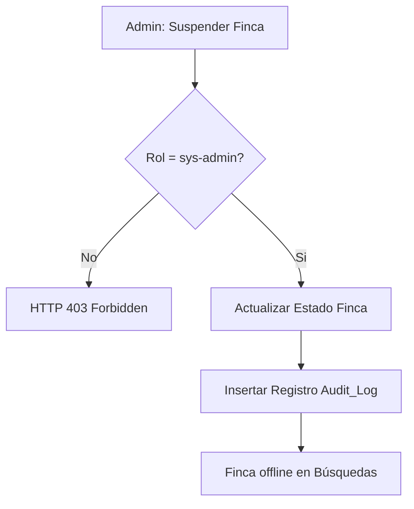

# Entregable 7 (D7): Requisitos Funcionales - Módulo: MOD-PADM

**Proyecto:** Nos Fuimos de Finca
**Fase:** 3 — Ingeniería de Requisitos
**Módulo:** `MOD-PADM` (Panel del Administrador)
**Estado:** Cerrado Provisionalmente

### 2. Requisitos Funcionales

| **ID de Req** | **Descripción del Requisito** | **Fuente / Trazabilidad** | **Actor Principal** | **MoSCoW** |
|---|---|---|---|---|
| **FR-PADM-001** | El sistema debe proveer una vista global de todas las fincas, propietarios y reservas. | D4 (NFF-002) | Administrador | Must |
| **FR-PADM-002** | El sistema debe permitir al Administrador cambiar el estado de una finca (Aprobada / Suspendida). | D4 (NFF-002) | Administrador | Must |
| **FR-PADM-003** | El sistema debe permitir al Administrador suspender la cuenta de un Propietario o Turista. | D4 (NFF-002) | Administrador | Must |

### 3. Requisitos No Funcionales de Módulo

| **ID de Req** | **Categoría** | **Descripción de la Restricción** | **Método de Medición** | **MoSCoW** |
|---|---|---|---|---|
| **NFR-PADM-001** | Security | Toda acción de mutación en el Panel de Administrador debe generar un log de auditoría (Audit Trail) inmutable. | Code Review | Must |

### 4. Verificación de Conflictos (Intra-Módulo)

- **Status:** Zero Open Entries

| **ID de Conflicto** | **Tipo** | **IDs de FR/NFR Involucrados** | **Descripción** | **Disposición** | **Estado** |
| --- | --- | --- | --- | --- | --- |
| **INTRA-PADM-001** | FR-NFR | FR-PADM-002, NFR-PADM-001 | Modificación de estados críticos sin rastro. | Obligación de crear Audit Log. | Resuelto |

### 5. Historias de Usuario

| **ID de US** | **Historia de Usuario** | **Criterios de Aceptación** | **Prioridad** | **Trazabilidad FR** |
|---|---|---|---|---|
| **US-PADM-001** | Como Administrador, quiero ver todas las fincas del sistema, para que pueda moderar el inventario. | 1. Tabla global paginada. | Must | FR-PADM-001 |
| **US-PADM-002** | Como Administrador, quiero suspender una finca, para que deje de aparecer en búsquedas si incumple normas. | 1. Cambio de estado a Inactivo. 2. Ya no sale en M-02. | Must | FR-PADM-002 |
| **US-PADM-003** | Como Administrador, quiero suspender usuarios maliciosos, para que proteja la integridad de la plataforma. | 1. Botón Banear Usuario. | Must | FR-PADM-003 |

### 6. Especificaciones de Casos de Uso

| Campo | Contenido |
|---|---|
| **ID** | `UC-PADM-001` |
| **Nombre** | Moderar Finca |
| **Actor principal** | Administrador |
| **Precondiciones** | Sesión activa como `sys-admin`. |
| **Escenario principal de éxito** | 1. Administrador navega a lista de Fincas. 2. Selecciona finca y marca "Suspender". 3. Sistema actualiza estado y genera log de auditoría. 4. Finca desaparece de M-02 (Search). |
| **Flujos alternativos** | N/A |
| **Flujos de excepción** | N/A |
| **Postcondiciones** | Finca suspendida. |
| **Requisitos relacionados** | FR-PADM-002, NFR-PADM-001 |

### 7. Diagramas de Actividad

### AD-PADM-001: Moderación y Auditoría
**Trazabilidad:** UC-PADM-001

### 8. Registro de Finalización de Pasos

| **Paso** | **Artefacto** | **Estado** |
|---|---|---|
| Step 7 | Functional Requirements Table | Completado |
| Step 8 | Intra-Module Conflict Check | Completado |
| Step 9 | User Stories & Use Cases | Completado |
| Step 10 | Activity Diagrams | Completado |

|**Código de Módulo**|MOD-PADM|
|**Estado del Módulo**|**Provisionally Closed**|
