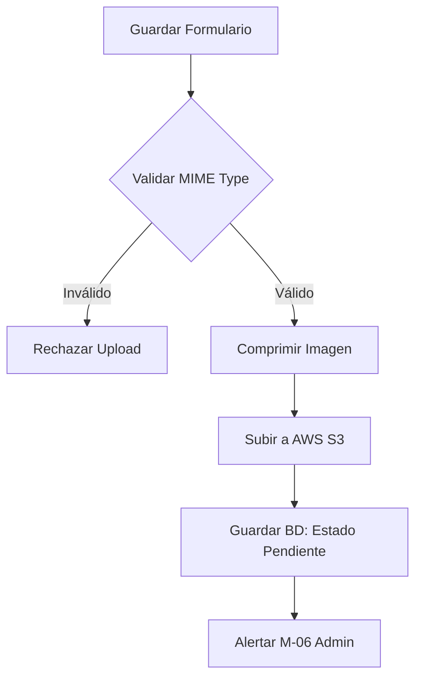

# Entregable 7 (D7): Requisitos Funcionales - Módulo: MOD-FCNT

**Proyecto:** Nos Fuimos de Finca
**Fase:** 3 — Ingeniería de Requisitos
**Módulo:** `MOD-FCNT` (Gestión de Contenido de Fincas)
**Estado:** Cerrado Provisionalmente

### 2. Requisitos Funcionales

| **ID de Req** | **Descripción del Requisito** | **Fuente / Trazabilidad** | **Actor Principal** | **MoSCoW** |
|---|---|---|---|---|
| **FR-FCNT-001** | El sistema debe permitir al Propietario crear el perfil de su Finca (título, descripción, precio, ubicación). | D4 (NFF-001) | Propietario | Must |
| **FR-FCNT-002** | El sistema debe permitir al Propietario subir fotos de su finca (formato JPG, PNG). | D4 (NFF-001) | Propietario | Must |
| **FR-FCNT-003** | El sistema debe permitir seleccionar las amenidades (ej. Piscina, WiFi) de una lista predefinida. | D4 (NFF-001) | Propietario | Must |
| **FR-FCNT-004** | El perfil de la finca recién creada debe iniciar en estado "Pendiente de Aprobación" (requiere M-06). | D4 (NFF-002) | Sistema | Must |
| **FR-FCNT-005** | El sistema debe permitir al Propietario editar su finca (incluso si está aprobada). | D4 (NFF-001) | Propietario | Must |

### 3. Requisitos No Funcionales de Módulo

| **ID de Req** | **Categoría** | **Descripción de la Restricción** | **Método de Medición** | **MoSCoW** |
|---|---|---|---|---|
| **NFR-FCNT-001** | Storage | Las imágenes subidas deben optimizarse a un máximo de 1MB por imagen y subirse a un CDN (S3/CloudFront). | File Size Check / Architecture Review | Must |
| **NFR-FCNT-002** | Security | Se debe validar el MIME type real del archivo (no solo la extensión) para evitar inyección de scripts. | Security Audit | Must |

### 4. Verificación de Conflictos (Intra-Módulo)

- **Status:** Zero Open Entries

| **ID de Conflicto** | **Tipo** | **IDs de FR/NFR Involucrados** | **Descripción** | **Disposición** | **Estado** |
| --- | --- | --- | --- | --- | --- |
| **INTRA-FCNT-001** | FR-NFR | FR-FCNT-002, NFR-FCNT-001 | Subida de fotos de alta resolución excede límite. | El frontend y backend aplicarán compresión antes de persistir en bucket. | Resuelto |

### 5. Historias de Usuario

| **ID de US** | **Historia de Usuario** | **Criterios de Aceptación** | **Prioridad** | **Trazabilidad FR** |
|---|---|---|---|---|
| **US-FCNT-001** | Como Propietario, quiero crear una finca, para que pueda ofrecerla al público. | 1. Formulario completado. 2. Queda "Pendiente de Aprobación". | Must | FR-FCNT-001, FR-FCNT-004 |
| **US-FCNT-002** | Como Propietario, quiero subir fotos, para que los Turistas vean el lugar. | 1. Múltiples fotos permitidas. 2. Se ven en la galería. | Must | FR-FCNT-002 |
| **US-FCNT-003** | Como Propietario, quiero seleccionar amenidades, para que mi finca aparezca en los filtros de búsqueda. | 1. Checkboxes de amenidades aplicados. | Must | FR-FCNT-003 |
| **US-FCNT-004** | Como Propietario, quiero editar el precio y descripción, para que la información esté actualizada. | 1. Permite guardado sin requerir re-aprobación del admin. | Must | FR-FCNT-005 |

### 6. Especificaciones de Casos de Uso

| Campo | Contenido |
|---|---|
| **ID** | `UC-FCNT-001` |
| **Nombre** | Crear Finca |
| **Actor principal** | Propietario |
| **Precondiciones** | Cuenta aprobada y sesión activa. |
| **Escenario principal de éxito** | 1. Propietario llena formulario (texto y amenidades). 2. Sube fotos. 3. Sistema comprime fotos y sube a CDN. 4. Sistema guarda Finca en BD como Pendiente. 5. Notifica a Administrador. |
| **Flujos alternativos** | N/A |
| **Flujos de excepción** | **2a. Archivo malicioso/grande:** Sistema rechaza archivo, HTTP 400. |
| **Postcondiciones** | Finca creada (no visible al público). |
| **Requisitos relacionados** | FR-FCNT-001, FR-FCNT-002, FR-FCNT-004 |

### 7. Diagramas de Actividad

### AD-FCNT-001: Subida de Fotos y Creación
**Trazabilidad:** UC-FCNT-001

### 8. Registro de Finalización de Pasos

| **Paso** | **Artefacto** | **Estado** |
|---|---|---|
| Step 7 | Functional Requirements Table | Completado |
| Step 8 | Intra-Module Conflict Check | Completado |
| Step 9 | User Stories & Use Cases | Completado |
| Step 10 | Activity Diagrams | Completado |

|**Código de Módulo**|MOD-FCNT|
|**Estado del Módulo**|**Provisionally Closed**|
