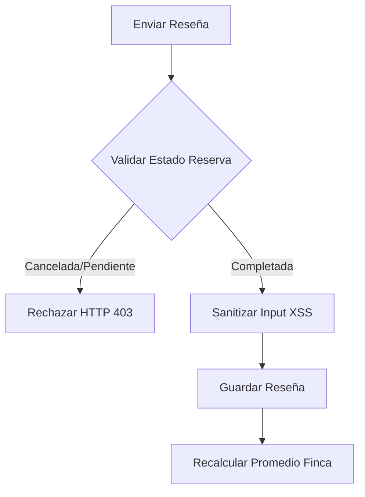

# Entregable 7 (D7): Requisitos Funcionales - Módulo: MOD-REV

**Proyecto:** Nos Fuimos de Finca
**Fase:** 3 — Ingeniería de Requisitos
**Módulo:** `MOD-REV` (Calificaciones y Reseñas)
**Estado:** Cerrado Provisionalmente

### 2. Requisitos Funcionales

| **ID de Req** | **Descripción del Requisito** | **Fuente / Trazabilidad** | **Actor Principal** | **MoSCoW** |
|---|---|---|---|---|
| **FR-REV-001** | El sistema debe permitir a un Turista dejar una reseña (1 a 5 estrellas y texto) solo si la reserva está Completada. | D4 (NFF-001) | Turista | Must |
| **FR-REV-002** | El sistema debe calcular y exponer el promedio de calificación de la finca. | D4 (NFF-001) | Sistema | Must |
| **FR-REV-003** | El sistema debe permitir al Propietario responder públicamente a una reseña. | D4 (NFF-002) | Propietario | Must |

### 3. Requisitos No Funcionales de Módulo

| **ID de Req** | **Categoría** | **Descripción de la Restricción** | **Método de Medición** | **MoSCoW** |
|---|---|---|---|---|
| **NFR-REV-001** | Security | Las reseñas deben ser filtradas contra Inyección SQL y XSS antes de persistirse. | SAST Scanner | Must |

### 4. Verificación de Conflictos (Intra-Módulo)

- **Status:** Zero Open Entries

| **ID de Conflicto** | **Tipo** | **IDs de FR/NFR Involucrados** | **Descripción** | **Disposición** | **Estado** |
| --- | --- | --- | --- | --- | --- |
| **INTRA-REV-001** | FR-FR | FR-REV-001 | ¿Qué pasa si el Turista cancela? | La regla estipula explícitamente "solo reserva Completada (Check-out)". | Resuelto |

### 5. Historias de Usuario

| **ID de US** | **Historia de Usuario** | **Criterios de Aceptación** | **Prioridad** | **Trazabilidad FR** |
|---|---|---|---|---|
| **US-REV-001** | Como Turista, quiero calificar la finca, para que otros conozcan mi experiencia. | 1. Solo se habilita post-checkout. 2. Estrella 1 a 5. | Must | FR-REV-001 |
| **US-REV-002** | Como Propietario, quiero responder a la reseña, para que pueda defender mi servicio. | 1. Un solo nivel de respuesta (no chat). | Must | FR-REV-003 |

### 6. Especificaciones de Casos de Uso

| Campo | Contenido |
|---|---|
| **ID** | `UC-REV-001` |
| **Nombre** | Publicar Reseña |
| **Actor principal** | Turista |
| **Precondiciones** | Reserva debe estar en estado 'Check-out' o 'Completada' en M-03. |
| **Escenario principal de éxito** | 1. Turista entra al link de la reseña. 2. Asigna estrellas y texto. 3. Sistema sanitiza input (XSS). 4. Sistema guarda reseña y recalcula promedio de la finca. 5. Reseña visible en M-02 (Perfil finca). |
| **Flujos alternativos** | N/A |
| **Flujos de excepción** | **1a. Reserva no completada:** HTTP 403 Forbidden. |
| **Postcondiciones** | Promedio actualizado. |
| **Requisitos relacionados** | FR-REV-001, FR-REV-002 |

### 7. Diagramas de Actividad

### AD-REV-001: Flujo de Reseña
**Trazabilidad:** UC-REV-001

### 8. Registro de Finalización de Pasos

| **Paso** | **Artefacto** | **Estado** |
|---|---|---|
| Step 7 | Functional Requirements Table | Completado |
| Step 8 | Intra-Module Conflict Check | Completado |
| Step 9 | User Stories & Use Cases | Completado |
| Step 10 | Activity Diagrams | Completado |

|**Código de Módulo**|MOD-REV|
|**Estado del Módulo**|**Provisionally Closed**|
