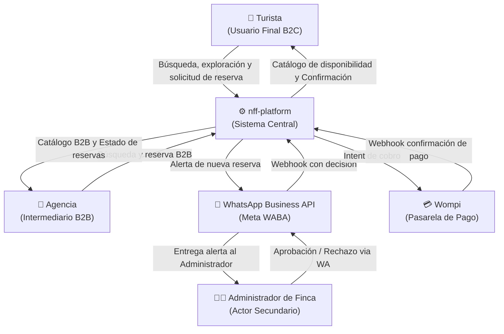

# 1. Diagrama de Contexto del Sistema

### 1. Metadatos del Documento
**Proyecto:** Nos Fuimos de Finca
**Fase:** 3 — Ingeniería de Requisitos
**Entregable:** 1 de 4
**Estado:** Aprobado

### 2. Actores del Sistema
| Actor | Tipo | Envía al Sistema | Recibe del Sistema |
| --- | --- | --- | --- |
| Turista | Primario | Búsqueda de fincas, solicitud de reserva | Catálogo de fincas, confirmación de disponibilidad |
| Agencia | Primario | Búsqueda y reservas B2B en nombre del turista | Catálogo B2B, estado de reservas |
| Administrador de Finca | Secundario | Aprobación / Rechazo de reserva (WhatsApp) | Alerta de reserva entrante |

### 3. Sistemas Externos
| Sistema | Tipo | Protocolo | Dirección del Flujo |
| --- | --- | --- | --- |
| WhatsApp Business API (Meta WABA) | SaaS | REST API + Webhook | Bidireccional |
| Wompi | SaaS | REST API + Webhook | Bidireccional |

### 4. Diagrama C4 Nivel 1 (Contexto)

### 5. Implicación de Compuerta de Fase
- **¿Bloquea el avance?:** No.
- **Condición:** Proceed. Todos los actores son trazables al MVP del D12. Los sistemas externos tienen protocolo declarado. El diagrama tiene flechas etiquetadas.
