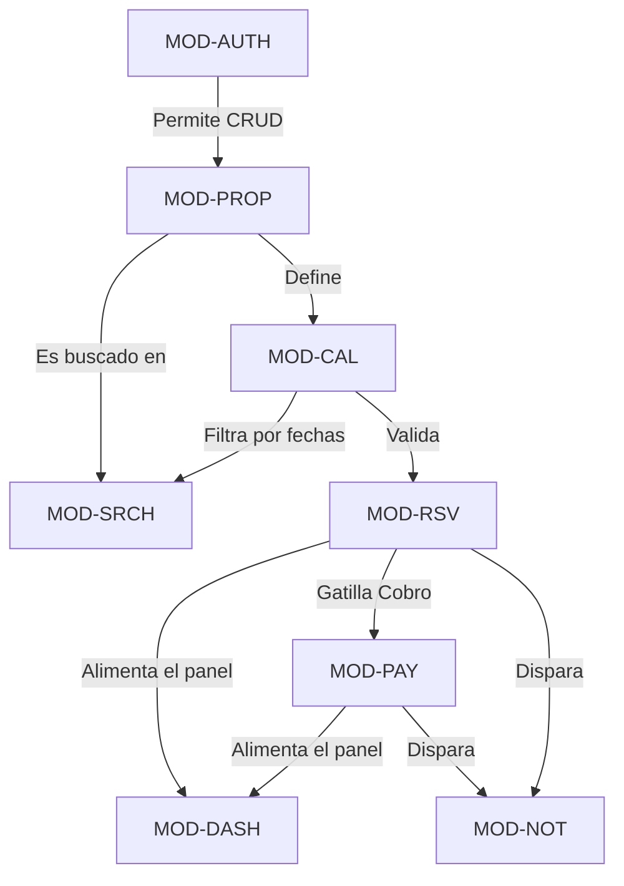

# 5. Descomposición Modular Funcional

### 1. Metadatos del Documento
**Proyecto:** Nos Fuimos de Finca
**Fase:** 3 — Ingeniería de Requisitos
**Entregable:** 5 de 6
**Estado:** Aprobado

### 2. Registro de Módulos (Module Registry)
| Código | Nombre | Actores Principales | Dependencias |
|---|---|---|---|
| `MOD-AUTH` | Autenticación y Onboarding | Turista, Finquero, Agencia | Ninguna |
| `MOD-PROP` | Gestión de Propiedades | Finquero | `MOD-AUTH` |
| `MOD-SRCH` | Búsqueda y Descubrimiento | Turista | `MOD-PROP`, `MOD-CAL` |
| `MOD-CAL` | Calendario y Disponibilidad | Finquero, Turista | `MOD-PROP` |
| `MOD-RSV` | Core Transaccional de Reservas | Turista, Agencia | `MOD-CAL`, `MOD-PAY` |
| `MOD-PAY` | Pasarela de Pagos (Wompi) | Turista, Wompi | `MOD-RSV` |
| `MOD-NOT` | Notificaciones (WhatsApp/Email) | Sistema | `MOD-RSV`, `MOD-PAY` |
| `MOD-DASH` | Paneles B2B Consolidados | Finquero, Agencia | `MOD-RSV`, `MOD-PAY` |

### 3. Fichas de Módulos (Definición Profunda)

#### MOD-AUTH: Autenticación y Onboarding KYC
- **Responsabilidad:** Gestionar identidades, tokens JWT y el proceso de verificación (KYC) para que los Finqueros puedan operar legalmente.
- **Objetivos:** Bloquear la publicación de fincas hasta que el Finquero apruebe el KYC. Proveer acceso a agencias.
- **Actores:** Turista (Sesión Guest temporal), Finquero (Registro + KYC), Agencia.
- **Conceptos de Dominio:** KYC, RUT, Sesión, Token.
- **Dependencias:** Ninguna (Es la base del sistema).
- **Out of Scope:** Autenticación social (Google/Facebook) excluida del MVP. Turistas no necesitan crear cuenta para navegar.

#### MOD-PROP: Gestión de Propiedades
- **Responsabilidad:** CRUD del perfil público de la Finca (Reglas, descripciones, galería fotográfica, precios base).
- **Objetivos:** Permitir al Finquero subir su inventario. Generar una URL pública compartible.
- **Actores:** Finquero.
- **Conceptos de Dominio:** Finca, URL Pública, Galería, Precio Base.
- **Dependencias:** Requiere `MOD-AUTH` (Usuario autenticado y verificado).
- **Out of Scope:** Sistema de reseñas y calificaciones 5 estrellas excluido del MVP.

#### MOD-SRCH: Búsqueda y Descubrimiento
- **Responsabilidad:** Proveer un motor de búsqueda B2C para que los Turistas filtren el catálogo.
- **Objetivos:** Filtrar propiedades cruzando tamaño de grupo, fechas deseadas y disponibilidad real.
- **Actores:** Turista.
- **Conceptos de Dominio:** Buscador, Filtro, Catálogo.
- **Dependencias:** Consulta datos de `MOD-PROP` y disponibilidad en `MOD-CAL`.
- **Out of Scope:** Algoritmos de recomendación predictiva o Machine Learning.

#### MOD-CAL: Calendario y Disponibilidad
- **Responsabilidad:** Gestionar la State Machine de las fechas (Disponible, Bloqueado Manualmente, Bloqueado por Reserva).
- **Objetivos:** Evitar el overbooking. Liberar fechas automáticamente si falla un pago (Time-To-Live).
- **Actores:** Finquero (Bloqueo manual), Sistema (Locks temporales).
- **Conceptos de Dominio:** Disponibilidad, Soft-Lock, Hard-Lock.
- **Dependencias:** Requiere a `MOD-PROP` (Saber qué finca se está bloqueando).
- **Out of Scope:** Sincronización bidireccional (iCal) con Airbnb o Booking.com.

#### MOD-RSV: Core Transaccional de Reservas
- **Responsabilidad:** Orquestar el ciclo atómico de la reserva: Intento -> Pago -> Confirmación. Ocultar precios B2B.
- **Objetivos:** Garantizar atomicidad de bases de datos. Generar PDFs comprobantes.
- **Actores:** Turista, Agencia.
- **Conceptos de Dominio:** Reserva, Checkout, Comprobante.
- **Dependencias:** Requiere a `MOD-CAL` para lockear fechas y a `MOD-PAY` para cobrar.
- **Out of Scope:** Alteración de reservas post-pago (No hay flujos de reprogramación en el MVP).

#### MOD-PAY: Pasarela de Pagos
- **Responsabilidad:** Integrarse exclusivamente con la API de Wompi para procesar pagos y escuchar Webhooks.
- **Objetivos:** Cobrar al Turista, dividir comisiones, no retener dinero en cuentas propias.
- **Actores:** Turista, Wompi (Sistema externo).
- **Conceptos de Dominio:** PaymentIntent, Webhook, Service Fee.
- **Dependencias:** Escucha transacciones de `MOD-RSV`.
- **Out of Scope:** Pasarelas múltiples (Stripe/PayPal) excluidas del MVP.

#### MOD-NOT: Orquestador de Notificaciones
- **Responsabilidad:** Enviar correos transaccionales y disparar Webhooks a la API de WhatsApp de Meta.
- **Objetivos:** Avisar al finquero para que apruebe. Avisar al turista que su pago fue exitoso.
- **Actores:** Sistema (Emisor), Turista y Finquero (Receptores).
- **Conceptos de Dominio:** Evento Transaccional, Mensaje WA.
- **Dependencias:** Reacciona a eventos de `MOD-RSV` y `MOD-PAY`.
- **Out of Scope:** SMS tradicionales o Notificaciones Push móviles.

#### MOD-DASH: Paneles Administrativos B2B
- **Responsabilidad:** Servir vistas pesadas de solo-lectura consolidando datos financieros y reservas.
- **Objetivos:** Darle a la Agencia una vista de "Todas mis fincas" y al Finquero un historial de "Mis ingresos".
- **Actores:** Agencia, Finquero.
- **Conceptos de Dominio:** Dashboard, Consolidado, Reporte.
- **Dependencias:** Agrupa datos de `MOD-PROP`, `MOD-RSV` y `MOD-PAY`.
- **Out of Scope:** Gráficos predictivos y exportación avanzada a Excel.

### 4. Mapeo Exhaustivo de Requerimientos (Requirement-to-Module)
| Statement ID | Candidate Requirement (Resumen) | Módulo Asignado |
|---|---|---|
| CR-001 | Turista visualiza disponibilidad antes de Checkout. | `MOD-SRCH` |
| CR-002 | Agencia crea Reserva con fechas verificadas. | `MOD-RSV` |
| CR-003 | Catálogo público sin cuenta requerida. | `MOD-PROP` |
| CR-004 | Correo electrónico con resumen post-pago. | `MOD-NOT` |
| CR-005 | Liberar fechas (TTL) si no hay pago en 120min. | `MOD-CAL` |
| CR-006 | Notificación vía WhatsApp al Finquero. | `MOD-NOT` |
| CR-007 | Prevenir concurrencia (Overbooking). | `MOD-RSV` |
| CR-008 | Finquero solo ve fechas/personas (Ocultar datos financieros del turista). | `MOD-DASH` |
| CR-009 | Finquero bloquea fechas para uso personal. | `MOD-CAL` |
| CR-010 | Cancelar reserva si Finquero no contesta WA en 90min. | `MOD-RSV` |
| CR-011 | Agencia ve disponibilidad consolidada B2B. | `MOD-DASH` |
| CR-012 | Ocultar precio base al turista si viene de agencia. | `MOD-RSV` |
| CR-013 | Comprobante de reserva en PDF descargable. | `MOD-RSV` |
| *CR-014* | *(Adicional derivado)* Subir fotos de Finca y precios. | `MOD-PROP` |
| *CR-015* | *(Adicional derivado)* Cargar RUT y pasar KYC para recibir pagos. | `MOD-AUTH` |
| *CR-016* | *(Adicional derivado)* Procesar Webhook de Wompi de manera segura. | `MOD-PAY` |

### 5. Diagrama de Dependencias (Anti-Circularidad)

### 6. Implicación de Compuerta de Fase
- **¿Bloquea el avance?:** No.
- **Condición:** Proceed. Se han documentado rigurosamente los 8 módulos críticos de la plataforma. La trazabilidad abarca todos los 16 requerimientos (crudos y derivados), y el grafo no presenta circularidad funcional.
