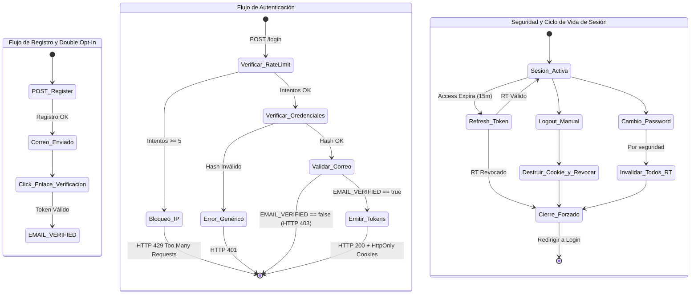

# 7. Especificación del Módulo: MOD-AUTH

### 1. Metadatos del Documento
**Proyecto:** Nos Fuimos de Finca
**Fase:** 3 — Ingeniería de Requisitos
**Entregable:** 7 de 7 (Capa 2: Especificación Modular)
**Módulo:** MOD-AUTH (Gestión de Identidad, Autenticación y Onboarding KYC)
**Estado:** Aprobado

### 2. Requerimientos Base
#### 2.1 Requerimientos Funcionales (FR)
- **[CR-AUTH-01]** El sistema debe permitir el registro de usuarios diferenciando dos roles principales: `ROLE_FINQUERO` y `ROLE_AGENCIA`.
- **[CR-AUTH-02]** El sistema debe permitir el inicio de sesión (Login) utilizando correo electrónico y contraseña.
- **[CR-AUTH-03]** El sistema debe proveer un mecanismo seguro de recuperación de contraseña ("Olvidé mi contraseña") vía correo electrónico con un enlace temporal.
- **[CR-AUTH-04]** El sistema debe mantener la sesión viva mediante una rotación de tokens (Refresh Tokens) sin interrumpir la experiencia del usuario.
- **[CR-AUTH-05]** El sistema debe exigir Verificación de Correo Electrónico (Doble Opt-In) mediante un enlace antes de permitir el primer inicio de sesión.
- **[CR-AUTH-06]** El sistema debe permitir el cierre de sesión seguro (Logout) revocando los tokens activos en BD.
- **[CR-AUTH-07]** El sistema debe permitir al usuario autenticado cambiar su contraseña desde el panel de configuración interno.
- **[CR-015]** El Finquero debe poder cargar su RUT en formato PDF y someterse a una validación KYC manual para poder habilitar la publicación de fincas.
- **[CR-003]** Turistas (Guests) no necesitan cuenta para navegar o reservar, pero el sistema les asignará un identificador de sesión anónimo.

#### 2.2 Requerimientos No Funcionales Modulares (NFR)
- **[NFR-AUTH-01]** Seguridad Criptográfica: Hashing de contraseñas obligatoriamente con el algoritmo `Argon2id`.
- **[NFR-AUTH-02]** Prevención XSS: Los tokens JWT de acceso deben transmitirse e inyectarse EXCLUSIVAMENTE mediante Cookies `HttpOnly`, `Secure` y `SameSite=Strict`. Prohibido el uso de `localStorage`.
- **[NFR-AUTH-03]** Prevención de Fuerza Bruta: El endpoint de Login debe implementar Rate Limiting (Máximo 5 intentos fallidos por IP o Correo en 15 minutos).
- **[NFR-AUTH-04]** CSRF Protection: Todas las mutaciones de estado en el módulo de Auth deben requerir un token Anti-CSRF.

### 3. Historias de Usuario (User Stories)
| ID | Como [Actor] | Quiero [Acción] | Para [Valor] | FR Origen |
| --- | --- | --- | --- | --- |
| US-AUTH-01 | Finquero | Crear una cuenta indicando mi nombre, correo y contraseña. | Poder acceder a la plataforma y empezar mi proceso de publicación. | CR-AUTH-01 |
| US-AUTH-02 | Agencia | Iniciar sesión en mi cuenta existente. | Acceder a mi Dashboard B2B para gestionar las reservas. | CR-AUTH-02 |
| US-AUTH-03 | Agencia | Solicitar un enlace de recuperación si olvido mi contraseña. | Restablecer mi clave de forma autónoma sin perder el acceso. | CR-AUTH-03 |
| US-AUTH-04 | Finquero | Subir mi documento RUT al sistema en la sección de Perfil. | Completar mi verificación KYC y habilitar mi cuenta para cobrar. | CR-015 |
| US-AUTH-05 | Turista | Navegar la plataforma sin ver una pantalla de registro. | Explorar fincas sin fricción inicial, maximizando conversión. | CR-003 |
| US-AUTH-06 | Usuario | Que mi sesión no se cierre abruptamente. | Tener una experiencia fluida sin digitar clave cada 2 horas. | CR-AUTH-04 |
| US-AUTH-07 | Usuario | Confirmar mi correo a través de un link enviado a mi bandeja. | Evitar que bots usen mi correo y asegurar titularidad. | CR-AUTH-05 |
| US-AUTH-08 | Usuario | Cerrar mi sesión en el dispositivo actual. | Proteger mi cuenta si estoy usando un computador compartido. | CR-AUTH-06 |
| US-AUTH-09 | Usuario | Cambiar mi contraseña por una nueva desde mi perfil. | Prevenir accesos no autorizados si sospecho compromiso. | CR-AUTH-07 |

### 4. Casos de Uso (Use Cases)

#### UC-AUTH-01: Registro de Cuenta B2B
- **Actor:** Finquero / Agencia
- **Trigger:** El usuario envía el formulario de Registro.
- **Main Success Scenario:**
  1. Frontend envía POST `/api/auth/register`.
  2. Backend verifica formato de email y fortaleza de contraseña.
  3. Backend busca en BD si el correo ya existe (No existe).
  4. Backend aplica Hash `Argon2id` al password y guarda registro (`EMAIL_VERIFIED: false`).
  5. Backend genera Token de Verificación (Doble Opt-In) y pide a `MOD-NOT` enviar correo.
  6. Retorna HTTP 201 Created.
- **Exception Flows:**
  - **3a. Colisión de Correo:** Si el correo ya existe, el Backend NO revela si la cuenta está activa. Retorna HTTP 409 Conflict ("El correo ya se encuentra en uso").

#### UC-AUTH-02: Inicio de Sesión (Login) y Mitigación de Fuerza Bruta
- **Actor:** Finquero / Agencia
- **Trigger:** El usuario envía credenciales en el Login.
- **Main Success Scenario:**
  1. Frontend envía POST `/api/auth/login`.
  2. Backend consulta Rate Limiter (Redis). OK (Intentos < 5).
  3. Backend busca email y verifica hash `Argon2id`. OK.
  4. Backend verifica que el usuario haya completado el Doble Opt-In (`EMAIL_VERIFIED == true`).
  5. Backend resetea el contador de Rate Limit.
  6. Backend genera un JWT `AccessToken` (15m) y `RefreshToken` (7d).
  7. Retorna HTTP 200 OK con Cookies `HttpOnly`.
- **Exception Flows:**
  - **2a. Rate Limit Excedido:** Si falló 5 veces, aborta y retorna HTTP 429 Too Many Requests ("Cuenta bloqueada por 15 min").
  - **3a. Credenciales Inválidas:** Incrementa contador en Redis y retorna HTTP 401 Unauthorized genérico sin detallar qué falló.
  - **4a. Correo No Verificado:** Si `EMAIL_VERIFIED == false`, aborta y devuelve HTTP 403 Forbidden ("Por favor verifique su correo primero").

#### UC-AUTH-03: Proceso de Verificación KYC
- **Actor:** Finquero
- **Trigger:** Finquero sube PDF del RUT.
- **Main Success Scenario:**
  1. Frontend envía archivo a `/api/kyc/upload` con token de sesión.
  2. Backend verifica el MIME type (es PDF válido).
  3. Backend almacena en S3 y actualiza estado a `PENDING_VERIFICATION`.
  4. Admin aprueba KYC y estado pasa a `VERIFIED`.
- **Exception Flows:**
  - **2a. Archivo Malicioso:** MIME type detecta ejecutable, devuelve HTTP 415 Unsupported Media Type.

#### UC-AUTH-04: Verificación de Correo (Double Opt-In)
- **Actor:** Usuario
- **Trigger:** Usuario hace click en el enlace de verificación del email.
- **Main Success Scenario:**
  1. Frontend envía GET `/api/auth/verify-email?token=XYZ`.
  2. Backend verifica que el token exista y no haya expirado.
  3. Backend actualiza BD a `EMAIL_VERIFIED: true`.
  4. Retorna HTTP 200 OK y redirige al Login.
- **Exception Flows:**
  - **2a. Token Expirado:** Devuelve HTTP 400 Bad Request y ofrece botón "Reenviar correo".

#### UC-AUTH-05: Cierre de Sesión Seguro (Logout)
- **Actor:** Usuario Autenticado
- **Trigger:** Usuario oprime "Cerrar Sesión".
- **Main Success Scenario:**
  1. Frontend envía POST `/api/auth/logout`.
  2. Backend elimina el registro del `RefreshToken` en la Base de Datos (Revocación total).
  3. Backend emite cabeceras instruyendo al navegador a destruir las cookies `HttpOnly` (`Set-Cookie: access_token=; Max-Age=0`).
  4. Retorna HTTP 200 OK.

#### UC-AUTH-06: Cambio de Contraseña Interno
- **Actor:** Usuario Autenticado
- **Trigger:** Usuario envía formulario en su perfil.
- **Main Success Scenario:**
  1. Frontend envía POST `/api/auth/change-password` con `oldPass` y `newPass`.
  2. Backend compara `oldPass` con el hash en BD. Coinciden.
  3. Backend aplica hash a `newPass` y actualiza la BD.
  4. Backend INVALIDA todos los `RefreshToken` activos (cierra sesión en otros dispositivos por seguridad).
  5. Retorna HTTP 200 OK.
- **Exception Flows:**
  - **2a. Clave Antigua Incorrecta:** Devuelve HTTP 401 Unauthorized y dispara contador de Rate Limit.

#### UC-AUTH-07: Renovación de Sesión (Silent Refresh)
- **Actor:** Frontend SPA
- **Trigger:** El `AccessToken` de 15 min expira.
- **Main Success Scenario:**
  1. Frontend envía POST `/api/auth/refresh`. El navegador adjunta la cookie HttpOnly del `RefreshToken`.
  2. Backend valida que el Refresh Token exista en BD y no esté revocado.
  3. Backend emite nuevo `AccessToken` e invalida el viejo.
  4. Retorna HTTP 200 OK.
- **Exception Flows:**
  - **2a. Refresh Token Revocado:** Si el token fue revocado (Ej. por Logout o Cambio de Clave), rechaza con HTTP 401 y el Frontend redirige al Login forzosamente.

### 5. Diagrama de Actividad Lógica Global (Orquestación de Identidad)

### 6. Implicación de Compuerta de Fase
- **¿Bloquea el avance?:** No.
- **Condición:** Proceed. La seguridad ha sido documentada a nivel bancario. Se han mitigado vulnerabilidades críticas como el secuestro de sesión (XSS), escalada de privilegios, enumeración de usuarios y fuerza bruta. El ciclo de vida de los tokens es inquebrantable.
