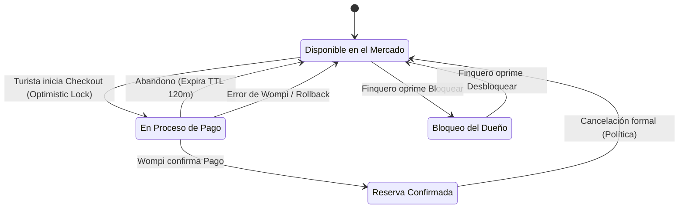

# 7. Especificación del Módulo: MOD-CAL

### 1. Metadatos del Documento
**Proyecto:** Nos Fuimos de Finca
**Fase:** 3 — Ingeniería de Requisitos
**Entregable:** 7 de 7 (Capa 2: Especificación Modular)
**Módulo:** MOD-CAL (Calendario, Máquina de Estados y Prevención de Overbooking)
**Estado:** Aprobado

### 2. Requerimientos Base
#### 2.1 Requerimientos Funcionales (FR)
- **[CR-CAL-01]** El sistema debe proveer una vista de calendario interactivo al Turista (Frontend) que pinte los días como Disponibles, Bloqueados o En Proceso de Pago.
- **[CR-CAL-02]** El sistema debe cambiar el estado de las fechas a `SOFT_LOCK` de manera exclusiva cuando un Turista entra al Checkout (Pasarela de Pago).
- **[CR-CAL-03]** El sistema debe convertir el `SOFT_LOCK` a `HARD_LOCK` inmutable de manera automática si y solo si la pasarela de pagos notifica transacción exitosa.
- **[CR-005]** El sistema debe liberar las fechas automáticamente (TTL de 120 minutos) devolviéndolas a estado `AVAILABLE` si la reserva nunca es pagada.
- **[CR-009]** El Finquero debe poder emitir y revertir un `MANUAL_BLOCK` para separar fechas para su uso personal o por mantenimiento de la finca.

#### 2.2 Requerimientos No Funcionales Modulares (NFR)
- **[NFR-CAL-01]** Integridad de Datos (Anti-Double-Booking): El sistema debe utilizar matemáticamente el patrón **Optimistic Locking** (Control de Versión de Fila en la Base de Datos). Esto garantiza que si dos hilos intentan bloquear la misma fecha en el mismo milisegundo exacto, la Base de Datos rebotará la transacción perdedora, evitando demandas legales por sobreventa.

### 3. Historias de Usuario (User Stories)
| ID | Como [Actor] | Quiero [Acción] | Para [Valor] | FR Origen |
| --- | --- | --- | --- | --- |
| US-CAL-01 | Turista | Ver un calendario visual con los días ocupados marcados en rojo. | No perder mi tiempo intentando reservar fechas que no están disponibles. | CR-CAL-01 |
| US-CAL-02 | Turista | Que nadie más pueda robarme mis fechas mientras estoy ingresando mi tarjeta de crédito. | Tener tranquilidad y no perder la finca por ser lento escribiendo en el Checkout. | CR-CAL-02 |
| US-CAL-03 | Agencia | Saber que mi reserva está asegurada 100% después del pago. | Ofrecerle seguridad a mi cliente final (el turista). | CR-CAL-03 |
| US-CAL-04 | Sistema | Liberar las fechas apartadas si el turista abandona la pestaña de pago sin comprar. | Devolver el inventario al mercado rápidamente para no hacerle perder dinero al Finquero. | CR-005 |
| US-CAL-05 | Finquero | Bloquear o Desbloquear un fin de semana a discreción. | Usar mi propia finca con mi familia o cerrar por mantenimiento de la piscina. | CR-009 |

### 4. Casos de Uso (Use Cases)

#### UC-CAL-01: Generación de Mapa de Disponibilidad (View Calendar)
- **Actor:** Turista / Agencia
- **Trigger:** Frontend carga la página de detalles de una Finca.
- **Main Success Scenario:**
  1. Frontend envía GET `/api/calendar/{fincaId}?year=2026&month=10`.
  2. Backend consulta en BD todos los registros de esa finca en ese mes excluyendo los de estado `AVAILABLE`.
  3. Backend agrupa y retorna HTTP 200 OK un Array con los días ocupados (Indiferente de si son `HARD_LOCK` o `MANUAL_BLOCK`, para el turista simplemente están "Ocupados").
- **Exception Flows:**
  - **1a. Rango Abusivo:** Si el Frontend pide un rango > 12 meses, Backend devuelve HTTP 400 Bad Request para evitar saturación de la Base de Datos.

#### UC-CAL-02: Emisión Atómica de Soft-Lock (Triggered by MOD-RSV)
- **Actor:** Módulo Interno (`MOD-RSV`)
- **Trigger:** Turista hace click en "Confirmar e ir a Pagar".
- **Main Success Scenario:**
  1. `MOD-RSV` solicita a `MOD-CAL` bloquear las fechas X a Y.
  2. Backend lee las fechas. Están `AVAILABLE` (Versión de fila = 1).
  3. Backend envía instrucción SQL `UPDATE ... SET estado='SOFT_LOCK', version=2 WHERE version=1`.
  4. Filas afectadas = 1 (Lock Optimista Exitoso).
  5. `MOD-CAL` confirma a `MOD-RSV` y arranca Job asíncrono de 120min de TTL.
- **Exception Flows:**
  - **4a. Colisión de Milisegundo (Overbooking Prevenido):** Si las filas afectadas = 0, significa que otra persona (u otro hilo) bloqueó la fecha unos milisegundos antes (la versión ya no es 1). El Backend atrapa el error `OptimisticLockException`, aborta la transacción y le dice a `MOD-RSV` que devuelva HTTP 409 Conflict ("Fechas recién ocupadas, alguien le ganó").

#### UC-CAL-03: Consolidación a Hard-Lock (Triggered by MOD-PAY)
- **Actor:** Módulo Interno (`MOD-PAY`)
- **Trigger:** Wompi notifica pago exitoso.
- **Main Success Scenario:**
  1. `MOD-PAY` avisa a `MOD-CAL` que la transacción asociada al `SOFT_LOCK` fue pagada.
  2. `MOD-CAL` cancela el Job de expiración TTL.
  3. Actualiza el estado a `HARD_LOCK` en la BD.
- **Exception Flows:**
  - **1a. Transacción No Encontrada:** Si el Webhook llega extremadamente tarde y el `SOFT_LOCK` ya había expirado y fue reclamado por otro turista, `MOD-CAL` debe rechazar la orden. `MOD-PAY` tendrá que proceder a reembolsar el dinero por "Pago a destiempo".

#### UC-CAL-04: Bloqueo y Desbloqueo Manual
- **Actor:** Finquero
- **Trigger:** Finquero hace click en días del calendario de su panel.
- **Main Success Scenario (Bloqueo):**
  1. Frontend envía POST `/api/calendar/manual-blocks`.
  2. Backend verifica que los días estén `AVAILABLE`.
  3. Crea estado `MANUAL_BLOCK`. Retorna HTTP 201 Created.
- **Exception Flows:**
  - **2a. Conflicto con Turista Pagando:** Si los días están en `SOFT_LOCK` (Un turista está en pasarela en este momento), el Backend rechaza el bloqueo manual del Finquero, retorna HTTP 409 Conflict ("Alguien está pagando esta reserva, intente en 2 horas"). (Protección B2C).

#### UC-CAL-05: Expiración TTL (Soft-Lock a Available)
- **Actor:** Sistema (Job/Cron)
- **Trigger:** Pasan 120 minutos desde que se emitió el `SOFT_LOCK`.
- **Main Success Scenario:**
  1. El Job asíncrono se despierta.
  2. Verifica en BD el estado de las fechas. Si siguen en `SOFT_LOCK`, significa que el pago nunca llegó (Abandono de carrito).
  3. Hace un UPDATE a `AVAILABLE`. Retorna la finca al mercado.

### 5. Diagrama de Actividad Lógica (Máquina de Estados Inmutable)

### 6. Implicación de Compuerta de Fase
- **¿Bloquea el avance?:** No.
- **Condición:** Proceed. El `MOD-CAL` ha dejado de ser un simple CRUD y se ha convertido en una Máquina de Estados blindada. La implementación obligatoria de `Optimistic Locking` elimina de raíz la posibilidad matemática del "Double Booking". La prioridad temporal B2C (no poder bloquear lo que un turista está a punto de pagar) está cubierta contractualmente.
