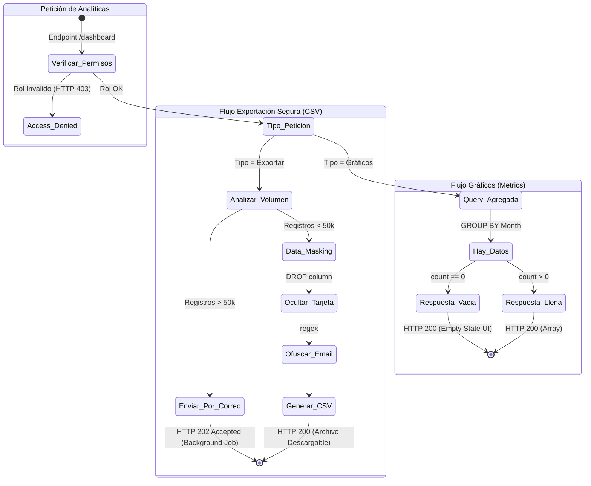

# 7. Especificación del Módulo: MOD-DASH

### 1. Metadatos del Documento
**Proyecto:** Nos Fuimos de Finca
**Fase:** 3 — Ingeniería de Requisitos
**Entregable:** 7 de 7 (Capa 2: Especificación Modular)
**Módulo:** MOD-DASH (Paneles Administrativos B2B, Analítica y Contabilidad)
**Estado:** Aprobado

### 2. Requerimientos Base
#### 2.1 Requerimientos Funcionales (FR)
- **[CR-DASH-01]** El sistema debe proveer al Finquero un panel visual con gráficos de líneas y barras representando el total de sus ingresos económicos generados por sus fincas.
- **[CR-DASH-02]** El sistema debe permitir al Finquero aplicar filtros de fechas (Ej. "Este Mes", "Año Pasado") en las métricas de su Dashboard.
- **[CR-DASH-03]** El sistema debe permitir la exportación del historial completo de reservas a un archivo en formato estandarizado `.csv` o `.xlsx` para propósitos contables.
- **[CR-DASH-04]** El sistema debe proveer a la Agencia una vista de "Macro-Calendario" consolidando la disponibilidad de todas las propiedades que administra en una única pantalla de matriz (Fila = Finca, Columna = Día).
- **[CR-008]** Privacidad Transaccional B2C: El Dashboard del Finquero/Agencia JAMÁS debe transferir, visualizar ni exportar información bancaria cruda del turista (Ej. Número de tarjeta o CVC).

#### 2.2 Requerimientos No Funcionales Modulares (NFR)
- **[NFR-DASH-01]** Seguridad y Compliance (Data Masking): Cualquier exportación de base de datos (Ej. CSV) generada por este módulo debe aplicar Enmascaramiento PII (Personally Identifiable Information) dinámico sobre correos electrónicos (Ej. `j***@gmail.com`).
- **[NFR-DASH-02]** Rendimiento Analítico (Performance): Los endpoints de consolidación histórica deben responder en `< 1.5 segundos`. Se prohíbe realizar iteraciones en memoria (`for` loops) sobre tablas transaccionales gigantes; el equipo debe usar Vistas Materializadas en SQL, Paginación Severa, o Caché en Redis.

### 3. Historias de Usuario (User Stories)
| ID | Como [Actor] | Quiero [Acción] | Para [Valor] | FR Origen |
| --- | --- | --- | --- | --- |
| US-DASH-01 | Finquero | Ver un gráfico visual con el historial de mis ganancias mensuales. | Proyectar las finanzas de mi negocio e identificar los meses de "temporada alta". | CR-DASH-01 |
| US-DASH-02 | Finquero | Descargar una tabla de Excel con el reporte de mis últimas 100 reservas. | Pasarle los datos a mi contador para las declaraciones de impuestos sin tener que copiar y pegar a mano. | CR-DASH-03 |
| US-DASH-03 | Agencia | Ver una cuadrícula (matriz) con los días disponibles de 20 fincas al mismo tiempo. | Encontrar rápidamente una finca libre para un cliente que me llama por teléfono sin abrir 20 pestañas distintas. | CR-DASH-04 |
| US-DASH-04 | Turista | Que el dueño de la finca NO pueda ver los datos de mi tarjeta de crédito ni mi correo personal. | Prevenir fraude o spam directo a mi bandeja de entrada por parte de terceros. | CR-008 |

### 4. Casos de Uso (Use Cases)

#### UC-DASH-01: Generación de Gráfico de Ingresos (Analytics)
- **Actor:** Finquero
- **Trigger:** Finquero ingresa a la pestaña "Rendimiento".
- **Main Success Scenario:**
  1. Frontend envía GET `/api/dashboard/metrics?startDate=2026-01-01&endDate=2026-12-31`.
  2. Backend verifica los permisos (JWT).
  3. Backend ejecuta consulta SQL pre-agregada (`GROUP BY month, property_id`) sumando los montos de reservas en estado `HARD_LOCK`.
  4. Retorna HTTP 200 OK con un Array de objetos (`{ month: 'Enero', total: 5000000 }`).
- **Exception Flows:**
  - **1a. Rango de Fechas Ilógico:** Si `endDate` es menor a `startDate`, el Backend aborta y retorna HTTP 400 Bad Request ("Rango de fechas inválido").
  - **3a. Sin Datos Históricos:** Si el finquero es nuevo y no tiene ventas, no debe retornar Error 404. Retorna HTTP 200 OK con `Array vacío []` para que el frontend pinte un "Empty State" comercial motivándolo a vender.

#### UC-DASH-02: Exportación Segura de Historial a CSV
- **Actor:** Finquero / Agencia
- **Trigger:** Finquero hace click en el botón "Exportar a CSV".
- **Main Success Scenario:**
  1. Frontend envía POST `/api/dashboard/export`.
  2. Backend recopila todas las reservas finalizadas del Finquero.
  3. **Data Masking (CR-008 / NFR-DASH-01):** El Backend filtra activamente las columnas. Omite la columna `payment_method` de BD, y ofusca el `tourist_email` (`j***@gmail.com`).
  4. Backend genera el archivo `.csv` en memoria.
  5. Retorna HTTP 200 OK con cabeceras `Content-Type: text/csv` y `Content-Disposition: attachment`.
- **Exception Flows:**
  - **2a. Exportación Masiva Crítica:** Si el sistema detecta que la consulta devolverá más de 50,000 registros, aborta la respuesta síncrona. Retorna HTTP 202 Accepted ("El archivo es muy pesado, se le enviará por correo electrónico en 5 minutos") y despacha un Job asíncrono.

#### UC-DASH-03: Renderizado de Calendario Macro (Agencias)
- **Actor:** Agencia
- **Trigger:** Agencia ingresa a la pestaña "Matriz de Fincas".
- **Main Success Scenario:**
  1. Frontend envía GET `/api/dashboard/macro-calendar`.
  2. Backend extrae los IDs de las propiedades vinculadas a esa Agencia específica.
  3. Cruza la información con la tabla de `MOD-CAL` para los próximos 30 días.
  4. Retorna HTTP 200 OK con estructura de matriz.
- **Exception Flows:**
  - **2a. Acceso Ilegal:** Si un usuario intenta forzar el parámetro para ver el Macro-Calendario de una Agencia a la que no pertenece, el Middleware de RBAC (Role-Based Access Control) interviene y retorna HTTP 403 Forbidden.

### 5. Diagrama de Actividad Lógica (Orquestación B2B)

### 6. Implicación de Compuerta de Fase
- **¿Bloquea el avance?:** No.
- **Condición:** Proceed. El Módulo de Analítica y Contabilidad cumple su propósito B2B con robustez empresarial. Se han documentado restricciones de privacidad legales (Data Masking) y salvaguardas arquitectónicas (Evitar colapsos de memoria por exportaciones masivas mediante Jobs asíncronos en el flujo 2a).
