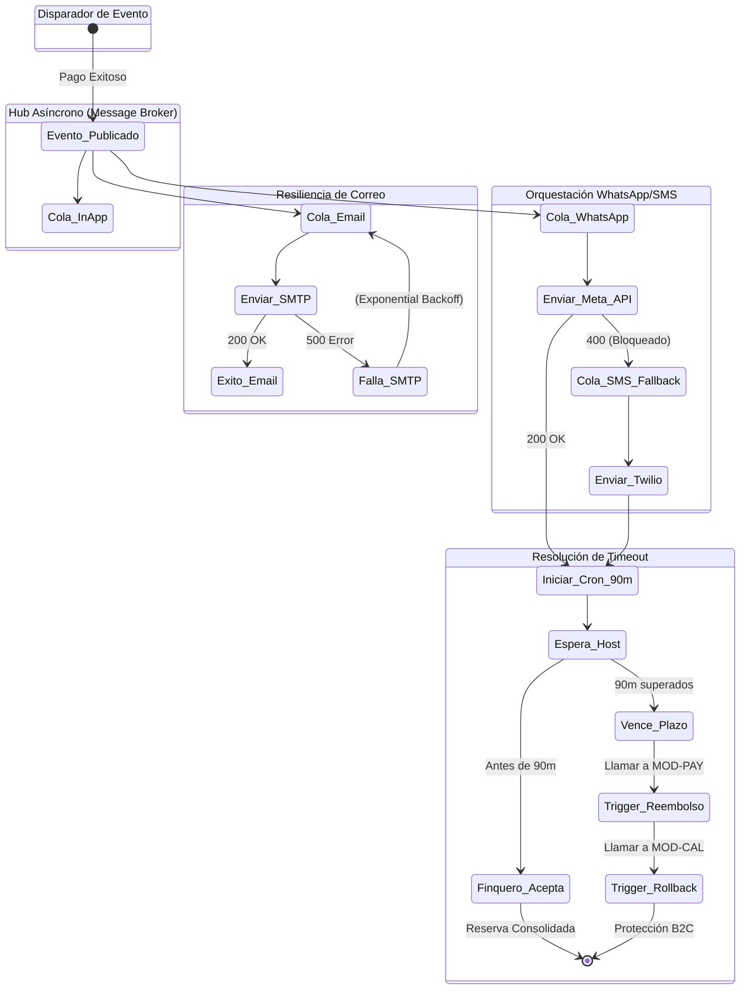

# 7. Especificación del Módulo: MOD-NOT

### 1. Metadatos del Documento
**Proyecto:** Nos Fuimos de Finca
**Fase:** 3 — Ingeniería de Requisitos
**Entregable:** 7 de 7 (Capa 2: Especificación Modular)
**Módulo:** MOD-NOT (Hub Asíncrono y Orquestador de Notificaciones)
**Estado:** Aprobado

### 2. Requerimientos Base
#### 2.1 Requerimientos Funcionales (FR)
- **[CR-NOT-01]** El sistema debe enviar correos electrónicos transaccionales (Ej. Comprobantes de pago, Links de recuperación) utilizando un motor de plantillas dinámico.
- **[CR-NOT-02]** El sistema debe enviar mensajes vía WhatsApp al Finquero indicando una nueva reserva, y proveer un mecanismo de Fallback (Plan B) vía SMS tradicional si la API de Meta rechaza la entrega.
- **[CR-NOT-03]** El sistema debe proveer notificaciones "In-App" en tiempo real (Campanita de Alertas) para Agencias y Finqueros que tengan su sesión activa en el Dashboard.
- **[CR-010]** Resolución de Timeout Comercial: El sistema debe orquestar y ejecutar la cancelación formal de la reserva (Trigger a `MOD-CAL` y `MOD-PAY`) si el Finquero no contesta la notificación de WhatsApp en un plazo máximo de 90 minutos.

#### 2.2 Requerimientos No Funcionales Modulares (NFR)
- **[NFR-NOT-01]** Tolerancia a Fallos (Resilience): Queda estrictamente prohibido el envío síncrono de notificaciones. Todo despacho debe insertarse en una Cola de Mensajes (Message Queue) e implementar `Exponential Backoff`. Si el proveedor (Ej. Sendgrid, Twilio) falla, el sistema reintentará sin perder la notificación (0% Data Loss).

### 3. Historias de Usuario (User Stories)
| ID | Como [Actor] | Quiero [Acción] | Para [Valor] | FR Origen |
| --- | --- | --- | --- | --- |
| US-NOT-01 | Turista | Recibir un correo de confirmación infalible 1 segundo después de pagar. | Estar tranquilo de que mi dinero no se perdió y que la finca está reservada. | CR-NOT-01 |
| US-NOT-02 | Finquero | Recibir un mensaje a mi WhatsApp o celular cuando alguien reserve mi finca. | Enterarme instantáneamente sin tener que estar revisando mi correo todo el día. | CR-NOT-02 |
| US-NOT-03 | Agencia | Ver una "campanita" roja en mi Dashboard B2B cuando ocurra un evento importante. | Gestionar las notificaciones de 20 fincas de forma centralizada mientras uso la PC. | CR-NOT-03 |
| US-NOT-04 | Sistema | Activar un temporizador de 90 minutos para cancelar y reembolsar si el dueño no contesta. | Proteger el dinero del turista B2C en caso de que el dueño sea un estafador o se haya quedado sin internet. | CR-010 |

### 4. Casos de Uso (Use Cases)

#### UC-NOT-01: Despacho de Correo Electrónico con Retry
- **Actor:** Módulo Interno (Ej. `MOD-PAY`)
- **Trigger:** Una transacción se marca como Pagada.
- **Main Success Scenario:**
  1. `MOD-PAY` emite un evento interno `RESERVA_PAGADA`.
  2. `MOD-NOT` escucha el evento e inserta un "Job" en la Cola de Correos de Redis.
  3. El Worker consume el Job, renderiza la plantilla HTML inyectando variables (Nombre, Finca, Fechas).
  4. Envía a la API de Sendgrid/AWS SES. Retorna HTTP 202 Accepted.
- **Exception Flows:**
  - **4a. Proveedor Caído (Resilience):** Si Sendgrid devuelve Error 500, el Worker NO descarta el Job. Lo reencola con un retraso exponencial (10s, luego 30s, luego 2m) hasta que el correo sale. Garantiza confirmación al Turista.

#### UC-NOT-02: Orquestación de WhatsApp y SMS Fallback
- **Actor:** Worker de Notificaciones
- **Trigger:** Evento de Nueva Reserva para el Finquero.
- **Main Success Scenario:**
  1. Worker saca Job de la Cola de WhatsApp.
  2. Llama a API de Meta Graph. Meta responde HTTP 200 OK.
  3. El Finquero recibe su WhatsApp.
- **Exception Flows:**
  - **2a. Finquero Bloqueó el Bot (Fallback a SMS):** Si Meta devuelve HTTP 400 (Ej. "User cannot be reached"), el Worker asume que el Finquero no usa WA o bloqueó al bot. Inmediatamente inserta un nuevo Job en la Cola de SMS (Ej. Twilio) para asegurar que el dueño se entere del negocio.

#### UC-NOT-03: Notificaciones In-App (WebSockets)
- **Actor:** Worker de Notificaciones
- **Trigger:** Evento interno cualquiera (Ej. KYC Aprobado, Pago Exitoso).
- **Main Success Scenario:**
  1. `MOD-NOT` guarda el registro en BD (Tabla `app_notifications`) con estado `UNREAD`.
  2. Verifica si el usuario destino tiene un canal WebSocket (Socket.io) activo.
  3. Sí está activo. Transmite el JSON al cliente en tiempo real.
  4. La campanita en el Dashboard B2B incrementa un número rojo.
- **Exception Flows:**
  - **3a. Usuario Offline:** Si el usuario no tiene la pestaña abierta, el Backend simplemente termina silenciosamente. El usuario leerá la notificación (Paso 1) la próxima vez que haga Login.

#### UC-NOT-04: CronJob de Resolución Comercial (Timeout 90 min)
- **Actor:** Sistema Cron
- **Trigger:** Pasan 90 minutos desde que se despachó el WhatsApp/SMS al Finquero.
- **Main Success Scenario:**
  1. El CronJob consulta si el estado de la reserva sigue `AWAITING_HOST_CONFIRMATION`.
  2. **Resolución Crítica:** Si el estado no ha cambiado (Finquero ignoró), el CronJob asume mala fe o imposibilidad operativa.
  3. Emite comando a `MOD-PAY` para ejecutar un `Refund` (Reembolso de la tarjeta del Turista).
  4. Emite comando a `MOD-CAL` para ejecutar un `Rollback` (Liberar las fechas del Hard-Lock a Available).
  5. Despacha correo de "Reserva Cancelada" al Turista explicando la inactividad del dueño.
- **Exception Flows:**
  - **1a. Finquero Ya Aprobó:** Si la reserva ya dice `HOST_CONFIRMED`, el CronJob simplemente muere y no hace nada.

### 5. Diagrama de Actividad Lógica (Arquitectura Basada en Eventos)

### 6. Implicación de Compuerta de Fase
- **¿Bloquea el avance?:** No.
- **Condición:** Proceed. El Módulo de Notificaciones ya no es un simple disparador síncrono. Su rediseño basado en Eventos y Colas (Message Queues) garantiza un sistema tolerante a fallos, previniendo que los errores de red detengan el flujo del negocio. El CronJob de resolución blinda legalmente a la empresa protegiendo el dinero del Turista.
