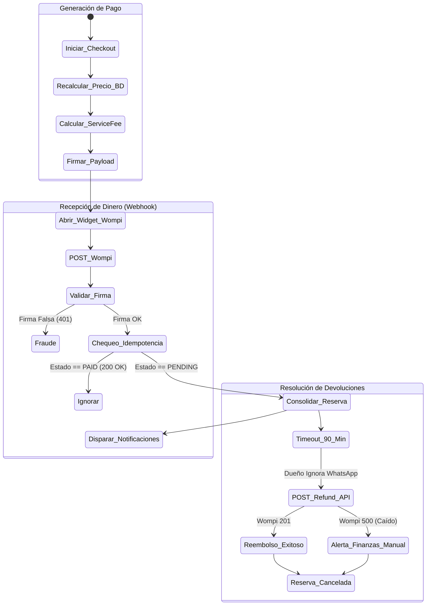

# 7. Especificación del Módulo: MOD-PAY

### 1. Metadatos del Documento
**Proyecto:** Nos Fuimos de Finca
**Fase:** 3 — Ingeniería de Requisitos
**Entregable:** 7 de 7 (Capa 2: Especificación Modular)
**Módulo:** MOD-PAY (Motor Financiero, Wompi y Service Fees)
**Estado:** Aprobado

### 2. Requerimientos Base
#### 2.1 Requerimientos Funcionales (FR)
- **[CR-PAY-01]** El sistema debe generar una Intención de Pago (Checkout Session) encriptada para enviar al turista hacia el modal/widget de Wompi.
- **[CR-PAY-02]** El sistema debe calcular automáticamente el Service Fee (Comisión de la plataforma) sumándolo al Subtotal del Finquero antes de generar el link de cobro.
- **[CR-016]** El sistema debe procesar de manera segura el Webhook asíncrono de confirmación enviado por Wompi y consolidar la reserva.
- **[CR-PAY-03]** El sistema debe proveer la capacidad de ejecutar Reembolsos (Refunds) conectándose a la API de Wompi en caso de cancelaciones o el timeout de 90 minutos de `MOD-NOT`.

#### 2.2 Requerimientos No Funcionales Modulares (NFR)
- **[NFR-PAY-01]** PCI-DSS Compliance (Aislamiento de Tarjetas): Queda arquitectónicamente PROHIBIDO diseñar tablas en la Base de Datos o Variables en el código que almacenen el PAN (Primary Account Number / Los 16 dígitos de la tarjeta) o el CVC. Toda captura de estos datos debe ocurrir 100% dentro de los iframes o componentes alojados en los servidores de Wompi.
- **[NFR-PAY-02]** Idempotencia Transaccional Extrema: El endpoint receptor del Webhook debe rechazar silenciosamente cualquier reintento (Ej. Wompi enviando 3 veces el mismo aviso de pago) garantizando que una misma transacción jamás genere una doble consolidación, doble envío de correos, o doble descuento de cupos.

### 3. Historias de Usuario (User Stories)
| ID | Como [Actor] | Quiero [Acción] | Para [Valor] | FR Origen |
| --- | --- | --- | --- | --- |
| US-PAY-01 | Plataforma | Añadir mi porcentaje de comisión (Service Fee) al total de la reserva de forma invisible para el dueño. | Monetizar el servicio de forma automatizada sin depender de cobrar facturas manuales a fin de mes. | CR-PAY-02 |
| US-PAY-02 | Turista | Que mi pago sea procesado por una entidad bancaria vigilada (Wompi). | Tener total seguridad y garantía de que mis datos no serán robados o clonados. | NFR-PAY-01 |
| US-PAY-03 | Sistema | Ejecutar un reembolso inmediato a la tarjeta del turista. | Devolver el dinero sin intervención humana si el dueño de la finca rechaza la reserva (Timeout 90 min). | CR-PAY-03 |
| US-PAY-04 | Sistema | Recibir y validar la firma criptográfica del Webhook de pago. | Prevenir que un Hacker simule un pago exitoso enviando falsos JSON a mi servidor. | CR-016 |

### 4. Casos de Uso (Use Cases)

#### UC-PAY-01: Generación de Intención de Pago y Service Fee
- **Actor:** Turista (vía Frontend)
- **Trigger:** Turista aprueba las fechas e inicia Checkout.
- **Main Success Scenario:**
  1. Frontend envía POST `/api/payments/checkout-session` con el `fincaId` y el rango de fechas.
  2. Backend recalcula el precio desde la Base de Datos (Seguridad contra alteración de precios en JS). 
  3. Backend calcula: `Subtotal Finquero + Service Fee (Ej. 10%) = Total Wompi`.
  4. Backend genera el hash/firma inicial exigido por Wompi con el secreto y el Total.
  5. Backend inserta registro de Reserva en estado `PENDING_PAYMENT`.
  6. Retorna HTTP 200 OK con el `transaction_id` interno y la Firma generada para que el Frontend abra el Widget.
- **Exception Flows:**
  - **2a. Inconsistencia de Precios (Fraude):** Si el precio enviado por el Frontend difiere del precio en BD, Backend asume alteración maliciosa en el navegador, aborta y devuelve HTTP 400 Bad Request ("Discrepancia de precios detectada").

#### UC-PAY-02: Procesamiento Idempotente del Webhook (Wompi)
- **Actor:** Wompi (Sistema Externo)
- **Trigger:** Wompi cobra exitosamente y dispara POST asíncrono a nuestro servidor.
- **Main Success Scenario:**
  1. Wompi envía POST a `/api/webhooks/wompi` con el payload de la transacción.
  2. Backend extrae la Firma y verifica matemáticamente que coincida con el `Event_Secret` del proyecto. Firma OK.
  3. Backend busca la Reserva en BD usando el `transaction_id`.
  4. Verifica Idempotencia: ¿Estado actual de reserva es `PENDING_PAYMENT`? Sí.
  5. Cambia estado a `PAID` (o `AWAITING_HOST_CONFIRMATION`).
  6. Dispara evento hacia `MOD-NOT` (Correos y WA) y `MOD-CAL` (Hard-Lock).
  7. Retorna HTTP 200 OK a Wompi.
- **Exception Flows:**
  - **2a. Firma Inválida (Fraude):** Si la firma no coincide, Backend ignora el cuerpo del mensaje y retorna HTTP 401 Unauthorized de inmediato.
  - **4a. Doble Webhook (Idempotencia):** Si la reserva YA ESTÁ en estado `PAID` (o cancelada), significa que este webhook llegó repetido o tarde. El Backend **no hace ninguna mutación ni envía correos**, simplemente devuelve HTTP 200 OK silencioso a Wompi para que deje de enviar intentos.

#### UC-PAY-03: Ejecución de Reembolso Automático (Refund API)
- **Actor:** Módulo Interno (`MOD-NOT` / CronJob)
- **Trigger:** Finquero no aprueba en 90 minutos.
- **Main Success Scenario:**
  1. CronJob ordena ejecutar reembolso por el 100% del monto.
  2. Backend envía POST a la API privada de Wompi `/v1/transactions/{id}/refunds`.
  3. Wompi retorna HTTP 201 confirmando la operación.
  4. Backend marca la reserva como `REFUNDED`.
- **Exception Flows:**
  - **2a. API de Wompi Caída:** Si Wompi devuelve HTTP 500, el Backend marca el reembolso como `FAILED_RETRY_LATER` y emite una Alerta Crítica (SMS/Slack) al equipo de Finanzas Interno de la plataforma para que gestionen la devolución manual antes de las 24 horas.

### 5. Diagrama de Actividad Lógica (Flujo de Vida del Dinero)

### 6. Implicación de Compuerta de Fase
- **¿Bloquea el avance?:** No.
- **Condición:** Proceed. El Módulo de Pagos ahora cumple con normativas internacionales (PCI-DSS). El modelo de negocio (Cálculo de Service Fee) no depende del Frontend (Evitando inyecciones de precios maliciosas). El control de Idempotencia sella herméticamente la arquitectura transaccional contra cobros dobles, que es el peor error que puede tener una startup financiera.
