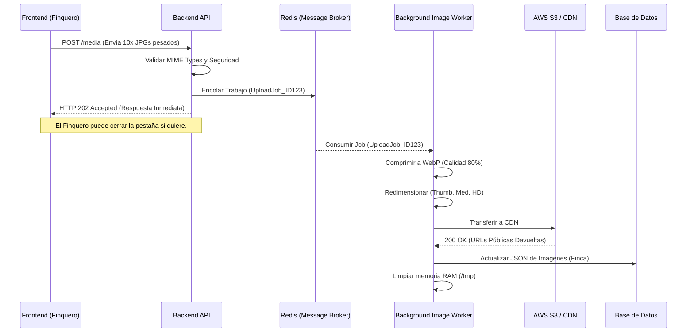

# 7. Especificación del Módulo: MOD-PROP

### 1. Metadatos del Documento
**Proyecto:** Nos Fuimos de Finca
**Fase:** 3 — Ingeniería de Requisitos
**Entregable:** 7 de 7 (Capa 2: Especificación Modular)
**Módulo:** MOD-PROP (Gestión de Propiedades, Geometría y Multimedia)
**Estado:** Aprobado

### 2. Requerimientos Base
#### 2.1 Requerimientos Funcionales (FR)
- **[CR-PROP-01]** El sistema debe permitir a los Finqueros crear y gestionar el perfil de sus fincas, incluyendo Reglas Base de negocio (Precio por noche, Mínimo de noches, Capacidad máxima y Amenidades JSONB).
- **[CR-PROP-02]** El sistema debe generar dinámicamente un "Slug" SEO-Friendly (Ej. `/finca-sol-melgar-123`) para permitir la indexación orgánica en Google.
- **[CR-PROP-03]** El sistema debe orquestar un "Pipeline Asíncrono" de procesamiento de imágenes. Las fotografías subidas por el dueño deben ser convertidas a formato `.WebP` y redimensionadas a múltiples tamaños (Thumbnail, Galería, HD) en segundo plano.
- **[CR-PROP-04]** El sistema debe registrar las coordenadas geográficas de la finca (Latitud y Longitud) como un objeto espacial geométrico (`POINT`) para habilitar búsquedas por mapa.
- **[CR-PROP-05]** El sistema debe proveer una vista de "Perfil Público" de solo lectura accesible para cualquier Turista anónimo sin necesidad de iniciar sesión (`MOD-AUTH`).

#### 2.2 Requerimientos No Funcionales Modulares (NFR)
- **[NFR-PROP-01]** Integridad Referencial (Soft Delete): Queda estrictamente prohibido utilizar comandos SQL `DELETE` sobre la tabla de Fincas si la propiedad posee historial en `MOD-RSV` o `MOD-CAL`. La eliminación debe ser manejada mediante Borrado Lógico (`is_active = false`).
- **[NFR-PROP-02]** Rendimiento I/O (Content Delivery Network): Ninguna imagen optimizada por el `CR-PROP-03` podrá ser almacenada en el File System local del servidor de la API ni servida mediante endpoints tradicionales. Todo activo multimedia debe delegarse a una CDN externa (Ej. AWS S3 + CloudFront o Cloudinary) para prevenir estrangulamiento de Ancho de Banda y proteger el rendimiento general de la plataforma.

### 3. Historias de Usuario (User Stories)
| ID | Como [Actor] | Quiero [Acción] | Para [Valor] | FR Origen |
| --- | --- | --- | --- | --- |
| US-PROP-01 | Finquero | Subir 20 fotos de mi finca desde mi celular sin que la página se congele. | Terminar de armar mi catálogo rápido y sin frustraciones. | CR-PROP-03 |
| US-PROP-02 | Turista | Cargar la página de una finca instantáneamente en mi celular con mala señal. | Ver las fotos sin tener que esperar 1 minuto mirando una pantalla blanca. | NFR-PROP-02 |
| US-PROP-03 | Agencia | Desactivar (ocultar) una de mis fincas porque entró en remodelación, pero sin borrar su historial financiero. | Poder volver a activarla en el futuro y mantener intacto el reporte de mis ingresos en el `MOD-DASH`. | NFR-PROP-01 |
| US-PROP-04 | Turista | Poder enviarle por WhatsApp el link de la finca a mi familia (Ej. `nosfuimosdefinca.com/fincas/villa-sol`). | Que ellos puedan ver la finca directamente sin tener que crear una cuenta o registrarse. | CR-PROP-02 / 05 |

### 4. Casos de Uso (Use Cases)

#### UC-PROP-01: Creación de Propiedad y Generación de Slug
- **Actor:** Finquero
- **Trigger:** Finquero completa el formulario del paso 1 y oprime "Guardar y Continuar".
- **Main Success Scenario:**
  1. Frontend envía POST `/api/properties` con el JSON de datos.
  2. Backend verifica en `MOD-AUTH` que el JWT del finquero tenga el atributo KYC aprobado (`is_verified: true`).
  3. Backend toma el nombre "Villa Sol Melgar" y genera el Slug `villa-sol-melgar-{UUID_corto}`.
  4. Inserta el registro en BD incluyendo el `POINT(lat, lng)`.
  5. Retorna HTTP 201 Created con el ID asignado.
- **Exception Flows:**
  - **2a. Bloqueo KYC:** Si el usuario no ha subido sus documentos de identidad al `MOD-AUTH`, el Backend aborta y retorna HTTP 403 Forbidden ("Debe verificar su identidad antes de publicar propiedades").

#### UC-PROP-02: Pipeline Multimedia Asíncrono (Fotos)
- **Actor:** Finquero
- **Trigger:** Finquero arrastra 10 fotografías (JPG/PNG de 10MB) al área de carga.
- **Main Success Scenario:**
  1. Frontend envía POST `/api/properties/{id}/media` con los archivos en formato `multipart/form-data`.
  2. Backend verifica firmas MIME, almacena temporalmente en `/tmp/uploads`, y delega inmediatamente el procesamiento a un Worker en background (Redis Queue).
  3. Backend retorna **HTTP 202 Accepted** ("Procesando imágenes, puedes continuar").
  4. (Asíncrono) El Worker toma cada JPG de 10MB, lo comprime a `.WebP` de 300KB (HD), 50KB (Galería) y 10KB (Thumbnail).
  5. El Worker transfiere los `.WebP` al Bucket S3 de la CDN y elimina los archivos del `/tmp`.
  6. El Worker actualiza la BD de la Finca con la lista final de URLs públicas.
- **Exception Flows:**
  - **2a. MIME Spoofing / Malware:** Si el archivo se llama "foto.png" pero el análisis MIME detecta que es un binario ejecutable (`.exe`), el Backend elimina el archivo inmediatamente y devuelve HTTP 415 Unsupported Media Type.

#### UC-PROP-03: Renderizado de Perfil Público LCP
- **Actor:** Turista (Anónimo o Logueado)
- **Trigger:** Click en una finca desde el Buscador (`MOD-SRCH`) o link directo de WhatsApp.
- **Main Success Scenario:**
  1. Frontend (Next.js) solicita GET `/api/properties/slug/villa-sol-melgar-xyz`.
  2. Backend busca el registro ignorando el Middleware de Autenticación.
  3. Backend verifica `is_active == true`.
  4. Retorna HTTP 200 OK con el JSON de datos, reglas comerciales y URLs directas a la CDN.
- **Exception Flows:**
  - **3a. Propiedad Desactivada o Baneada:** Si `is_active` es `false`, o si el Admin de la plataforma baneó la finca, el Backend retorna HTTP 404 Not Found genérico o HTTP 410 Gone ("Esta finca ya no está disponible").

#### UC-PROP-04: Eliminación Segura (Soft Delete B2B)
- **Actor:** Finquero
- **Trigger:** Finquero entra a la configuración avanzada y oprime "Eliminar Finca".
- **Main Success Scenario:**
  1. Frontend envía DELETE `/api/properties/{id}`.
  2. Backend verifica las reglas de Negocio: Cruza el ID con `MOD-RSV`.
  3. ¿Existen reservas en estado `PENDING_PAYMENT`, `AWAITING_HOST_CONFIRMATION` o `HOST_CONFIRMED` en el futuro? **No.**
  4. Backend ejecuta `UPDATE properties SET is_active = false WHERE id = {id}` (Evita usar DELETE).
  5. Retorna HTTP 200 OK.
- **Exception Flows:**
  - **3a. Restricción Relacional (Reservas Pendientes):** Si la finca tiene una reserva de un turista que pagó para ir en 2 semanas, el Backend aborta y retorna HTTP 409 Conflict ("No puede eliminar una finca con reservas activas. Cancele las reservas primero asumiendo la penalidad o espere a que terminen").

### 5. Diagrama de Actividad Lógica (Pipeline Multimedia Asíncrono)

### 6. Implicación de Compuerta de Fase
- **¿Bloquea el avance?:** No.
- **Condición:** Proceed. El Módulo de Propiedades está formalizado a nivel Enterprise. Su diseño previene el desastre de Integridad de Datos (Mediante la regla estricta de "Soft Delete") y garantiza la experiencia de usuario B2C (NFR-PROP-02) separando el procesamiento pesado de imágenes del ciclo de respuesta síncrono, evitando que el servidor caiga por exceso de consumo de RAM (OOM).
