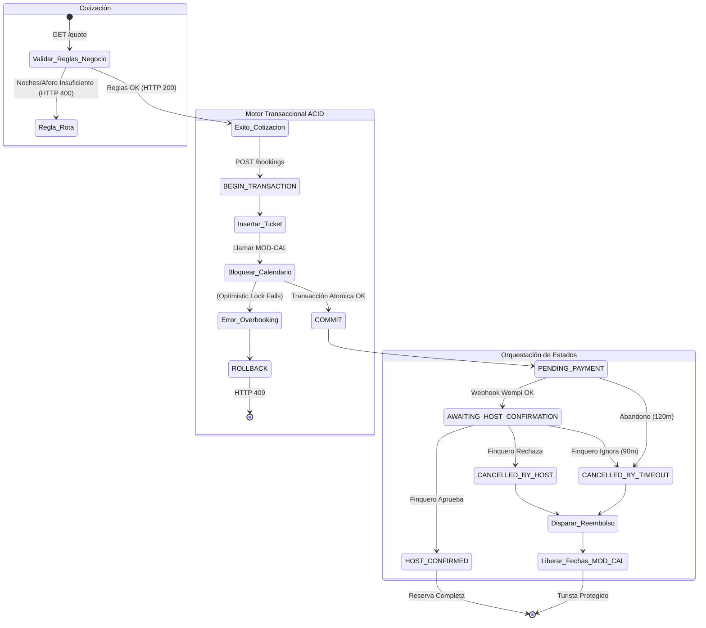

# 7. Especificación del Módulo: MOD-RSV

### 1. Metadatos del Documento
**Proyecto:** Nos Fuimos de Finca
**Fase:** 3 — Ingeniería de Requisitos
**Entregable:** 7 de 7 (Capa 2: Especificación Modular)
**Módulo:** MOD-RSV (Motor Transaccional y Ciclo de Vida de Reservas)
**Estado:** Aprobado

### 2. Requerimientos Base
#### 2.1 Requerimientos Funcionales (FR)
- **[CR-RSV-01]** El sistema debe proveer un Motor de Cotización (Pricing Engine) que valide las reglas de negocio del Finquero (Ej. Mínimo de noches, Capacidad máxima de personas) antes de permitir el checkout.
- **[CR-RSV-02]** El sistema debe crear el Ticket de Reserva con un estado inicial de `PENDING_PAYMENT` y un Token único de transacción para su seguimiento.
- **[CR-RSV-03]** El sistema debe transicionar la reserva a estado `AWAITING_HOST_CONFIRMATION` una vez que la pasarela notifique el pago.
- **[CR-RSV-04]** El Finquero debe poder aprobar manualmente la reserva (Cambiándola a `HOST_CONFIRMED`) o rechazarla (Cambiándola a `CANCELLED_BY_HOST` y disparando reembolso automático).

#### 2.2 Requerimientos No Funcionales Modulares (NFR)
- **[NFR-RSV-01]** Integridad Relacional (ACID Transactions): La creación del ticket de reserva en `MOD-RSV` y el bloqueo de fechas en `MOD-CAL` deben ejecutarse dentro de una Transacción SQL Atómica (`BEGIN TRANSACTION`). Si alguna de las dos tablas falla, el motor debe hacer `ROLLBACK` absoluto para evitar tickets de reserva sin fechas bloqueadas (Corrupción de BD).

### 3. Historias de Usuario (User Stories)
| ID | Como [Actor] | Quiero [Acción] | Para [Valor] | FR Origen |
| --- | --- | --- | --- | --- |
| US-RSV-01 | Turista | Ver el cálculo exacto del precio total de mi viaje. | Saber si entra en mi presupuesto antes de sacar la tarjeta. | CR-RSV-01 |
| US-RSV-02 | Finquero | Que el sistema rechace a turistas que quieran alquilar mi finca por 1 sola noche. | Respetar mis reglas de negocio para que el aseo y logística sean rentables. | CR-RSV-01 |
| US-RSV-03 | Finquero | Tener un botón para "Aprobar" o "Rechazar" al turista que ya pagó. | Filtrar a mis huéspedes si sospecho que van a hacer daños en mi propiedad. | CR-RSV-04 |
| US-RSV-04 | Turista | Que el sistema me devuelva el dinero sin tener que pelear por teléfono si el dueño me rechaza. | Sentirme seguro comprando en la plataforma. | CR-RSV-04 |

### 4. Casos de Uso (Use Cases)

#### UC-RSV-01: Motor de Cotización y Validación (Pricing Engine)
- **Actor:** Turista
- **Trigger:** Turista selecciona fechas e ingresa número de personas.
- **Main Success Scenario:**
  1. Frontend envía GET `/api/bookings/quote?fincaId=1&checkin=...&checkout=...&guests=5`.
  2. Backend verifica en BD las reglas de la Finca: `min_nights` (Ej. 2) y `max_guests` (Ej. 10).
  3. Backend calcula la diferencia de días. (Ej. 3 noches). Cumple `min_nights`.
  4. Backend multiplica: `3 noches * precio_noche`. 
  5. Retorna HTTP 200 OK con el desglose del subtotal.
- **Exception Flows:**
  - **3a. Regla Incumplida (Noches Mínimas):** Si intenta reservar 1 noche y el mínimo es 2, el Backend aborta y retorna HTTP 400 Bad Request ("Esta finca requiere un mínimo de 2 noches").
  - **3b. Regla Incumplida (Aforo):** Si intenta meter 15 personas y el máximo es 10, retorna HTTP 400 Bad Request ("La capacidad máxima ha sido superada").

#### UC-RSV-02: Creación del Ticket de Reserva (Orquestador ACID)
- **Actor:** Turista
- **Trigger:** Turista aprueba la cotización e inicia Checkout.
- **Main Success Scenario:**
  1. Frontend envía POST `/api/bookings` con la intención de compra.
  2. Backend inicia una transacción de BD (`BEGIN`).
  3. Backend inserta registro de Reserva (`status: PENDING_PAYMENT`).
  4. Backend invoca internamente a `MOD-CAL` para emitir el `SOFT_LOCK` de las fechas. Lock exitoso.
  5. Backend invoca a `MOD-PAY` para generar la firma de Wompi.
  6. Backend ejecuta `COMMIT` en la BD.
  7. Retorna HTTP 201 Created.
- **Exception Flows:**
  - **4a. Fallo Atómico (Overbooking detectado):** Si `MOD-CAL` falla al hacer el lock (porque alguien más le ganó el milisegundo), el Backend atrapa la excepción, ejecuta `ROLLBACK` (destruyendo el registro de la reserva del paso 3), y devuelve HTTP 409 Conflict.

#### UC-RSV-03: Transición por Aprobación B2B
- **Actor:** Finquero
- **Trigger:** Finquero oprime "Aprobar Cliente" en su Dashboard o Link de WhatsApp.
- **Main Success Scenario:**
  1. Frontend envía POST `/api/bookings/{id}/approve`.
  2. Backend verifica que el estado actual sea `AWAITING_HOST_CONFIRMATION`.
  3. Backend cambia el estado a `HOST_CONFIRMED`.
  4. Envía evento a `MOD-NOT` para despachar correo de júbilo al Turista ("¡Tu reserva ha sido aprobada!").
  5. Retorna HTTP 200 OK.
- **Exception Flows:**
  - **2a. Reserva Expirada:** Si el Finquero oprime el botón pero ya pasaron los 90 minutos y el CronJob canceló la reserva, el Backend devuelve HTTP 410 Gone ("Esta reserva ha expirado y el dinero fue reembolsado al turista").

#### UC-RSV-04: Transición por Rechazo B2B (Mala Fe o Mantenimiento)
- **Actor:** Finquero
- **Trigger:** Finquero oprime "Rechazar Cliente".
- **Main Success Scenario:**
  1. Frontend envía POST `/api/bookings/{id}/reject`.
  2. Backend verifica que el estado actual sea `AWAITING_HOST_CONFIRMATION`.
  3. Backend cambia el estado a `CANCELLED_BY_HOST`.
  4. Backend invoca a `MOD-PAY` y ejecuta el reembolso del 100% (Refund API).
  5. Backend invoca a `MOD-CAL` y libera las fechas (`HARD_LOCK` -> `AVAILABLE`).
  6. Envía correo de disculpas al turista a través de `MOD-NOT`.
  7. Retorna HTTP 200 OK.

### 5. Diagrama de Actividad Lógica (Ciclo de Vida de la Reserva)

### 6. Implicación de Compuerta de Fase
- **¿Bloquea el avance?:** No.
- **Condición:** Proceed. El `MOD-RSV` se consolidó como el cerebro del proyecto. Sus Casos de Uso conectan toda la arquitectura de validación de reglas, protegen la base de datos de datos corruptos mediante transacciones ACID, y respetan escrupulosamente los derechos comerciales tanto del dueño (derecho a rechazar) como del turista (derecho a reembolso automático).
