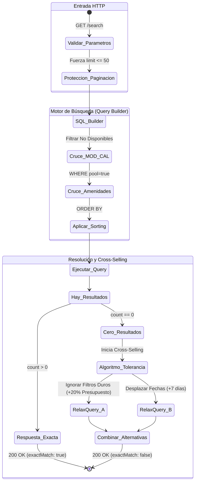

# 7. Especificación del Módulo: MOD-SRCH

### 1. Metadatos del Documento
**Proyecto:** Nos Fuimos de Finca
**Fase:** 3 — Ingeniería de Requisitos
**Entregable:** 7 de 7 (Capa 2: Especificación Modular)
**Módulo:** MOD-SRCH (Motor de Búsqueda, Filtrado y Tolerancia)
**Estado:** Aprobado

### 2. Requerimientos Base
#### 2.1 Requerimientos Funcionales (FR)
- **[CR-SRCH-01]** El sistema debe proveer una búsqueda multifacética (Faceted Search) que permita cruzar parámetros simultáneos: Rango de fechas, Capacidad (Personas), Amenidades booleanas (Piscina, Mascotas, Wifi) y Rango de Precio Mín/Máx.
- **[CR-SRCH-02]** El sistema debe permitir el ordenamiento (Sorting) dinámico de los resultados por variables comerciales (Ej. Mayor Precio, Menor Precio, Mejor Calificación).
- **[CR-SRCH-03]** El sistema debe implementar de manera obligatoria Paginación (Offset/Limit o Cursor-based) para evitar la transferencia masiva de registros hacia el cliente.
- **[CR-SRCH-04]** El sistema debe implementar un algoritmo de "Soft-Match" (Cross-Selling) cuando una búsqueda estricta devuelva 0 resultados, sugiriendo propiedades con fechas ligeramente alteradas o presupuestos similares.

#### 2.2 Requerimientos No Funcionales Modulares (NFR)
- **[NFR-SRCH-01]** Rendimiento LCP (Largest Contentful Paint): La carga inicial del catálogo (Texto + Imágenes WebP) debe completarse en `< 2.5s` en redes 3G.
- **[NFR-SRCH-02]** Eficiencia de Indexación: Las consultas de cruce multifacético en la BD deben resolverse en `< 200ms`. Se exige la implementación arquitectónica de Índices Compuestos (B-Tree o GIN) en las columnas críticas (Precio, Capacidad, JSONB de Amenidades) para evitar "Full Table Scans".

### 3. Historias de Usuario (User Stories)
| ID | Como [Actor] | Quiero [Acción] | Para [Valor] | FR Origen |
| --- | --- | --- | --- | --- |
| US-SRCH-01 | Turista | Filtrar explícitamente fincas que permitan mascotas y tengan piscina. | No perder el tiempo mirando propiedades que no sirven para mi familia. | CR-SRCH-01 |
| US-SRCH-02 | Turista | Ordenar los resultados de "Menor a Mayor Precio". | Encontrar la opción que más se ajuste a mi presupuesto limitado. | CR-SRCH-02 |
| US-SRCH-03 | Turista | Que la página cargue rápido y fluida al bajar por la lista de 500 fincas. | Tener una experiencia ágil como en Airbnb. | CR-SRCH-03 |
| US-SRCH-04 | Turista | Que si busco algo imposible (Ej. Finca para 50 personas a $10), el sistema me ofrezca la opción más cercana. | No frustrarme con una pantalla vacía y encontrar alternativas. | CR-SRCH-04 |

### 4. Casos de Uso (Use Cases)

#### UC-SRCH-01: Ejecución de Búsqueda Multifiltro (Faceted Search)
- **Actor:** Turista
- **Trigger:** Turista llena el formulario del Home y hace click en "Buscar".
- **Main Success Scenario:**
  1. Frontend envía GET `/api/search?checkin=X&checkout=Y&guests=10&amenities=pool,pets&max_price=500000&limit=20&page=1`.
  2. Backend cruza con `MOD-CAL` para descartar fincas bloqueadas.
  3. Backend filtra en `MOD-PROP` aplicando el techo de precio y las amenidades.
  4. La Base de Datos utiliza Índices Compuestos (NFR-SRCH-02) para ejecutar el cruce en `< 200ms`.
  5. Retorna HTTP 200 OK con el Array de las primeras 20 fincas y metadatos de paginación (`total_pages: 5`).
- **Exception Flows:**
  - **1a. Paginación Abusiva (Protección DDoS):** Si un cliente altera la URL y envía `limit=10000` intentando tumbar el servidor (OOM), el Backend ignora el parámetro y fuerza `limit=50`.

#### UC-SRCH-02: Algoritmo de Tolerancia Comercial (Cross-Selling)
- **Actor:** Sistema (Backend)
- **Trigger:** La consulta principal del `UC-SRCH-01` devuelve una longitud (length) de `0`.
- **Main Success Scenario:**
  1. El Backend detecta `results.length === 0`.
  2. En lugar de retornar vacío, inicia un sub-proceso de "Relaxed Query" (Aflojar variables).
  3. Ejecuta Búsqueda Alternativa A: Mismas fechas, pero ignora el filtro de "Mascotas" o el "Precio Máximo" (Techo +20%).
  4. Ejecuta Búsqueda Alternativa B: Mismos filtros estrictos, pero rodando las fechas al siguiente fin de semana.
  5. Retorna HTTP 200 OK adjuntando `exactMatch: false` y dos Arrays (`alternativesPrice`, `alternativesDates`).
- **Exception Flows:**
  - **3a. Cero Absoluto:** Si las búsquedas alternativas también arrojan cero resultados, entonces sí devuelve HTTP 200 OK con Array vacío y el Frontend pinta el estado "No encontramos nada en toda la plataforma".

#### UC-SRCH-03: Ordenamiento Dinámico (Sorting)
- **Actor:** Turista
- **Trigger:** Turista hace click en el dropdown "Ordenar por: Menor Precio".
- **Main Success Scenario:**
  1. Frontend repite la última petición pero añade `&sort=price_asc`.
  2. Backend ejecuta la consulta inyectando `ORDER BY base_price ASC`.
  3. Retorna HTTP 200 OK con la página 1 ordenada correctamente.
- **Exception Flows:**
  - **1a. Sort Injection (Seguridad):** Si el Frontend envía `sort=DROP TABLE users`, el Backend valida contra una Lista Blanca (Whitelist: `price_asc`, `price_desc`, `rating_desc`). Si no está en la lista, ignora el parámetro y ordena por defecto.

### 5. Diagrama de Actividad Lógica (Pipeline de Consulta)

### 6. Implicación de Compuerta de Fase
- **¿Bloquea el avance?:** No.
- **Condición:** Proceed. El Módulo de Búsqueda ha evolucionado de un simple filtro de fechas a un embudo de conversión (Funnel) avanzado. Al establecer un "Exception Flow" para la paginación abusiva y un NFR para obligar el uso de Índices Compuestos, garantizamos que el servidor soportará alto tráfico. El algoritmo de tolerancia es vital para retener turistas en la plataforma en lugar de que salten a la competencia.
