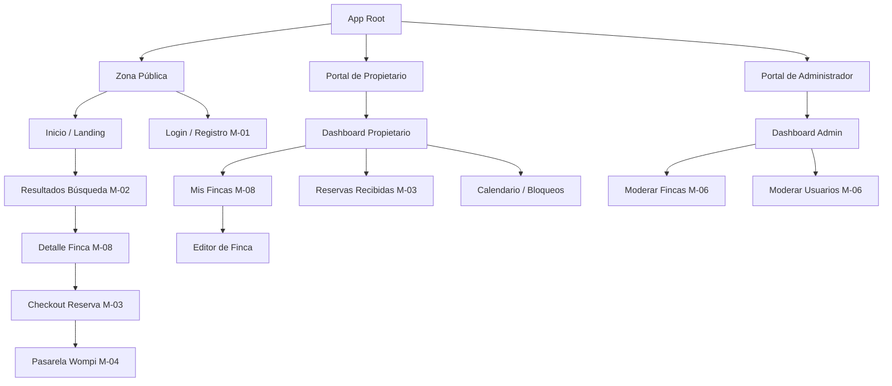

# Entregable 1 (D1): Estrategia de Contenido y Arquitectura de Información

**Proyecto:** Nos Fuimos de Finca
**Fase:** 4 — Modelado del Sistema
**Estado:** Aprobado

### 2. Taxonomía de Contenido
Una lista categorizada de todos los tipos de datos con los que el usuario interactuará, mapeados al Glosario de Dominio.

| Entidad | Vistas Requeridas | Atributos Centrales a Mostrar | Contexto de Acceso |
| --- | --- | --- | --- |
| **Finca** | Lista (Búsqueda), Detalle (Pública), Formulario (Crear/Editar) | Título, Precio/Noche, Fotos, Amenidades, Reglas | Público (Lectura), Propietario (Escritura) |
| **Disponibilidad** | Widget de Calendario (Detalle Finca), Formulario (Bloqueo Masivo) | Vector de Fechas, Estado (Libre, Bloqueo Temporal, Bloqueo Permanente) | Público (Lectura), Propietario (Escritura) |
| **Reserva** | Lista (Historial), Detalle (Voucher), Formulario (Checkout) | Fechas, Monto Anticipo, Estado, Datos Turista | Turista (Propio), Propietario (Lista), Admin |
| **Perfil/Actor** | Formulario (Registro/Login), Detalle (Cuenta) | Nombre, Email, Teléfono, Rol, Estado Cuenta | Propio (Editar), Admin (Suspender) |
| **Reseña** | Lista (En Detalle Finca), Formulario (Crear) | Estrellas (1-5), Comentario, Fecha | Público (Lectura), Turista (Escritura), Propietario (Responder) |

### 3. Mapa del Sitio Jerárquico
La relación padre-hijo de todas las pantallas de la aplicación.

### 4. Mapeo de Navegación
Cómo acceden los diferentes Roles a los nodos principales del Mapa del Sitio.

| Nodo / Vista | `turista-guest` | `propietario-admin` | `sys-admin` |
| --- | --- | --- | --- |
| **Público Home & Búsqueda** | Acceso Completo | Full Access | Acceso Completo |
| **Checkout (Reserva)** | Full Access (if Autenticación) | Denegado | Denied |
| **Portal Propietario** | Denegado | Acceso Completo | Denegado |
| **Gestión Fincas Propias**| Denegado | Acceso Completo | Denegado |
| **Portal Admin** | Denegado | Denied | Acceso Completo |
| **Moderación Global** | Denegado | Denied | Acceso Completo |
