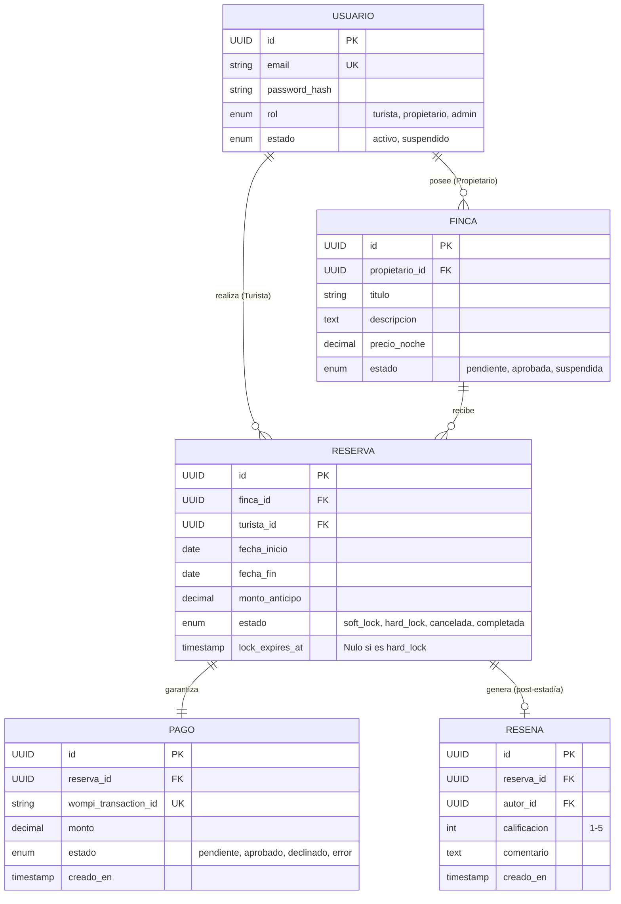

# Entregable 6 (D6): Modelo de Dominio y ERD Conceptual

**Proyecto:** Nos Fuimos de Finca
**Fase:** 4 — Modelado del Sistema
**Estado:** Aprobado

### 1. Modelo Conceptual de Datos (ERD)

Este modelo conceptual mapea las entidades core para soportar la arquitectura de 9 módulos. La concurrencia transaccional recae en la tabla `Reserva`.

### 2. Restricciones de Entidad y Reglas de Negocio
- **Reserva.estado:**
  - `soft_lock`: Se establece en el momento en que el usuario avanza al pago. El campo `lock_expires_at` se configura a `now() + 15 mins`. Durante este estado, estas fechas no pueden ser tomadas por otra Reserva.
  - `hard_lock`: Se consolida cuando Wompi envía el Webhook aprobado. `lock_expires_at` se vuelve nulo (bloqueo permanente).
  - *Automated Cleanup*: Un Worker o Cron en DB purgará/cancelará las reservas en `soft_lock` donde `lock_expires_at < now()`.
- **Finca.estado:**
  - `pendiente`: Estado inicial al ser creada (FCNT). Solo visible para el Propietario y Admin.
  - `aprobada`: Visible en el buscador público (SRCH). Solo el Admin puede pasarla a este estado (PADM).
- **Reseña:** 
  - Solo puede existir si la Reserva atada está en estado `completada` (Validación cruzada RSV-REV).
