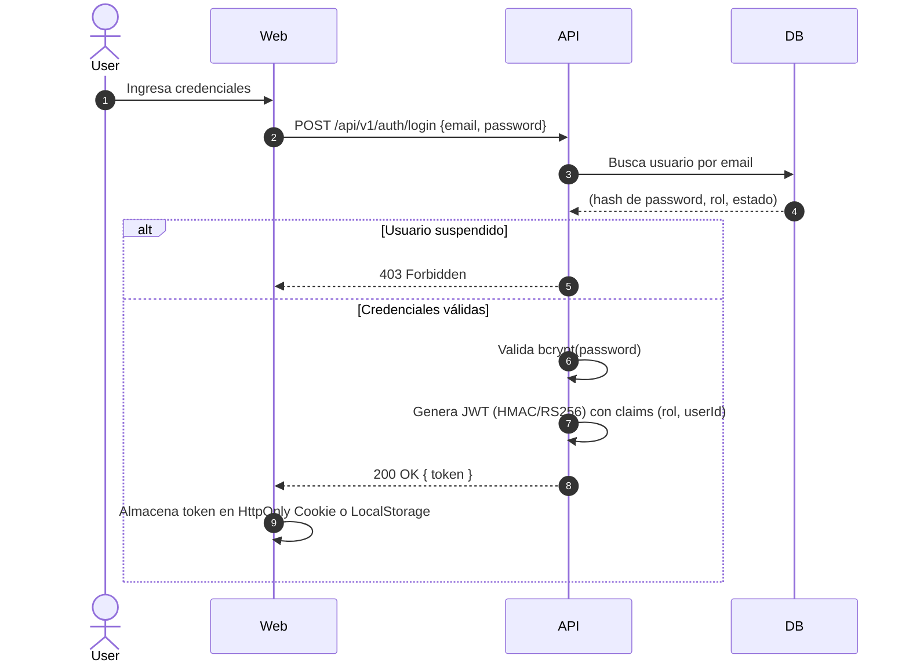

# Entregable 7 (D7): Diagramas de Secuencia del Sistema (MOD-AUTH)

**Proyecto:** Nos Fuimos de Finca
**Fase:** 4 — Modelado del Sistema
**Módulo:** MOD-AUTH (Autenticación)
**Estado:** Aprobado

### 1. SSD: Login y Emisión de JWT

