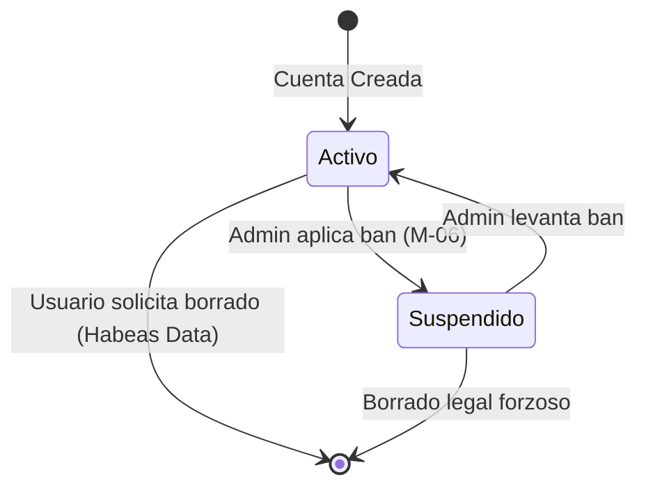

# Entregable 8 (D8): Diagramas de Máquina de Estado y Actividad (MOD-AUTH)

**Proyecto:** Nos Fuimos de Finca
**Fase:** 4 — Modelado del Sistema
**Módulo:** MOD-AUTH (Autenticación)
**Estado:** Aprobado

### 1. Máquina de Estados: Estado de Cuenta de Usuario

