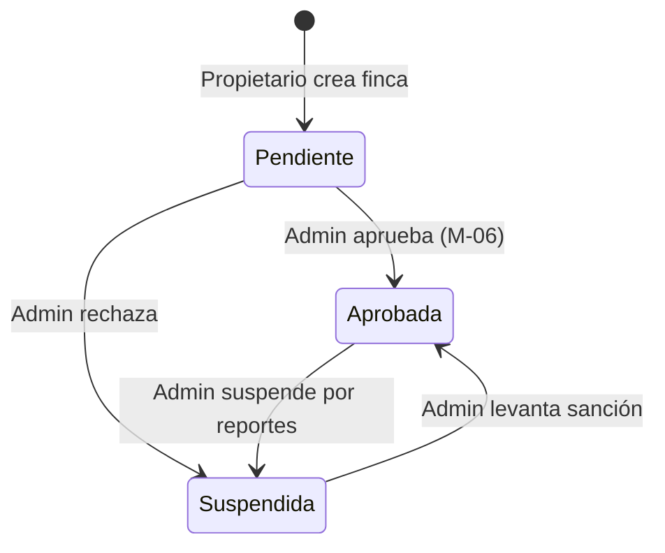

# Entregable 8 (D8): Diagramas de Máquina de Estado y Actividad (MOD-FCNT)

**Proyecto:** Nos Fuimos de Finca
**Fase:** 4 — Modelado del Sistema
**Módulo:** MOD-FCNT (Gestión de Contenido de Fincas)
**Estado:** Aprobado

### 1. Máquina de Estados: Estado de la Finca

