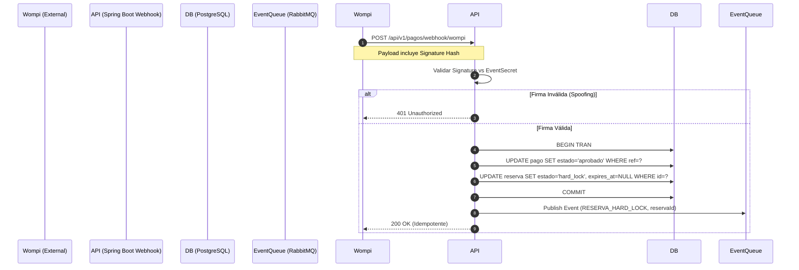
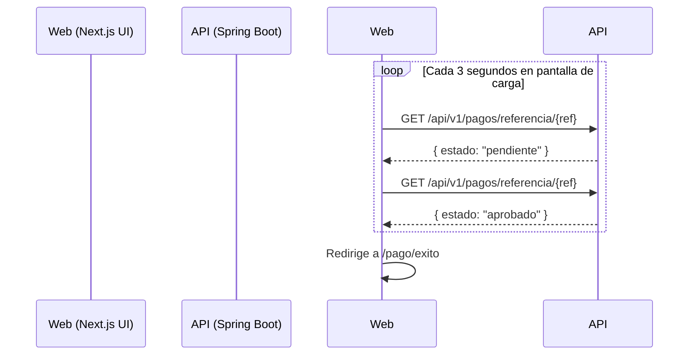

# Entregable 7 (D7): Diagramas de Secuencia del Sistema (MOD-PAY)

**Proyecto:** Nos Fuimos de Finca
**Fase:** 4 — Modelado del Sistema
**Módulo:** MOD-PAY (Pagos y Facturación)
**Estado:** Aprobado

### 1. SSD: Webhook de Wompi y Promoción a Hard-Lock

Este diagrama modela el flujo asíncrono donde Wompi confirma que el pago fue exitoso, disparando la inmutabilidad de la reserva.

### 2. SSD: Polling de Estado por parte del Frontend
Dado que el Webhook es server-to-server, el frontend móvil del turista debe enterarse del resultado.

