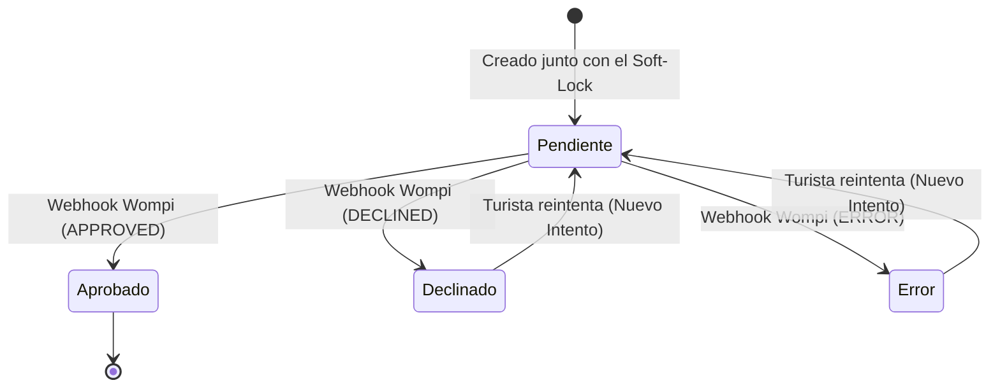

# Entregable 8 (D8): Diagramas de Máquina de Estado y Actividad (MOD-PAY)

**Proyecto:** Nos Fuimos de Finca
**Fase:** 4 — Modelado del Sistema
**Módulo:** MOD-PAY (Pagos y Facturación)
**Estado:** Aprobado

### 1. Máquina de Estados: Ciclo de Vida del Pago

Mapea directamente con los estados reportados por la pasarela de Wompi.

### 2. Reglas Transicionales
- La transición de `Pendiente` a `Aprobado` en el objeto `Pago` es la que dispara en cascada la transición de `Soft-Lock` a `Hard-Lock` en el objeto `Reserva`. Son operaciones atómicas (en la misma transacción de Base de Datos).
- Un pago `Declinado` no cancela el `Soft-Lock` inmediatamente. El Turista aún puede aprovechar los minutos que le queden de su candado de 15 minutos para ingresar una tarjeta diferente.
