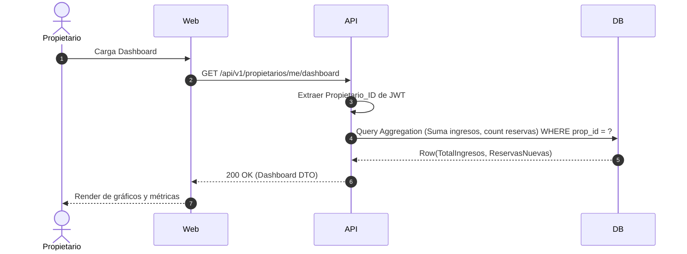

# Entregable 7 (D7): Diagramas de Secuencia del Sistema (MOD-POWN)

**Proyecto:** Nos Fuimos de Finca
**Fase:** 4 — Modelado del Sistema
**Módulo:** MOD-POWN (Panel del Propietario)
**Estado:** Aprobado

### 1. SSD: Dashboard Data Aggregation

