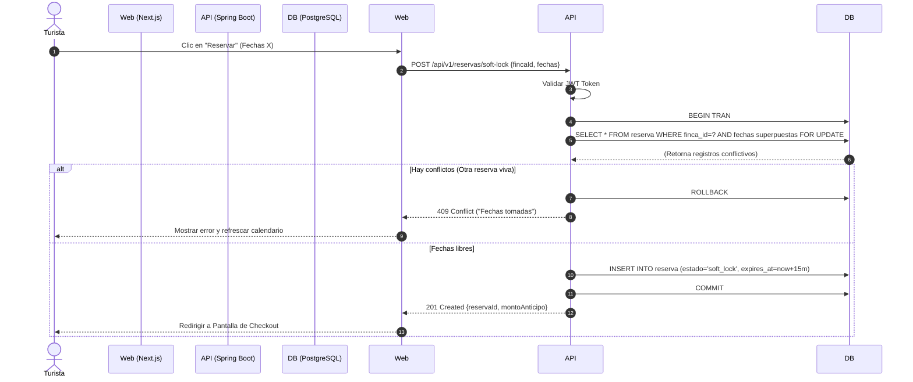
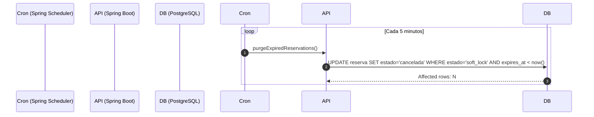

# Entregable 7 (D7): Diagramas de Secuencia del Sistema (MOD-RSV)

**Proyecto:** Nos Fuimos de Finca
**Fase:** 4 — Modelado del Sistema
**Módulo:** MOD-RSV (Gestión de Reservas)
**Estado:** Aprobado

### 1. SSD: Creación de Soft-Lock (Turista)

Este diagrama modela cómo se reserva una finca temporalmente para pasar al pago, garantizando cero colisiones.

### 2. SSD: Cron Job Purgador de Soft-Locks Expirados

