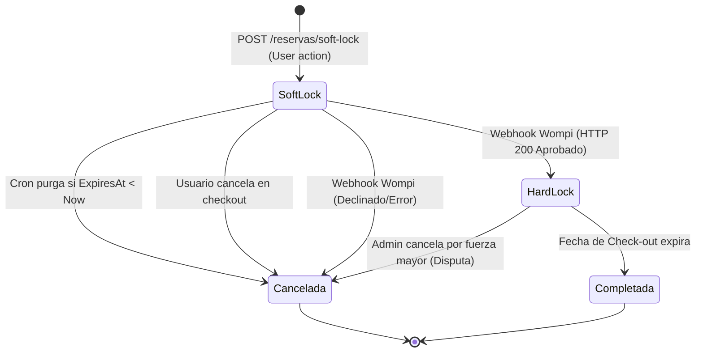

# Entregable 8 (D8): Diagramas de Máquina de Estado y Actividad (MOD-RSV)

**Proyecto:** Nos Fuimos de Finca
**Fase:** 4 — Modelado del Sistema
**Módulo:** MOD-RSV (Gestión de Reservas)
**Estado:** Aprobado

### 1. Máquina de Estados: Ciclo de Vida de la Reserva

La máquina de estados de la entidad `Reserva` es el corazón transaccional del proyecto. Mapea la transición de la intención (Soft-Lock) a la confirmación (Hard-Lock).

### 2. Reglas Transicionales y Eventos Empleados
- **SoftLock a Cancelada (Timeout):** Transición automática. La finca vuelve a estar disponible inmediatamente. No se envía correo (spam).
- **SoftLock a HardLock:** Requiere evento criptográficamente firmado por Wompi (M-04). Al hacer la transición, el campo `expires_at` se hace NULL (bloqueo permanente). Dispara notificación (M-10).
