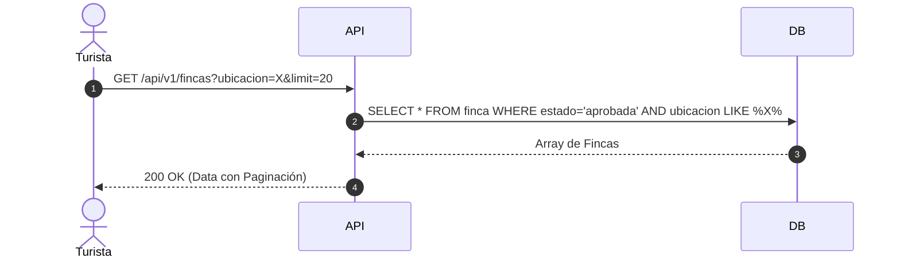

# Entregable 7 (D7): Diagramas de Secuencia del Sistema (MOD-SRCH)

**Proyecto:** Nos Fuimos de Finca
**Fase:** 4 — Modelado del Sistema
**Módulo:** MOD-SRCH (Búsqueda y Navegación)
**Estado:** Aprobado

### 1. SSD: Motor de Búsqueda (Read-Heavy)

*(Nota Arquitectónica: A futuro, esta query puede delegarse a Redis o ElasticBúsqueda si la latencia supera los 200ms).*
