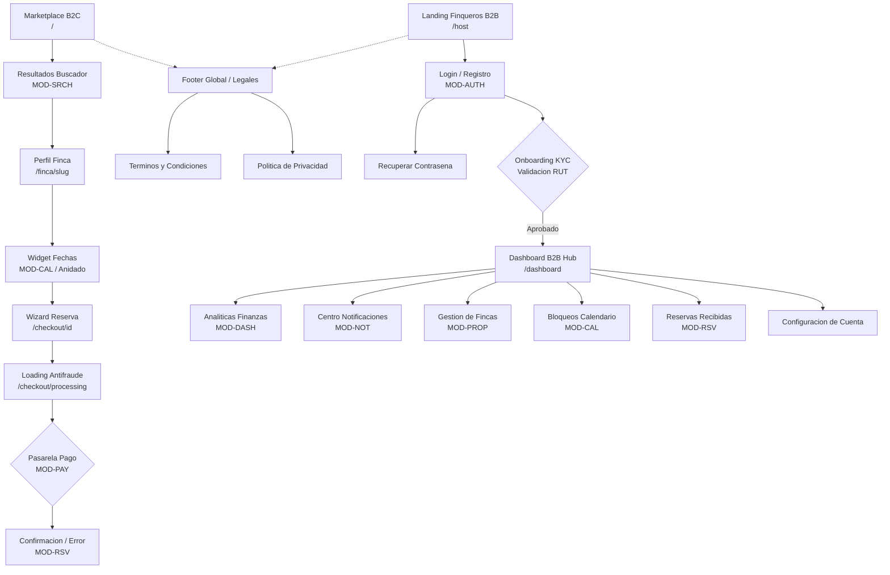

 # Entregable 1 (D1): Estrategia de Contenido y Arquitectura de Informacion

**Proyecto:** Nos Fuimos de Finca
**Fase:** 4 Modelado del Sistema
**Entregable:** 1 de 15 (Arquitectura de Informacion)
**Estado:** Aprobado

---

### 1. Inventario de Informacion (Domain Mapping)

El ecosistema Frontend se descompone en funcion de los 8 modulos criticos de backend definidos en `[[PHASE_3_REQUIREMENTS_ENGINEERING/7.Module_Specification.md]]`. La asimetria de rol es la conclusion arquitectonica central: un mismo modulo genera vistas radicalmente distintas segun el actor.

| Modulo Origen (Fase 3) | Rol | Tipo de Acceso | Necesidad UX Atomica | Patron de Vista |
|:---|:---|:---|:---|:---|
| **`MOD-SRCH`** | Turista | Direccionable | Encontrar la finca ideal cruzando filtros, fechas y amenidades. | **Search Results View** (List + Infinite Scroll) |
| **`MOD-PROP`** | Turista | Direccionable | Ver fotos HD en alta velocidad, leer precios antes de reservar. | **Detail View** (Public Profile, LCP Optimizado) |
| **`MOD-PROP`** | Finquero | Direccionable | Subir fotos asincronamente y editar precio base. | **Form View** (Management Form, Segregated B2B) |
| **`MOD-CAL`** | Turista | Anidado | Saber que dias estan libres antes de iniciar el checkout. | **Widget Embebido** (Date Picker, dentro de Perfil Finca) |
| **`MOD-CAL`** | Finquero | Direccionable | Bloquear manualmente fechas y ver estado del calendario. | **Dashboard View** (Calendar Admin, Segregated B2B) |
| **`MOD-RSV`** | Turista | Direccionable | Ver subtotal, ingresar datos personales e ir a pago. | **Wizard** (Checkout Step-by-Step) |
| **`MOD-RSV`** | Finquero | Direccionable | Aprobar o rechazar solicitudes de reserva entrantes. | **List View** + **Action Modal** (Segregated B2B) |
| **`MOD-PAY`** | Sistema | Anidado | Redirigir al Turista a pasarela externa y esperar confirmacion. | **Action Modal** (Loading/Polling State, Transitorio) |
| **`MOD-DASH`** | Finquero | Direccionable | Ver grafico de ganancias del mes y exportar reporte CSV. | **Dashboard View** (Analytics, Segregated B2B) |
| **`MOD-DASH`** | Agencia | Direccionable | Ver macro-calendario cruzado de todas sus reservas de fincas. | **Dashboard View** (Matrix View, Segregated B2B) |
| **`MOD-AUTH`** | Turista / Finquero / Agencia | Direccionable | Registrarse, iniciar sesion o recuperar contrasena. | **Form View** (Auth Shared Flow) |
| **`MOD-AUTH`** | Finquero | Direccionable | Subir RUT y documentos para validacion KYC. | **Wizard** (Onboarding KYC, Segregated B2B) |
| **`MOD-NOT`** | Finquero / Agencia | Anidado | Ver historial de alertas en tiempo real dentro del dashboard. | **Widget Embebido** (In-App Notification Center) |

---

### 2. Vistas Auxiliares y de Soporte

Vistas transversales de sistema que no nacen de modulos funcionales sino de obligaciones de infraestructura y cumplimiento legal. Fuente: `[[PHASE_3_REQUIREMENTS_ENGINEERING/6.Non-Functional_Requirements]]`.

| Categoria | Ruta de Routing | Proposito / Justificacion |
|:---|:---|:---|
| **Seguridad (Error)** | `/404` | Ruta inexistente o finca eliminada (soft-delete). CTA: "Volver al Buscador". |
| **Seguridad (Error)** | `/403` | Rol autenticado sin permiso sobre el recurso. No revela existencia del recurso. |
| **Seguridad (Error)** | `/500` | Falla critica del SSR o base de datos. Nunca expone stack traces. |
| **Seguridad (Expiracion)** | `/410` | Sesion de pago expirada (TTL 120 min de `MOD-RSV`/`MOD-PAY`). |
| **Transaccional (Loading)** | `/checkout/processing` | Spinner/Skeleton antifraude durante espera de confirmacion de pasarela. Previene doble cobro. |
| **Legal & Compliance** | `/terminos-y-condiciones` | Requisito bloqueante de la pasarela de pago (`MOD-PAY`) para aprobacion del widget de cobro. |
| **Legal & Compliance** | `/politica-de-privacidad` | Requisito Habeas Data (Ley 1581) para recoleccion de emails (`MOD-NOT`) e identidades (`MOD-AUTH`). |
| **Settings (Preferencias)** | `/dashboard/settings` | Panel de configuracion de cuenta del Finquero. Requiere JWT valido. |

---

### 3. Sitemap Jerarquico (Visual Mermaid)

Construccion basada en: Ley de Pertenencia (un unico padre logico por nodo) + Ley de Flujo Causal (orden real de uso del usuario). Referencia: `[[example_step_3_sitemap.md]]`.

---

### 5. Matriz RBAC UI y Restricciones de Routing

Documentado en `[[example_step_4_rbac_mapping.md]]`. Las redirecciones aplican en el Spring Security Filter (Fase 6).

| Nodo del Sitemap (Ruta Frontend) | Roles Permitidos | Estrategia UI | Regla de Routing Inverso (Bloqueo) |
|:---|:---|:---|:---|
| **Buscador B2C** (`/`) | `TOURIST`, `OWNER_API`, `AGENCY_USER` | Shared View | Ninguno. Acceso irrestricto. |
| **Perfil Finca** (`/finca/[slug]`) | `TOURIST`, `OWNER_API`, `AGENCY_USER` | Shared View | Si es el dueno (`OWNER_API`), inyecta "Vista Previa". |
| **Checkout Wizard** (`/checkout/[id]`) | `TOURIST`, `AGENCY_USER` (con ID) | Segregated | Si el Soft-Lock ID es invalido HTTP 302 a `/finca/[slug]`. |
| **Login B2B** (`/login`) | `TOURIST` (no auth) | Segregated | Si JWT activo + `OWNER_API`/`AGENCY_USER` HTTP 302 a `/dashboard`. |
| **Onboarding KYC** (`/onboarding`) | `OWNER_API` (pending) | Segregated | KYC aprobado `/dashboard`. `TOURIST` `/login`. |
| **Dashboard Hub** (`/dashboard/*`) | `OWNER_API` (Ok), `AGENCY_USER` | Segregated | Sin JWT `/login`. `TOURIST` `/`. KYC pending `/onboarding`. |
| **`/terminos`, `/privacidad`** | `guest`, `finquero` | Shared View | Acceso publico obligatorio (requisito regulatorio). |
| **`/404`, `/403`, `/500`, `/410`** | `guest`, `finquero` | Shared View | Acceso publico obligatorio. Sin bloqueo de ruta. |

