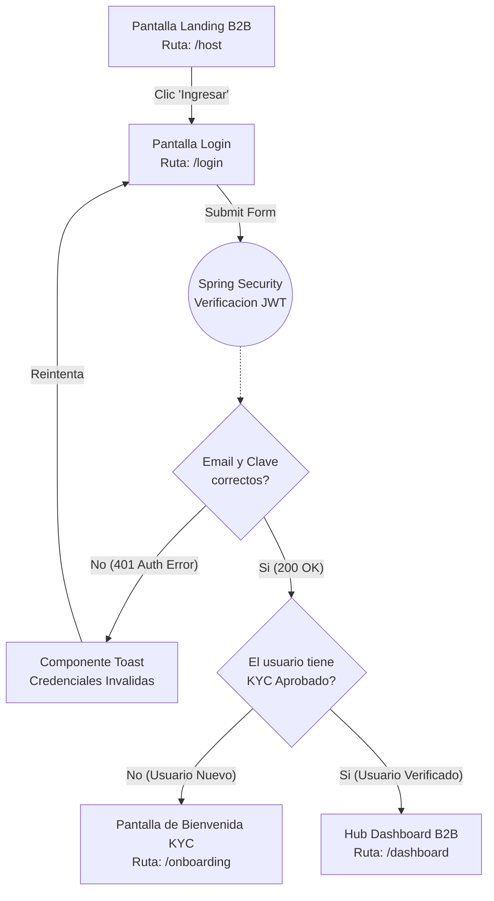
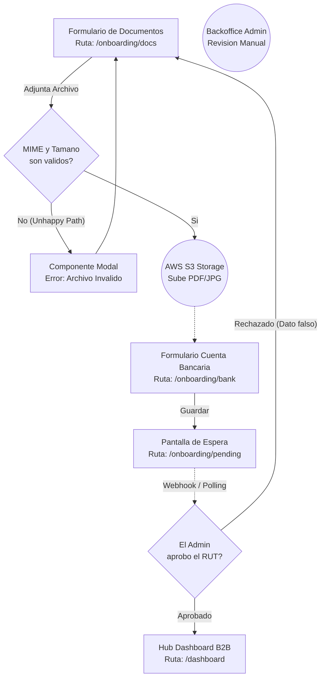
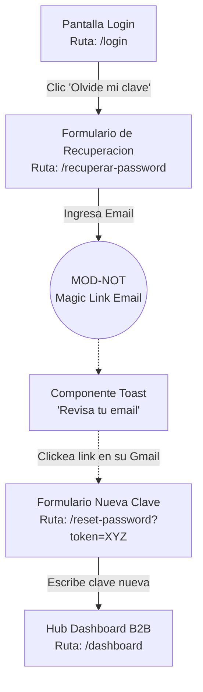

# User Flows: MOD-AUTH (Identidad y Seguridad)

**Project:** Nos Fuimos de Finca
**Phase:** 4 System Modeling (D2)
**Module:** MOD-AUTH
**Status:** Approved

---

## 1. Flow Inventory (Inventario Heuristico)

Basado en los requerimientos de la Fase 3, extraemos las interacciones humanas y las clasificamos bajo las reglas estrictas de UX.

| Caso de Uso Origen (Fase 3) | Tipo de Flujo | Justificacion UX (Regla Aplicada) | Actor |
| :--- | :--- | :--- | :--- |
| **Login B2B / Muro de Seguridad** | **User Flow** | Requiere maquina de estados. Tiene bifurcaciones criticas (JWT expirado, KYC pendiente, contrasena erronea). | Finquero / Turista |
| **Onboarding B2B (KYC)** | **User Flow** | Flujo condicional y asincrono. Sube documentos y debe esperar respuesta del Admin. Requiere vista transitoria (Pending). | Finquero |
| **Recuperar Contrasena** | **Task Flow** | Camino lineal atomico. Ingresa email, recibe link, cambia clave. No hay validaciones complejas de multiples actores. | Universal |

---

## 2. Screen Mapping (Cruce Topologico)

Las interfaces que sustentan los flujos de Autenticacion, cruzadas con el *Sitemap* (D1).

| Flujo | Nodos UI Involucrados (Rutas Reales) | Estado UI Transaccional (Si aplica) |
| :--- | :--- | :--- |
| **Login B2B** | `/host` -> `/login` -> `/dashboard` (Exito) | **Modal Toast:** "Credenciales Invalidas". |
| **Onboarding** | `/onboarding/docs` -> `/onboarding/bank` -> `/dashboard` | **Pending View:** `/onboarding/pending` (Revision manual). |
| **Recovery** | `/login` -> `/recuperar-password` -> `/reset-password` | **Modal Toast:** "Correo Enviado" / "Expirado". |

---

## 3. Visual Flow Modeling (Mermaid)

### 3.1. User Flow: Autenticacion Unificada B2B (`/login`)
El camino del usuario que intenta entrar al Portal B2B, con el "Unhappy Path" del error de credenciales y el Muro KYC.

### 3.2. User Flow: Onboarding B2B (Muro Legal KYC)
El flujo estricto donde el Finquero debe subir su RUT y queda bloqueado hasta que el Administrador de la plataforma lo aprueba.

### 3.3. Task Flow: Recuperacion de Contrasena
Accion lineal y atomica sin decisiones de multiples actores.

