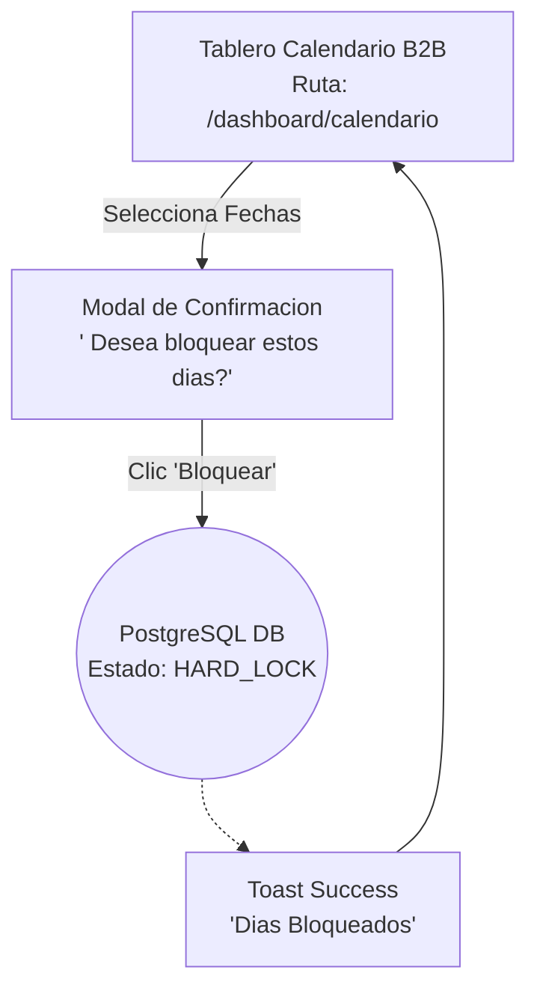

# User Flows: MOD-CAL (Calendario y Disponibilidad)

**Project:** Nos Fuimos de Finca
**Phase:** 4 System Modeling (D2)
**Module:** MOD-CAL
**Status:** Approved

---

## 1. Flow Inventory (Inventario Heuristico)

Basado en los requerimientos de la Fase 3, evaluamos como los conceptos de "Soft-Lock" y "Hard-Lock" se traducen en acciones humanas en el Frontend.

| Caso de Uso Origen (Fase 3) | Tipo de Flujo | Justificacion UX (Regla Aplicada) | Actor |
| :--- | :--- | :--- | :--- |
| **Bloqueo Manual de Fechas (B2B)** | **Task Flow** | El Finquero selecciona fechas y oprime "Bloquear". Es un flujo lineal de administracion sin decisiones sistemicas complejas. | Finquero |
| **Seleccion de Fechas B2C (Soft-Lock)** | **User Flow** | El Turista elige fechas. El sistema debe evaluar disponibilidad real (evitando Double-Booking) y asegurar el "Soft-Lock" por 90 min. | Turista |

---

## 2. Screen Mapping (Cruce Topologico)

Mapeo de los flujos contra los Nodos del Sitemap (D1).

| Flujo | Nodos UI Involucrados (Rutas Reales) | Estado UI Transaccional (Si aplica) |
| :--- | :--- | :--- |
| **Bloqueo Manual B2B** | `/dashboard/calendario` | **Toast Notification:** "Fechas Bloqueadas Exitosamente". |
| **Seleccion Soft-Lock B2C** | `/finca/[slug]` -> `/checkout/[id]` | **Modal/Alert:** "Fechas ocupadas temporalmente por otro usuario". |

---

## 3. Visual Flow Modeling (Mermaid)

### 3.1. Task Flow: Bloqueo Manual de Calendario (Finquero)
El camino administrativo donde el dueno decide cerrar su finca para mantenimiento o uso personal. Es lineal y ocurre completamente dentro del Hub Protegido.



### 3.2. User Flow: Seleccion de Fechas y Soft-Lock (Turista)
El flujo critico Anti-Overbooking. El turista no puede simplemente "elegir" una fecha; el sistema debe asegurar (Locking) los dias exclusivamente para el en la base de datos antes de permitirle ir a la pasarela de pagos.

```mermaid
flowchart TD
    %% Nodos UI
    FincaUI[Perfil Publico de Finca<br>Ruta: /finca/slug]
    WidgetUI[Widget Selector Fechas<br>Componente Anidado]
    CheckoutUI[Wizard de Reserva<br>Ruta: /checkout/id]
    ErrorToastUI[Componente Error<br>Fechas No Disponibles]
    
    %% Nodos Asincronos
    DB((PostgreSQL DB<br>Validacion Transaccional))
    LockCron((Redis / CronJob<br>Timer de 90 Min))
    
    %% Decisiones
    AvailabilityCheck{ Las fechas<br>estan libres?}

    %% Flujo Turista
    FincaUI --> WidgetUI
    WidgetUI --> |Elige Check-in/out<br>Clic 'Reservar'| DB
    
    %% Respuesta Backend
    DB -.-> AvailabilityCheck
    
    %% Unhappy Path (Alguien le gano la reserva milisegundos antes)
    AvailabilityCheck -- No (Ocupado) --> ErrorToastUI
    ErrorToastUI --> FincaUI
    
    %% Happy Path (Se otorgan los 90 minutos)
    AvailabilityCheck -- Si (Libre) --> |Inicia SOFT_LOCK| LockCron
    LockCron -.-> |Genera ID| CheckoutUI
```
