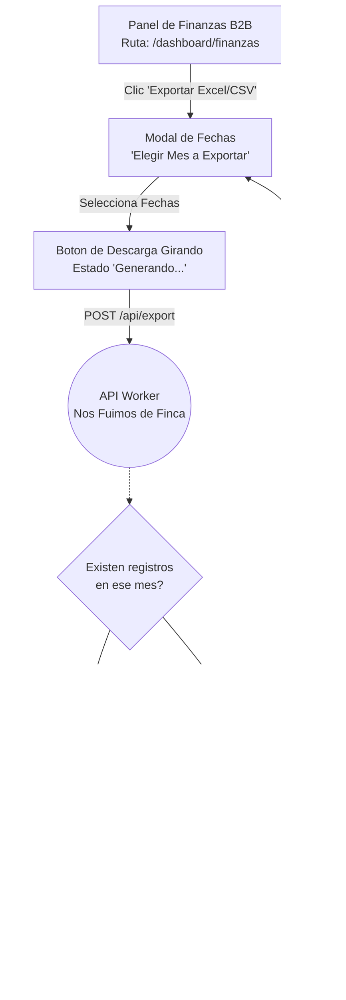

# User Flows: MOD-DASH (Dashboard y Analiticas B2B)

**Project:** Nos Fuimos de Finca
**Phase:** 4 System Modeling (D2)
**Module:** MOD-DASH
**Status:** Approved

---

## 1. Flow Inventory (Inventario Heuristico)

Extraemos las acciones administrativas del Finquero y de la Agencia sobre el panel de control.

| Caso de Uso Origen (Fase 3) | Tipo de Flujo | Justificacion UX (Regla Aplicada) | Actor |
| :--- | :--- | :--- | :--- |
| **Carga de Metricas Dinamicas** | **Task Flow** | El usuario entra y el sistema carga las metricas (Ingresos, Ocupacion). No hay bifurcaciones de decision del usuario. | Finquero / Agencia |
| **Exportacion de Reporte Financiero (CSV)** | **User Flow** | El usuario pide exportar datos. Requiere validacion de seguridad (Data Masking de PII) por parte del servidor antes de entregar el archivo. | Finquero / Agencia |

---

## 2. Screen Mapping (Cruce Topologico)

Las acciones del modulo ocurren integramente dentro del Ecosistema Protegido (B2B Hub).

| Flujo | Nodos UI Involucrados (Rutas Reales) | Estado UI Transaccional (Si aplica) |
| :--- | :--- | :--- |
| **Renderizado Analiticas** | `/dashboard/finanzas` | **Skeleton Loaders:** Se muestran mientras el Backend totaliza los datos. |
| **Exportacion CSV** | `/dashboard/finanzas` | **Toast Notification:** "Descarga Iniciada" o "Error Generando Archivo". |

---

## 3. Visual Flow Modeling (Mermaid)

### 3.1. Task Flow: Renderizado de Metricas y Skeleton Loaders
Demuestra como el Frontend debe pintar "fantasmas" (Skeletons) para evitar una pantalla en blanco mientras la Base de Datos procesa sumatorias pesadas (COUNT, SUM).

```mermaid
flowchart TD
    %% Nodos UI
    SidebarUI[Navegacion Menu Lateral<br>Ruta: /dashboard/*]
    SkeletonUI[Pantalla con Skeleton Loaders<br>Componente UI Transitorio]
    ChartsUI[Pantalla Renderizada (Graficos)<br>Ruta: /dashboard/finanzas]
    ErrorToastUI[Toast Error<br>Fallo de Conexion]
    
    %% Nodos Asincronos
    DB((PostgreSQL DB<br>Agregacion de Datos))
    
    %% Flujo Lineal B2B
    SidebarUI --> |Clic 'Finanzas'| SkeletonUI
    SkeletonUI --> |Fetch API Asincrono| DB
    
    DB -.-> |Timeout / Error 500| ErrorToastUI
    ErrorToastUI --> ChartsUI
    
    DB -.-> |Data Array 200 OK| ChartsUI
    
    %% Nota: ChartsUI reemplaza a SkeletonUI en el DOM.
```

### 3.2. User Flow: Exportacion Financiera y Data Masking (PII)
Este es un flujo condicional de seguridad. El Finquero solicita descargar un CSV con los datos de sus turistas, pero el sistema debe interceptar y enmascarar los correos electronicos (Habeas Data) antes de entregar el archivo.


