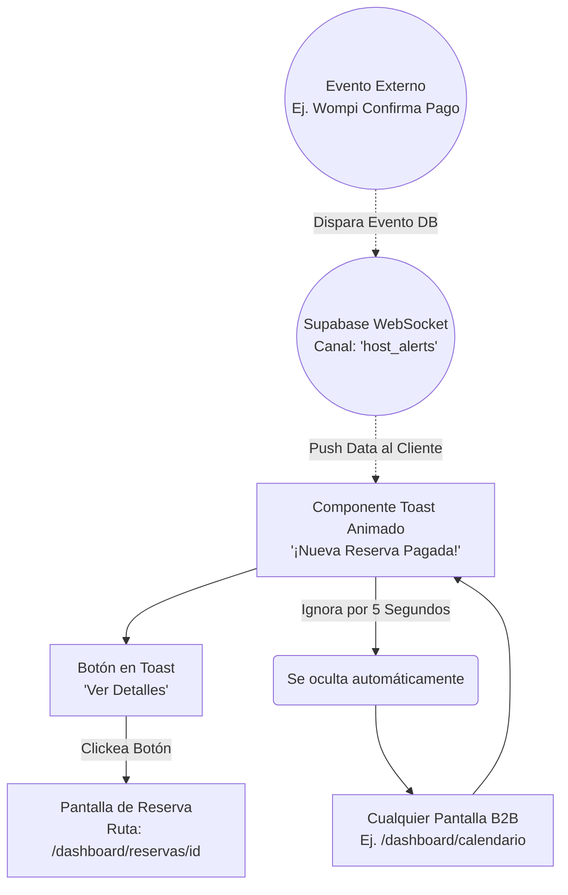

# User Flows: MOD-NOT (Notificaciones y Alertas Asíncronas)

**Project:** Nos Fuimos de Finca
**Phase:** 4 — System Modeling (D2)
**Module:** MOD-NOT
**Status:** Approved

---

## 1. Flow Inventory (Inventario Heurístico)

Extraemos las formas en que el Sistema interrumpe o informa al usuario sobre eventos que sucedieron en segundo plano (WebSockets) o mientras no estaba logueado.

| Caso de Uso Origen (Fase 3) | Tipo de Flujo | Justificación UX (Regla Aplicada) | Actor |
| :--- | :--- | :--- | :--- |
| **In-App Notification Center** | **Task Flow** | El usuario abre la "campanita", lee sus alertas históricas y las marca como leídas. Es un flujo lineal de lectura. | Finquero / Agencia |
| **Toast de Tiempo Real (WebSocket)** | **User Flow** | Un evento externo asíncrono (Ej. "Turista pagó la reserva") empuja un Toast UI a la pantalla del Finquero de la nada, con un botón de acción rápida para redirigirlo a los detalles. | Finquero / Agencia |

---

## 2. Screen Mapping (Cruce Topológico)

Las notificaciones son componentes "Flotantes" que no tienen una URL propia, pero pueden dispararse en cualquier parte del ecosistema protegido B2B.

| Flujo | Nodos UI Involucrados (Rutas Reales) | Estado UI Transaccional (Si aplica) |
| :--- | :--- | :--- |
| **Centro de Notificaciones** | Barra de Navegación B2B (`/dashboard/*`) | **Dropdown View:** Se despliega un panel sobre la pantalla actual. |
| **Toast en Tiempo Real** | Global B2B (Cualquier ruta) | **Componente Toast:** Desaparece a los 5 segundos (Auto-hide). |

---

## 3. Visual Flow Modeling (Mermaid)

### 3.1. Task Flow: Buzón Histórico (Centro de Notificaciones)
El usuario entra activamente a revisar qué pasó mientras no estaba conectado a la aplicación.

### 3.2. User Flow: Interrupción Asíncrona (WebSocket Toast)
Este flujo modela un evento del sistema que es empujado al Frontend sin que el usuario haga absolutamente nada (Real-time). Exige que el Frontend esté suscrito a un canal de Supabase/WebSocket.

