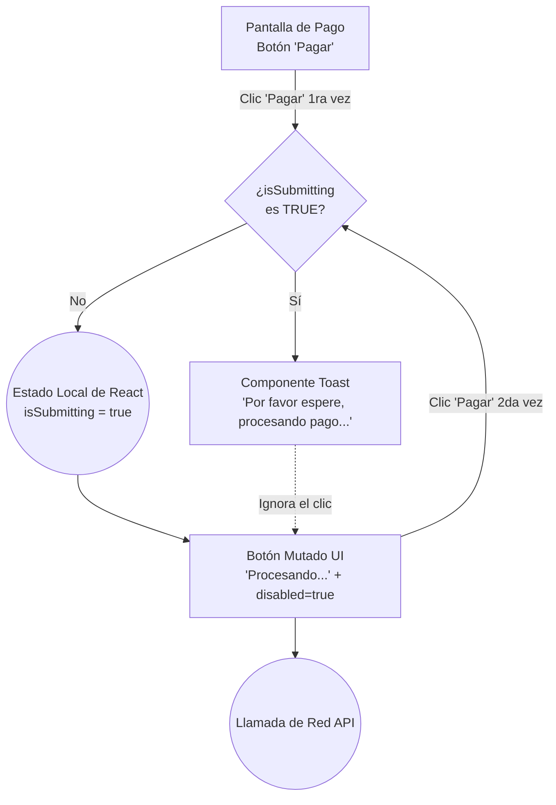

# User Flows: MOD-PAY (Motor Financiero y Pagos)

**Project:** Nos Fuimos de Finca
**Phase:** 4 — System Modeling (D2)
**Module:** MOD-PAY
**Status:** Approved

---

## 1. Flow Inventory (Inventario Heurístico)

Este módulo dicta cómo el dinero fluye a través de la aplicación. Exige un control absoluto de "Unhappy Paths" para evitar fraudes, cobros dobles o multas por la norma PCI-DSS.

| Caso de Uso Origen (Fase 3) | Tipo de Flujo | Justificación UX (Regla Aplicada) | Actor |
| :--- | :--- | :--- | :--- |
| **Procesamiento de Pago Wompi** | **User Flow** | Requiere el bloqueo de la Interfaz Gráfica. Delega la seguridad de los datos de la tarjeta a un tercero (PCI-DSS) y reacciona a los declives bancarios. | Turista |
| **Protección de Idempotencia (Doble Clic)** | **Task Flow** | Regla estricta de UI: Evitar que la desesperación del Turista cause un cobro doble en su tarjeta de crédito. | Turista |

---

## 2. Screen Mapping (Cruce Topológico)

Las transacciones ocurren en el embudo del Checkout, con redirecciones obligatorias a ecosistemas externos (Banco).

| Flujo | Nodos UI Involucrados (Rutas Reales) | Estado UI Transaccional (Si aplica) |
| :--- | :--- | :--- |
| **Flujo Wompi PCI-DSS** | `/checkout/[id]` -> `Wompi UI` -> `/checkout/success` | **Redirección Estricta:** Salida del dominio `nosfuimosdefinca.com`. |
| **Prevención Idempotencia** | `/checkout/processing` | **Botón Bloqueado (`disabled=true`)**: Con Spinner de carga. |

---

## 3. Visual Flow Modeling (Mermaid)

### 3.1. User Flow: Integración Segura Wompi (PCI-DSS)
Este flujo grafica explícitamente cómo nuestro sistema jamás toca los números de la tarjeta del Turista (PAN/CVC). Toda la validación asíncrona ocurre en el ecosistema del proveedor.

### 3.2. Task Flow: Prevención Antifraude (Idempotencia en UI)
Modela el comportamiento milimétrico de la Interfaz Gráfica cuando un usuario está ansioso porque su internet está lento y oprime el botón de pago 5 veces seguidas.

