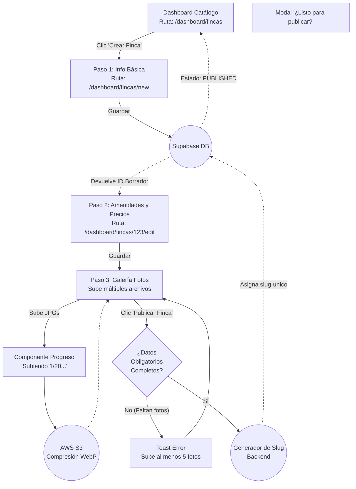
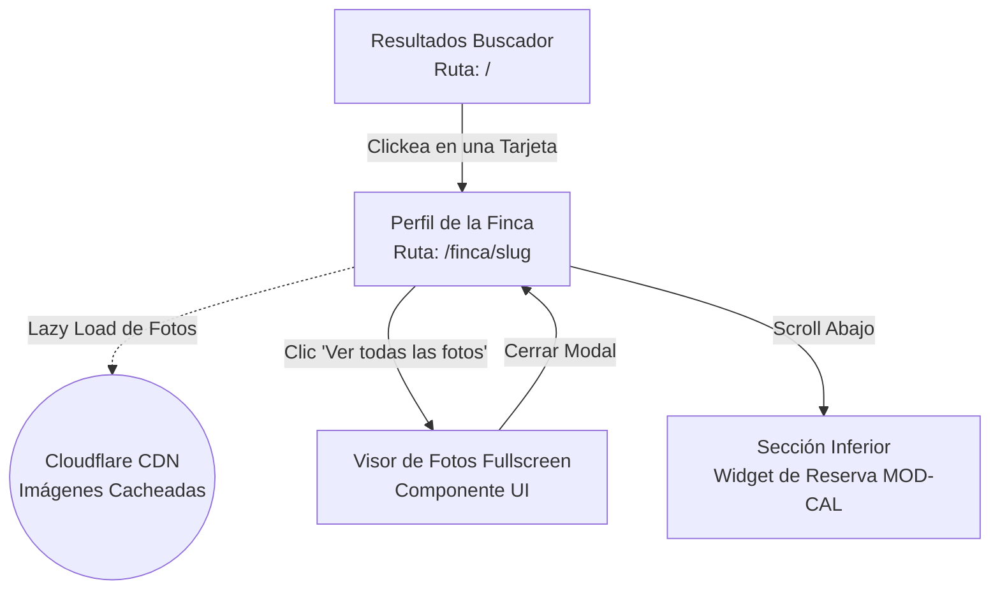

# User Flows: MOD-PROP (Gestión de Propiedades)

**Project:** Nos Fuimos de Finca
**Phase:** 4 — System Modeling (D2)
**Module:** MOD-PROP
**Status:** Approved

---

## 1. Flow Inventory (Inventario Heurístico)

Extraemos cómo el Finquero nutre el catálogo de la plataforma y cómo el Turista lo consume.

| Caso de Uso Origen (Fase 3) | Tipo de Flujo | Justificación UX (Regla Aplicada) | Actor |
| :--- | :--- | :--- | :--- |
| **Pipeline de Creación de Finca** | **User Flow** | Extremadamente complejo. Un formulario gigante dividido en múltiples pasos (Wizard) con subida de imágenes asíncrona, generación de slugs y estado borrador/publicado. | Finquero |
| **Visualización Perfil Público** | **Task Flow** | El turista navega por la URL pública para ver la finca. Flujo de lectura lineal, altamente optimizado en LCP (Largest Contentful Paint). | Turista |

---

## 2. Screen Mapping (Cruce Topológico)

| Flujo | Nodos UI Involucrados (Rutas Reales) | Estado UI Transaccional (Si aplica) |
| :--- | :--- | :--- |
| **Creación Wizard (B2B)** | `/dashboard/fincas/new` -> `/dashboard/fincas/[id]/edit` | **Skeleton / Progress Bar:** "Subiendo 20 imágenes... 45%". |
| **Perfil Finca (B2C)** | `/finca/[slug]` | **Galería Modal:** Visor de imágenes expandido en pantalla completa. |

---

## 3. Visual Flow Modeling (Mermaid)

### 3.1. User Flow: Wizard de Creación de Finca (Pipeline B2B)
Enseñar al Finquero a usar la plataforma requiere dividir el trabajo. Si le mostramos un formulario con 50 campos, se irá. Modelamos un *Wizard* donde la Finca se crea inmediatamente en la DB como "Borrador" y el Finquero puede ir completando pasos a su ritmo.

### 3.2. Task Flow: Visualización Perfil Público (Turista)
El flujo más importante del Marketplace. El turista lee la finca y navega la galería de fotos.

