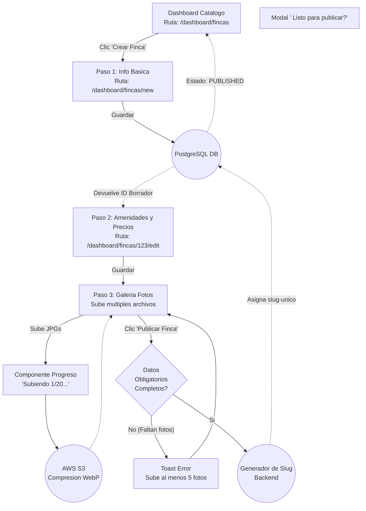

# User Flows: MOD-PROP (Gestion de Propiedades)

**Project:** Nos Fuimos de Finca
**Phase:** 4 System Modeling (D2)
**Module:** MOD-PROP
**Status:** Approved

---

## 1. Flow Inventory (Inventario Heuristico)

Extraemos como el Finquero nutre el catalogo de la plataforma y como el Turista lo consume.

| Caso de Uso Origen (Fase 3) | Tipo de Flujo | Justificacion UX (Regla Aplicada) | Actor |
| :--- | :--- | :--- | :--- |
| **Pipeline de Creacion de Finca** | **User Flow** | Extremadamente complejo. Un formulario gigante dividido en multiples pasos (Wizard) con subida de imagenes asincrona, generacion de slugs y estado borrador/publicado. | Finquero |
| **Visualizacion Perfil Publico** | **Task Flow** | El turista navega por la URL publica para ver la finca. Flujo de lectura lineal, altamente optimizado en LCP (Largest Contentful Paint). | Turista |

---

## 2. Screen Mapping (Cruce Topologico)

| Flujo | Nodos UI Involucrados (Rutas Reales) | Estado UI Transaccional (Si aplica) |
| :--- | :--- | :--- |
| **Creacion Wizard (B2B)** | `/dashboard/fincas/new` -> `/dashboard/fincas/[id]/edit` | **Skeleton / Progress Bar:** "Subiendo 20 imagenes... 45%". |
| **Perfil Finca (B2C)** | `/finca/[slug]` | **Galeria Modal:** Visor de imagenes expandido en pantalla completa. |

---

## 3. Visual Flow Modeling (Mermaid)

### 3.1. User Flow: Wizard de Creacion de Finca (Pipeline B2B)
Ensenar al Finquero a usar la plataforma requiere dividir el trabajo. Si le mostramos un formulario con 50 campos, se ira. Modelamos un *Wizard* donde la Finca se crea inmediatamente en la DB como "Borrador" y el Finquero puede ir completando pasos a su ritmo.

### 3.2. Task Flow: Visualizacion Perfil Publico (Turista)
El flujo mas importante del Marketplace. El turista lee la finca y navega la galeria de fotos.

