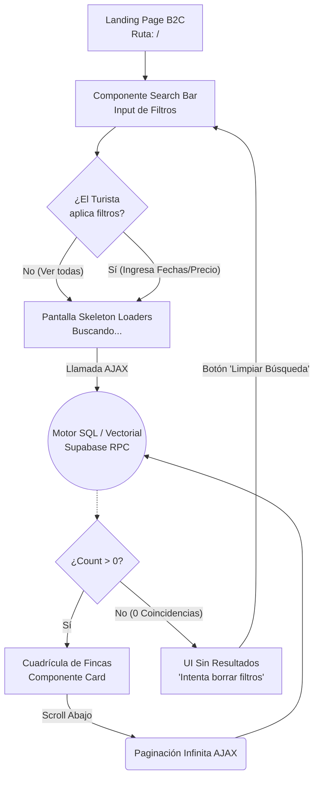

# User Flows: MOD-SRCH (Buscador B2C)

**Project:** Nos Fuimos de Finca
**Phase:** 4 — System Modeling (D2)
**Module:** MOD-SRCH
**Status:** Approved

---

## 1. Flow Inventory (Inventario Heurístico)

Este es el primer punto de contacto del usuario con la plataforma. Exige una latencia mínima y una alta disponibilidad.

| Caso de Uso Origen (Fase 3) | Tipo de Flujo | Justificación UX (Regla Aplicada) | Actor |
| :--- | :--- | :--- | :--- |
| **Búsqueda Parametrizada y Paginación** | **User Flow** | Altamente dinámico. El usuario combina fechas, ubicación y precios, y el Frontend debe responder con Skeleton Loaders, estados vacíos ("No se encontraron fincas") o paginación infinita. | Turista |

---

## 2. Screen Mapping (Cruce Topológico)

| Flujo | Nodos UI Involucrados (Rutas Reales) | Estado UI Transaccional (Si aplica) |
| :--- | :--- | :--- |
| **Motor de Búsqueda** | `/` (Landing Home) -> `/search?q=...` | **Empty State:** "Lo sentimos, no hay fincas con piscina en esas fechas". |

---

## 3. Visual Flow Modeling (Mermaid)

### 3.1. User Flow: Búsqueda Parametrizada y Empty States
Este flujo es vital para el Marketplace. Muestra cómo el Frontend debe reaccionar cuando la base de datos se demora o cuando los filtros del turista son tan estrictos que no existe una finca que cumpla con ellos.

