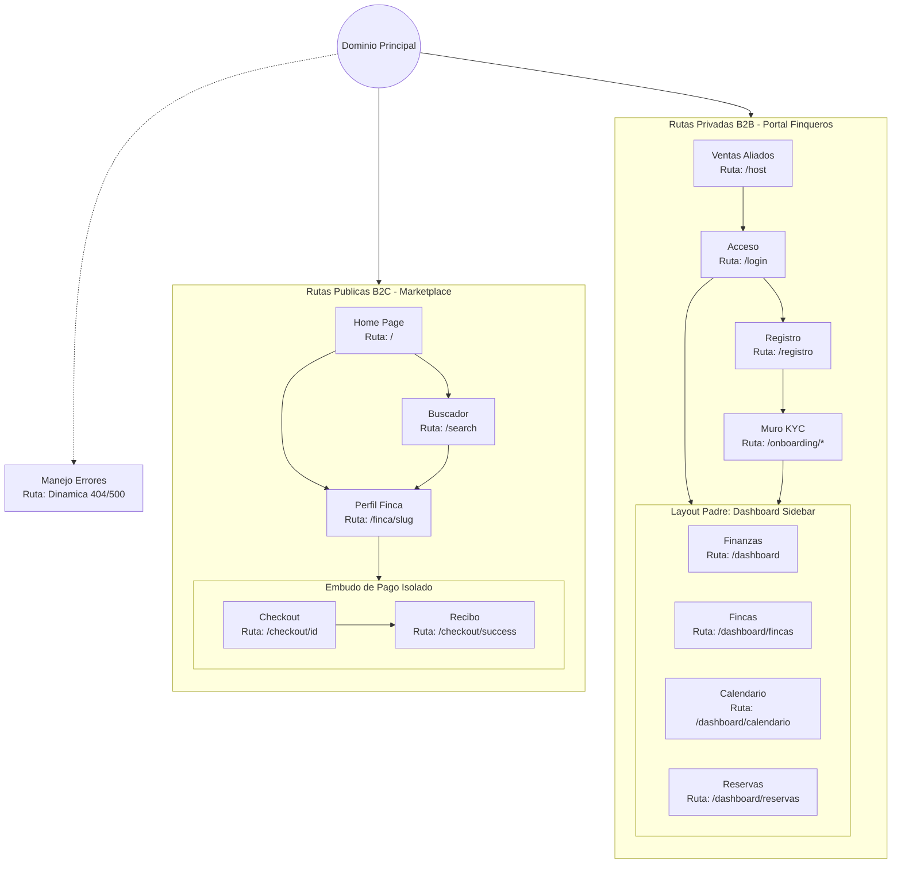

# Inventario Maestro de Paginas (All Pages Index)

**Project:** Nos Fuimos de Finca
**Phase:** 4 System Modeling (D3)

Este documento es el **Mapa Cartografico del Proyecto Frontend**. Enlista todas las pantallas fisicas (Rutas URL) que existiran en la aplicacion y declara que Modulos Funcionales (`MOD-X`) le dan vida a cada una. 

La IA (Director UX) usara este indice para generar los Blueprints individuales en la carpeta `pages/`. El Disenador Humano usara este indice para saber cuantas mesas de trabajo debe crear en Figma.

---

## Mapa Topologico (Sitemap Visual)

Este diagrama muestra la estructura de navegacion y como las rutas anidadas (ej. el Dashboard) comparten un mismo Layout envolvente.

---

## 1. Rutas Publicas B2C (El Marketplace del Turista)

Las pantallas disenadas para conversion y descubrimiento. Carga cognitiva baja, alto impacto visual.

| Ruta (URL) | Nombre de Pantalla | Modulos Funcionales Inyectados | Estado Figma | Link a Blueprint |
| :--- | :--- | :--- | :--- | :--- |
| **`/`** | Home (Landing Page) | `MOD-SRCH` (Buscador), `MOD-PROP` (Grilla de Destacados) | Completado | [[1.home_page]] |
| **`/search`** | Resultados de Busqueda | `MOD-SRCH` (Filtros y Paginacion Infinita) | Completado | [[pages/search_page]] |
| **`/finca/[slug]`** | Perfil de Propiedad | `MOD-PROP` (Galeria y Reglas), `MOD-CAL` (Disponibilidad) | Completado | [[pages/property_page]] |
| **`/checkout/[id]`** | Embudo de Reservas | `MOD-RSV` (Datos y Legal), `MOD-PAY` (Wompi), `MOD-CAL` (Soft-Lock) | Completado | [[pages/checkout_page]] |
| **`/checkout/success`** | Confirmacion de Pago | `MOD-PAY` (Recibo) | Completado | [[pages/checkout_success_page]] |

---

## 2. Rutas Privadas B2B (El Portal del Finquero)

El "Backoffice". Alta densidad de datos, formularios pesados, foco en eficiencia.

| Ruta (URL) | Nombre de Pantalla | Modulos Funcionales Inyectados | Estado Figma | Link a Blueprint |
| :--- | :--- | :--- | :--- | :--- |
| **`/host`** | Landing de Aliados | Estatico B2C (Ventas) | Completado | [[pages/host_landing_page]] |
| **`/login`** | Acceso B2B | `MOD-AUTH` (Autenticacion y Rate Limiting) | Completado | [[pages/login_page]] |
| **`/registro`** | Registro | `MOD-AUTH` (Autenticacion e Identidad) | Completado | [[08.Registration_Page/registration_page]] |
| **`/onboarding/*`** | Muro KYC | `MOD-AUTH` (Subida de Documentos) | Completado | [[pages/onboarding_page]] |
| **`/dashboard`** | Resumen y Analiticas | `MOD-DASH` (Reportes) | Completado | [[pages/dashboard_page]] |
| **`/dashboard/fincas`** | Mis Fincas (Pipeline) | `MOD-PROP` (Lista y Wizard de Creacion) | Completado | [[pages/dashboard_properties_page]] |
| **`/dashboard/calendario`**| Gestor de Fechas | `MOD-CAL` (Hard-Locks y Precios por dia) | Completado | [[pages/dashboard_calendar_page]] |
| **`/dashboard/reservas`** | Buzon de Solicitudes | `MOD-RSV` (Aprobar/Rechazar Reservas) | Completado | [[pages/dashboard_bookings_page]] |

---

## 3. Elementos Globales (Cross-Route)

Componentes flotantes o envolventes que no pertenecen a una URL especifica sino a todas.

| Componente Global | Naturaleza de UI | Modulos Funcionales Inyectados | Estado Figma | Link a Blueprint |
| Componente Global | Naturaleza de UI | Modulos Funcionales Inyectados | Estado Figma | Link a Blueprint |
| :--- | :--- | :--- | :--- | :--- |
| **`GlobalShell`** | Navbar y Footer | Envoltorio General (Ruteo) | Completado | [[GLOBAL_LAYOUT_specs]] |
| **`ErrorHandler`** | Pantalla de Rescate | Transversal (Manejo 404/500) | Completado | [[09.Error_Handler_Page/error_handler_page]] |
| **`NotificationCenter`**| Drawer o Toasts | `MOD-NOT` (Alertas WebSockets) | Pendiente | - |
