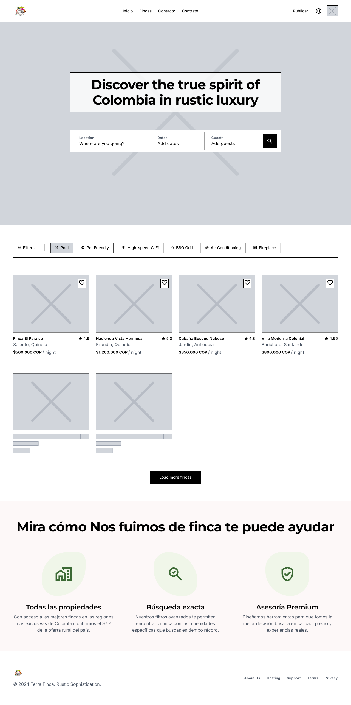

# Wireframe Specifications: `/` (Home B2C)

**Ruta UI:** `/` (Landing Page Pública)
**Requisitos Funcionales Inyectados:** `MOD-SRCH` (Buscador y Tolerancia), `MOD-PROP` (Grilla de Propiedades Destacadas).

---

# RESULTADOS

- **Diagnóstico:** Esta es la fachada comercial (Marketplace) del proyecto. El Turista B2C tiene una carga cognitiva baja inicial; quiere inspirarse (Ver fincas hermosas) pero también quiere utilidad inmediata (Buscar fechas disponibles).
- **Patrón Principal:** `Hero Search + Edge-to-Edge Grid`. 
  - La mitad superior debe ser inmersiva: Una gran imagen de fondo (`Edge-to-Edge`) con el buscador (`MOD-SRCH`) superpuesto en el centro para captar la atención inmediata.
  - La mitad inferior debe usar el patrón `Infinite Card Grid`, mostrando una grilla de tarjetas visuales (`MOD-PROP`) sin distracciones de texto excesivo.

---

## 2. Inventario de UI (Atomic Design)

Diseñador, asegúrate de tener estos *Master Components* en tu Design System de Figma para ensamblar la página de Inicio:

### A. Átomos
- `HeroImage`: Fotografía panorámica de alta calidad de una finca (Asset estático).
- `SearchInput` **(Obligatorio por MOD-SRCH)**: Campo de texto/número. *Variantes: `DateRange`, `GuestCounter`, `PriceSlider`.*
- `FilterChip` **(Obligatorio por MOD-SRCH)**: Píldoras booleanas para amenidades. *Variantes: `Default`, `Selected` (Borde oscuro).*
- `PropertyImage`: Contenedor 4:3 para la foto de la finca. *Debe tener bordes redondeados (`border-radius: 12px`).*
- `PriceTag`: Tipografía en negrita para el precio por noche (Ej. "$500.000 COP / noche").

### B. Moléculas
- `SearchBar` **(Obligatorio por MOD-SRCH)**: Une (`SearchInput` Fechas + `SearchInput` Personas + Botón Primario "Buscar").
- `PropertyCard` **(Obligatorio por MOD-PROP)**: Une (`PropertyImage` + Título + Ubicación + `PriceTag`).

### C. Organismos
- `HeroSection`: Une (`HeroImage` de fondo + Título H1 Aspiracional + `SearchBar` flotando en el centro).
- `FilterDrawer` **(Obligatorio por MOD-SRCH)**: Un panel deslizable (Modal en Mobile, Horizontal en Desktop) que une todos los `FilterChip` y `PriceSlider`.
- `FeaturedGrid` **(Obligatorio por MOD-PROP)**: Une un grid de 12 a 20 `PropertyCard`s apiladas en columnas (1 en Mobile, 4 en Desktop).

---

## 3. Heurísticas Espaciales y Accesibilidad (Layout Rules)

1. **Ley de Fitts (Thumb Zone para Búsqueda):**
   - En Mobile (390px), el `SearchBar` no debe ser un bloque gigante desplegado en el Hero. En su lugar, usa un `Sticky Top Pill` (una píldora pegada al tope que diga "¿Adónde vas?") que al tocarse abra un modal a pantalla completa para que el usuario use sus pulgares cómodamente. En Desktop sí debe ir extendido en el centro.
2. **Accesibilidad (a11y) y Legibilidad:**
   - La `HeroImage` obligatoriamente debe tener un `Overlay` (Capa negra con 40% de opacidad). Esto garantiza que el texto blanco del título H1 y el Buscador tengan un contraste superior a `4.5:1` frente a cualquier fotografía.
3. **Skeleton Loaders (Obligatorio por NFR-SRCH-01 - Percepción de Velocidad):**
   - Para cumplir con el requerimiento de latencia (`LCP < 2.5s`), mientras el `MOD-PROP` consulta la Base de Datos, se deben pintar `Skeleton Cards` grises parpadeantes con la misma forma y tamaño del `PropertyCard`.

---

## 4. The Designer Checklist (Tareas para Figma)

Diseñador, marca con `[x]` cuando hayas dibujado estas mesas de trabajo (`Artboards`) para la ruta `/`:

### ✅ Pantallas Base (Happy Path)
- `[ ]` **Desktop (1440px):** Dibuja el `HeroSection` completo (Imagen + Buscador) y debajo un `FeaturedGrid` con 4 columnas.
- `[ ]` **Mobile (390px):** Dibuja el Hero con la píldora de búsqueda colapsada, y el `FeaturedGrid` en 1 columna.

### ✅ Estados Transitorios (Loaders)
- `[ ]` **Loading Grid (Obligatorio por MOD-SRCH):** Diseña la pantalla de la grilla mostrando 4 `Skeleton Cards` mientras el sistema busca las fincas.

### ✅ Excepciones y Tolerancia Comercial (Unhappy Paths)
- `[ ]` **Empty State Cross-Selling (Obligatorio por MOD-SRCH):** Diseña el estado cuando el turista filtra fincas imposibles (Ej. 50 personas a 1 peso). El sistema lanza `length === 0`. Dibuja un Organismo amigable con una ilustración que diga *"No encontramos coincidencias exactas, pero mira estas opciones similares"*, seguido de una grilla de fincas tolerantes (Otras fechas u otro precio).
- `[ ]` **Drawer de Filtros Abierto (Obligatorio por MOD-SRCH):** Dibuja la vista donde el usuario expande el `FilterDrawer` para seleccionar amenidades (Piscina, Mascotas).
