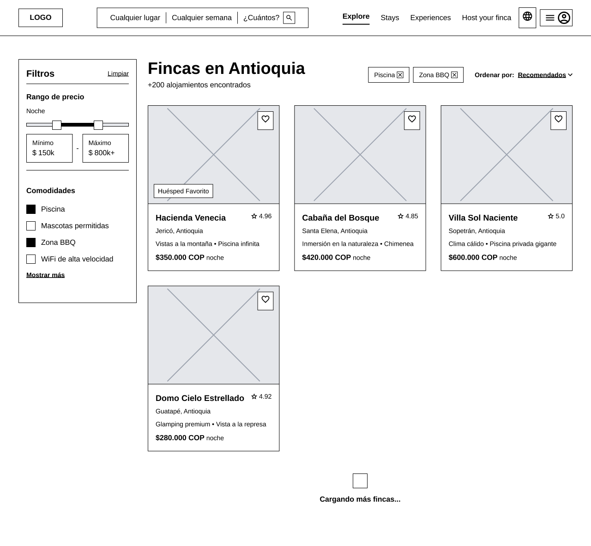
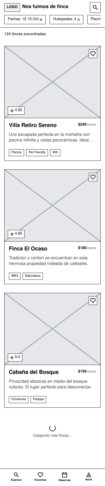

# Wireframe Specifications: `/search` (Resultados de Búsqueda)

**Ruta UI:** `/search` (Catálogo Filtrado)
**Requisitos Funcionales Inyectados:** `MOD-SRCH` (Filtros, Ordenamiento y Paginación Infinita).

---

# RESULTADOS

## 1. Análisis Cognitivo y Patrón UX Recomendado

- **Diagnóstico:** El usuario ya hizo una búsqueda en el Home y ahora está en modo "Evaluación Comparativa". Su carga cognitiva es alta porque está leyendo precios, comodidades y evaluando fotos. Debemos evitar que se sature visualmente.
- **Patrón Principal:** `Sidebar Filters + Infinite Grid` (Desktop) / `Sticky Filter Bar + Modal` (Mobile).
  - **Desktop:** El clásico layout de e-commerce. Menú lateral fijo a la izquierda con todos los filtros de `MOD-SRCH` y una gran grilla a la derecha.
  - **Mobile:** Por falta de espacio, los filtros se esconden tras un botón flotante (`Sticky`) que despliega un modal de pantalla completa. La paginación infinita reemplaza a los botones de "Siguiente página" para no romper el flujo de lectura (Requisito `CR-SRCH-03`).

---

## 2. Inventario de UI (Atomic Design)

Diseñador, asegúrate de tener estos *Master Components* en Figma para ensamblar la página `/search`:

### A. Átomos
- `SortDropdown` **(Obligatorio por MOD-SRCH)**: Menú desplegable para ordenar (Menor precio, Mayor precio, Calificación).
- `CheckboxGroup` **(Obligatorio por MOD-SRCH)**: Lista de checkboxes para seleccionar amenidades (Piscina, Mascotas). *Variantes: `Unchecked`, `Checked`, `Disabled`.*
- `PriceRangeSlider` **(Obligatorio por MOD-SRCH)**: Control deslizante con dos manijas (Mínimo y Máximo).

### B. Moléculas
- `ActiveFilterPill`: Pequeña píldora que muestra un filtro activo (Ej. "Con Piscina ✖️") para que el usuario pueda removerlo rápidamente.
- `PaginationLoader` **(Obligatorio por MOD-SRCH)**: Un texto o icono animado ("Cargando más fincas...") que aparece al final de la página.

### C. Organismos
- `FilterSidebar` **(Obligatorio por MOD-SRCH)**: Bloque vertical que agrupa el `PriceRangeSlider` y múltiples `CheckboxGroup`.
- `MobileFilterModal` **(Obligatorio por MOD-SRCH)**: Versión adaptada del Sidebar que se sobrepone a toda la pantalla en teléfonos.
- `SearchResultsGrid` **(Obligatorio por MOD-PROP)**: Una cuadrícula que recicla las `PropertyCard`s creadas en el Home.

---

## 3. Heurísticas Espaciales y Accesibilidad (Layout Rules)

1. **Gestión de Memoria (Infinite Scroll):**
   - Para evitar que la vista colapse al cargar la página 10 de resultados, en Figma debes indicar que la grilla es dinámica (Paginación Infinita). Al final de la grilla siempre debe haber un espacio reservado para el `PaginationLoader`.
2. **Ley de Proximidad (Filtros Activos):**
   - Las `ActiveFilterPill` deben renderizarse justo debajo del `SortDropdown` y arriba de la grilla de resultados. El usuario necesita ver de un vistazo rápido por qué solo le aparecen 3 fincas (Ej. Ah, es que tengo marcado "Solo Mascotas").
3. **Carga Cognitiva (Mobile Sticky Bar):**
   - En Mobile, el botón de "Filtros" y "Ordenar" debe estar anclado en `Sticky Bottom` (Flotando abajo de la pantalla) para que el pulgar lo alcance instantáneamente sin importar cuánto *scroll* haya hecho el turista.

---

## 4. The Designer Checklist (Tareas para Figma)

Diseñador, marca con `[x]` cuando hayas dibujado estas mesas de trabajo (`Artboards`) para la ruta `/search`:

### ✅ Pantallas Base (Happy Path)
- `[ ]` **Desktop (1440px):** Dibuja el layout de 2 columnas (`FilterSidebar` a la izquierda, `SearchResultsGrid` a la derecha).
- `[ ]` **Mobile (390px):** Dibuja la grilla de resultados ocupando el 100% y el botón de "Filtros" flotando abajo (`Sticky Bottom`).

### ✅ Mutaciones de Estado y Paginación
- `[ ]` **Filtros Abiertos (Mobile) (Obligatorio por MOD-SRCH):** Dibuja el `MobileFilterModal` abierto, mostrando los sliders de precios y checkboxes.
- `[ ]` **Paginación Infinita (Obligatorio por MOD-SRCH):** Dibuja el final de la pantalla mostrando el `PaginationLoader` justo cuando el usuario llega al final de las fincas cargadas.

### ✅ Excepciones (Unhappy Paths)
- `[ ]` **Zero Results (Cross-Selling) (Obligatorio por MOD-SRCH):** Pantalla donde el usuario aplicó demasiados filtros. Dibuja el Empty State tolerante (Como en el Home) sugiriendo *"Borra el filtro de 'Piscina' para ver 40 resultados más"*.
