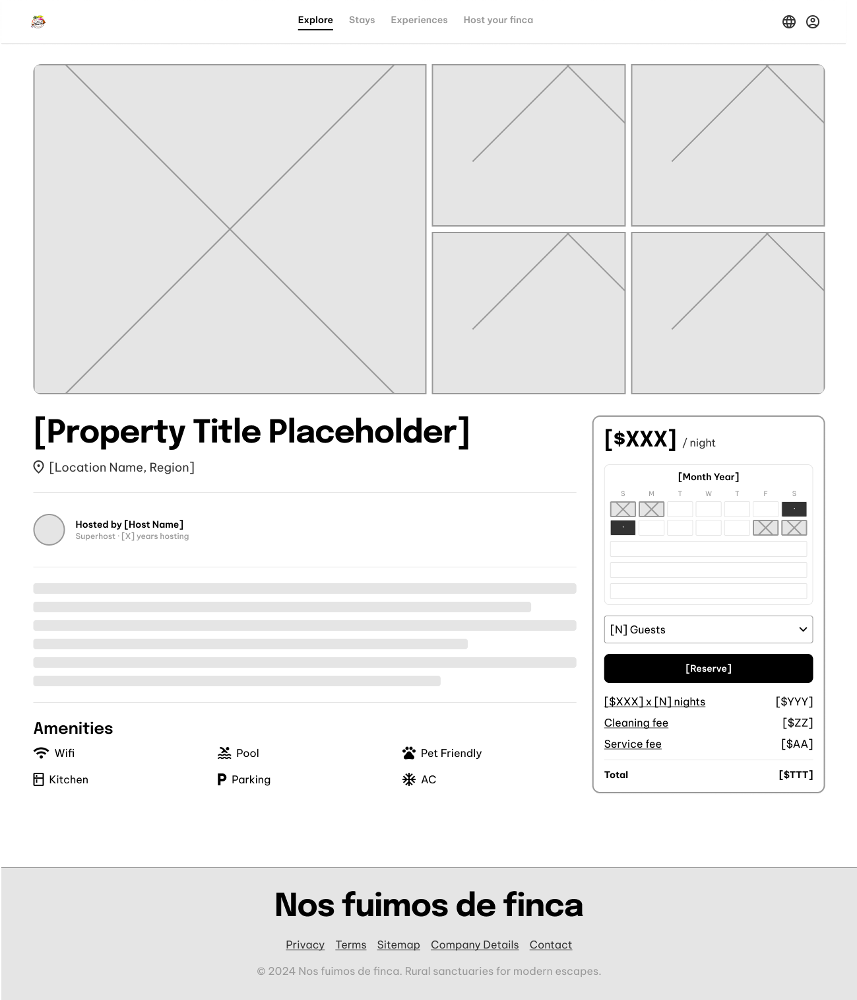
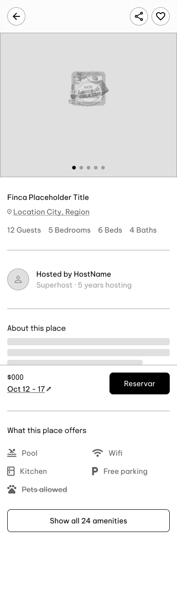

# Wireframe Specifications: `/finca/[slug]` (Perfil de Propiedad)

**Ruta UI:** `/finca/[slug]` (Detalle Comercial de la Finca)
**Requisitos Funcionales Inyectados:** `MOD-PROP` (Galeria Multimedia y Reglas de Negocio), `MOD-CAL` (Motor de Disponibilidad y Soft-Lock).

---

# RESULTADOS

## 1. Analisis Cognitivo y Patron UX Recomendado

- **Diagnostico:** Esta es la pantalla que **cierra la venta**. El turista ya hizo click, ahora quiere enamorarse de las fotos y confirmar si la finca esta libre en sus fechas. La carga cognitiva debe dirigirse 100% a las imagenes y al precio.
- **Patron Principal:** `Bento Grid Gallery + Sticky Sidebar Booking`.
  - **Desktop:** Usa un `Bento Grid` (Una cuadricula asimetrica) en la parte superior para mostrar las 5 mejores fotos. Debajo, divide la pantalla en 2 columnas: 70% izquierda para leer la descripcion, 30% derecha para un `Sticky Widget` (Un panel que baja contigo) que contiene el Calendario y el boton de reservar.
  - **Mobile:** Las fotos se convierten en un carrusel deslizable horizontalmente (Swipe). El boton de reservar se ancla en `Sticky Bottom` para que siempre este al alcance del pulgar, ocultando el calendario hasta que el usuario lo toque.

---

## 2. Inventario de UI (Atomic Design)

Disenador, asegurate de tener estos *Master Components* en Figma para ensamblar el Perfil de la Finca:

### A. Atomos
- `BentoImage` **(Obligatorio por MOD-PROP)**: Contenedor fotografico con radios de borde variables dependiendo de su posicion en la grilla.
- `RuleIcon` **(Obligatorio por MOD-PROP)**: Pequeno icono + texto para mostrar si aceptan mascotas o numero de personas.
- `CalendarDay` **(Obligatorio por MOD-CAL)**: Celda del calendario. *Variantes: `Available`, `Selected`, `HardLocked` (Gris tachado), `SoftLocked` (Gris tachado).*

### B. Moleculas
- `HostProfileBadge`: Foto circular del dueno + Nombre y calificacion.
- `CalendarMonth` **(Obligatorio por MOD-CAL)**: Grilla de 7x5 usando el atomo `CalendarDay`.
- `BookingSummary`: Desglose matematico (Ej. $500k x 2 noches = $1M).

### C. Organismos
- `HeroBentoGallery` **(Obligatorio por MOD-PROP)**: Agrupacion de 5 `BentoImage`s formando un rectangulo perfecto.
- `FullscreenGalleryModal` **(Obligatorio por MOD-PROP)**: Modal oscuro a pantalla completa que permite ver las 50 fotos de la finca con flechas de navegacion.
- `BookingWidget` **(Obligatorio por MOD-CAL)**: Tarjeta flotante que une (Precio + `CalendarMonth` + `BookingSummary` + Boton "Reservar").

---

## 3. Heuristicas Espaciales y Accesibilidad (Layout Rules)

1. **Jerarquia Visual LCP (Largest Contentful Paint):**
   - Segun el NFR de rendimiento de `MOD-PROP`, las imagenes del `HeroBentoGallery` cargaran rapidisimo desde una CDN. Para evitar saltos en la pantalla (Cumulative Layout Shift), el componente debe tener un `aspect-ratio` fijo en CSS (Ej. 16:9 global).
2. **Ley de Fitts (Reserva Inmediata):**
   - En Mobile, el `BookingWidget` no cabe en la pantalla mientras se lee la descripcion. Por tanto, debe estar encogido en un `Sticky Bottom Bar` que solo muestre el precio total y un boton brillante de "Reservar". Si el usuario lo toca, un `BottomSheet` emerge revelando el `CalendarMonth`.
3. **Carga Cognitiva (Feedback de Error):**
   - Si un usuario selecciona fechas en el calendario que estan tachadas (`HardLocked`), el boton de "Reservar" debe mutar a estado `Disabled` de inmediato para prevenir un viaje en vano hacia el servidor.

---

## 4. The Designer Checklist (Tareas para Figma)

Disenador, marca con `[x]` cuando hayas dibujado estas mesas de trabajo (`Artboards`) para la ruta `/finca/[slug]`:

### Pantallas Base (Happy Path)
- `[ ]` **Desktop (1440px):** Dibuja el layout de 2 columnas. A la derecha, el `BookingWidget` debe verse claramente pegado (`sticky`) mientras haces scroll en la columna izquierda.
- `[ ]` **Mobile (390px):** Dibuja el carrusel de imagenes superior y la barra inferior pegajosa (`Sticky Bottom`) con el boton de reserva.

### Mutaciones de Estado y Modulos
- `[ ]` **Galeria Expandida (Obligatorio por MOD-PROP):** Dibuja el `FullscreenGalleryModal` abierto, mostrando como el turista navega foto por foto en pantalla completa.
- `[ ]` **Seleccion de Fechas (Obligatorio por MOD-CAL):** Dibuja el `BookingWidget` reaccionando a la seleccion: El usuario toco dos dias (Check-in y Check-out). Debe aparecer el `BookingSummary` mostrando la multiplicacion matematica del total a pagar.

### Excepciones y Barreras (Unhappy Paths)
- `[ ]` **Overbooking Collision (Obligatorio por MOD-CAL):** Imagina que el turista da clic en "Reservar", pero justo 1 milisegundo antes, otro turista bloqueo esas mismas fechas. Dibuja la pantalla donde el sistema rechaza la accion mostrando un Toast rojo que diga *"Lo sentimos, alguien mas acaba de reservar estas fechas. Por favor, selecciona otras"*.
