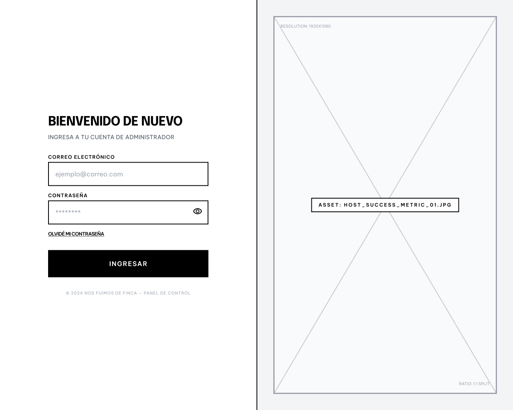

# Wireframe Specifications: `/login` (Acceso B2B)

**Ruta UI:** `/login` (Autenticacion del Finquero/Agencia)
**Requisitos Funcionales Inyectados:** `MOD-AUTH` (Gestion de Identidad, Rate Limiting y Enrutamiento Condicional).

---

# RESULTADOS

## 1. Analisis Cognitivo y Patron UX Recomendado

- **Diagnostico:** El finquero o administrador de agencia entra aqui a trabajar. No busca inspiracion turistica, busca velocidad. Sin embargo, el login puede ser un muro frustrante si olvida la clave o es bloqueado por seguridad.
- **Patron Principal:** `Split-Screen Login`.
  - **Desktop:** Divide la pantalla en 50/50. Lado izquierdo: Un formulario minimalista sobre fondo blanco solido (Baja carga cognitiva). Lado derecho: Una imagen aspiracional de la plataforma (Ej. un finquero feliz ganando dinero) o un espacio para inyectar *Social Proof* (Testimonios).
  - **Mobile:** El formulario ocupa el 100% de la pantalla, centrado verticalmente.

---

## 2. Inventario de UI (Atomic Design)

Disenador, asegurate de tener estos *Master Components* en Figma para ensamblar la pagina `/login`:

### A. Atomos
- `AuthInput` **(Obligatorio por MOD-AUTH)**: Campo de texto. *Variantes: `Default`, `Focus`, `Error` (Borde rojo).*
- `PrimaryButton` **(Obligatorio por MOD-AUTH)**: Boton principal. *Variantes: `Default`, `Hover`, `Disabled`, `Loading` (Spinner).*
- `TextLink`: Texto clickeable azul o subrayado (Ej. "Olvide mi contrasena").

### B. Moleculas
- `AuthFormField` **(Obligatorio por MOD-AUTH)**: Une (Label + `AuthInput` + Texto de ayuda rojo debajo).
- `PasswordToggleField` **(Obligatorio por MOD-AUTH)**: Une (`AuthInput` + Icono de "Ojo" clickeable para ver la clave).

### C. Organismos
- `LoginFormBlock` **(Obligatorio por MOD-AUTH)**: Une (Titulo H2 "Bienvenido de nuevo" + `AuthFormField` Email + `PasswordToggleField` + `TextLink` "Olvide mi clave" + `PrimaryButton` "Ingresar").
- `ToastNotification` **(Obligatorio por MOD-AUTH)**: Componente flotante superior derecho para alertas de sistema (Rojo para errores, Verde para exitos).

---

## 3. Heuristicas Espaciales y Accesibilidad (Layout Rules)

1. **Jerarquia Visual de Errores (Rate Limiting):**
   - Segun el NFR de seguridad (`NFR-AUTH-03`), el servidor bloqueara al usuario si falla 5 veces (Mitigacion de Fuerza Bruta). El error devuelto debe mostrarse explicitamente usando el `ToastNotification` en color rojo vibrante con el texto de bloqueo temporal, NO dentro del formulario.
2. **Ley de Fitts (Teclado Movil):**
   - En Mobile, los inputs de Email y Clave deben estar posicionados en el tercio superior de la pantalla. Esto asegura que cuando el teclado nativo del celular emerja desde abajo, no tape el `PrimaryButton` ni el enlace de recuperacion.
3. **Muro Condicional (Bifurcacion KYC):**
   - El disenador debe saber que el boton "Ingresar" no siempre lleva al Dashboard. Segun las reglas de negocio, si es un usuario nuevo, el Frontend lo pateara hacia el `/onboarding`.

---

## 4. The Designer Checklist (Tareas para Figma)

Disenador, marca con `[x]` cuando hayas dibujado estas mesas de trabajo (`Artboards`) para la ruta `/login`:

### Pantallas Base (Happy Path)
- `[ ]` **Desktop (1440px):** Layout en `Split-Screen`. Izquierda blanca con el `LoginFormBlock`, derecha con fotografia aspiracional B2B.
- `[ ]` **Mobile (390px):** Layout en 1 columna, centrado verticalmente (Teclado escondido).

### Estados Transitorios (Mutaciones Asincronas)
- `[ ]` **Loading State (Obligatorio por MOD-AUTH):** El usuario oprimio "Ingresar". Dibuja el `PrimaryButton` mutado a gris, no clickeable, mostrando un icono de Spinner de carga para evitar el doble-clic.

### Excepciones y Muros de Seguridad (Unhappy Paths)
- `[ ]` **Client-Side Validation Error:** Pantalla donde el usuario escribio mal el correo ("juan@..."). El `AuthFormField` de email se pinta de rojo indicando el error de sintaxis antes de enviarlo al servidor.
- `[ ]` **Auth Error Rate Limit (Obligatorio por MOD-AUTH):** Pantalla donde el usuario fallo la clave. Dibuja el `ToastNotification` flotando en la esquina superior derecha con el texto *"Credenciales incorrectas. Te quedan 4 intentos"*.
- `[ ]` **Recuperar Contrasena (Obligatorio por MOD-AUTH):** Dibuja una mesa de trabajo alterna (`/recuperar-password`) donde el formulario solo pide el Correo y el boton cambia a *"Enviar enlace de recuperacion"*.
