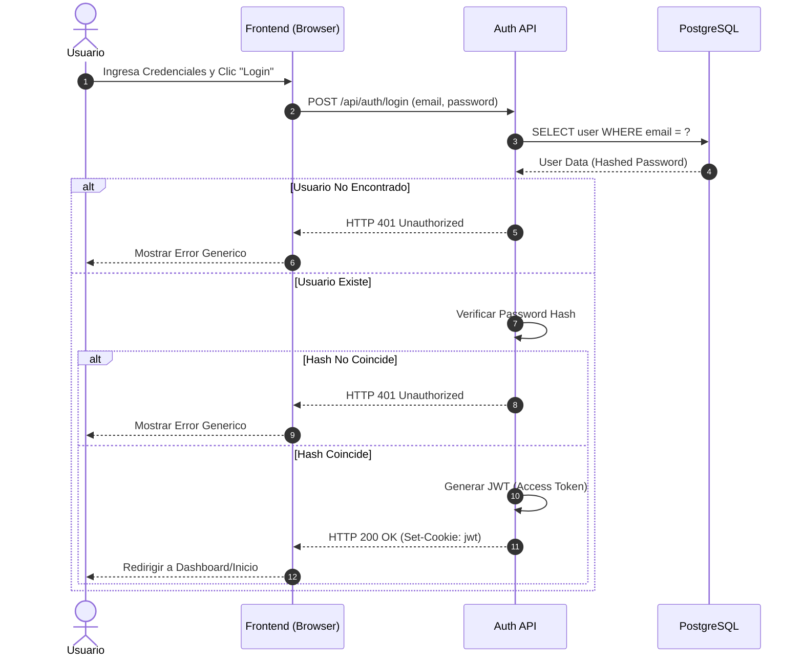

# Modulo: MOD-AUTH

### A-01: Proceso de Autenticacion (Login)

Este diagrama modela el flujo sincrono de inicio de sesion de un usuario, la validacion de credenciales en la base de datos y la subsecuente generacion de un JSON Web Token (JWT) firmado por el servidor para manejar la sesion en el cliente.

---
### Implicaciones de Fase Especificas
- El equipo Frontend debe configurar sus peticiones subsecuentes para incluir credentials y leer el estado desde el middleware.
- El Backend debe estandarizar el error 401 devolviendo un mensaje generico para no revelar si fallo el email o la contrasena por motivos de seguridad (Prevencion de Enumeracion).
