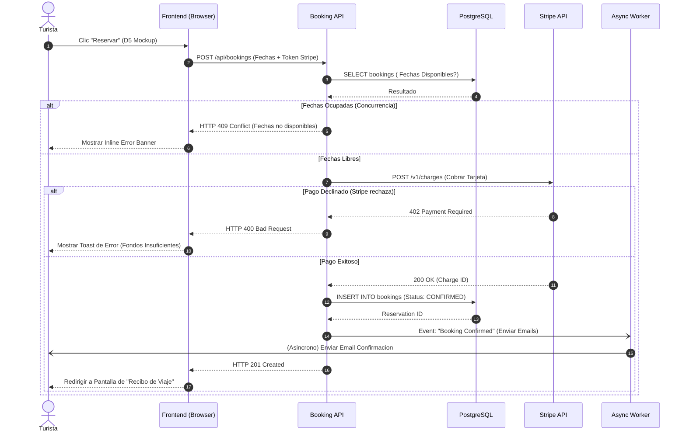

# Modulo: MOD-BOOKING

### S-01: Proceso de Reserva y Pago (Booking Checkout)

Este diagrama documenta la orquestacion sincrona y asincrona que ocurre cuando un Turista intenta reservar una finca, incluyendo la validacion concurrente (fechas ocupadas) y el cobro de la tarjeta de credito.

---

### Phase Gate Implication
- El equipo Frontend ya sabe exactamente que Codigos HTTP esperar (201, 400, 409) para gatillar las pantallas disenadas en el D5.
- El equipo Backend ya sabe que enviar el correo es una tarea NO BLOQUEANTE (Background Worker).
- **Proceed to D8:** State Machine & Activity Diagrams.
