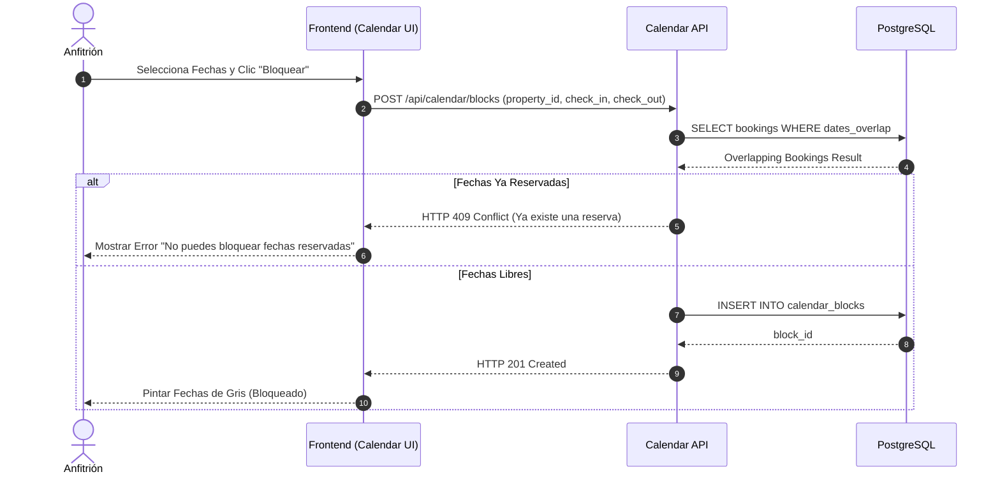

# Módulo: MOD-CALENDAR

### C-01: Sincronización y Bloqueo de Fechas

Este diagrama modela la lógica en la cual un Anfitrión bloquea manualmente fechas en el calendario (o mediante iCal sync) para evitar que los Turistas reserven su propiedad en esos días. Representa una escritura crítica de base de datos para prevenir colisiones.

---
### Implicaciones de Fase Específicas
- Las sentencias `SELECT` de superposición de fechas introducen un riesgo de condición de carrera si el nivel de aislamiento de la base de datos no es correcto o si no se manejan bloqueos transaccionales (row-level locking).
- El Frontend espera que un 409 desencadene una recarga del estado del calendario para mostrar la reserva conflictiva al anfitrión.
