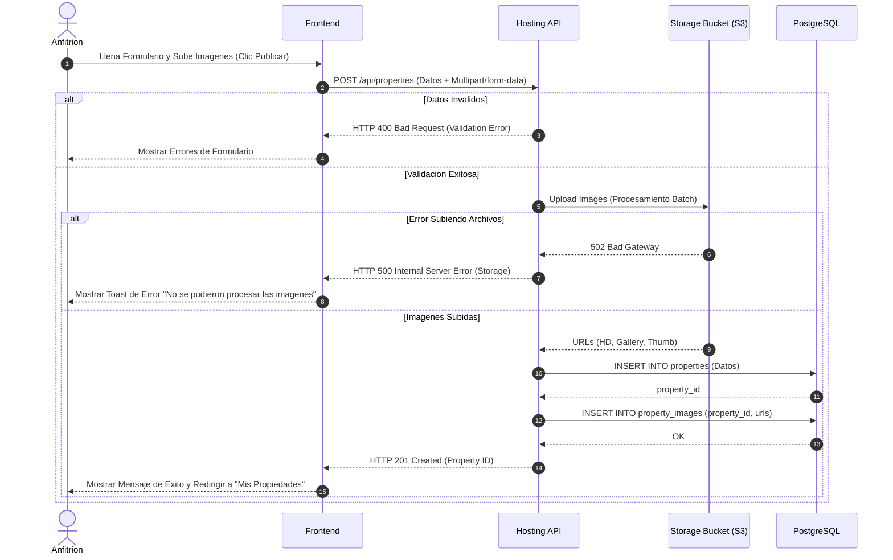

# Modulo: MOD-HOSTING

### H-01: Proceso de Publicacion de Propiedad

Este diagrama modela la logica transaccional cuando un anfitrion crea una nueva finca (propiedad) y sube imagenes de la misma. Destaca la delegacion del almacenamiento de archivos estaticos (imagenes) a un servicio de terceros (ej. AWS S3 o Cloudinary) de forma asincrona o mediante firmas pre-aprobadas, y la posterior persistencia de las URLs en la base de datos principal.

---
### Implicaciones de Fase Especificas
- El backend requiere integracion con un SDK de almacenamiento en la nube, aumentando el tiempo de respuesta. El Frontend debe mantener el "Spinner" o barra de progreso activo durante este periodo.
- El esquema de base de datos (`property_images`) requiere que las imagenes esten asociadas obligatoriamente a un `property_id` valido.
