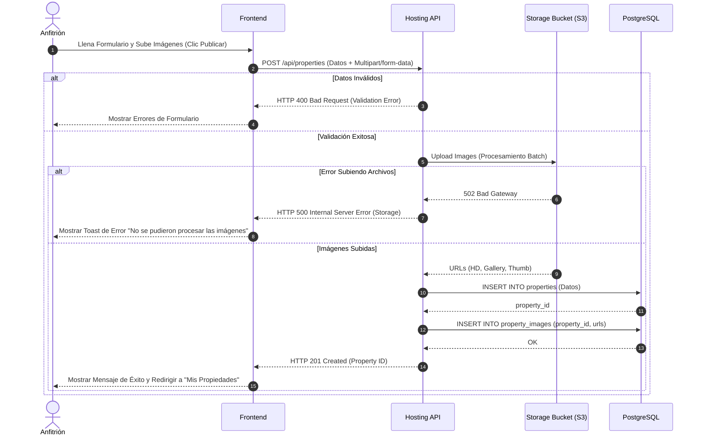

# Módulo: MOD-HOSTING

### H-01: Proceso de Publicación de Propiedad

Este diagrama modela la lógica transaccional cuando un anfitrión crea una nueva finca (propiedad) y sube imágenes de la misma. Destaca la delegación del almacenamiento de archivos estáticos (imágenes) a un servicio de terceros (ej. AWS S3 o Cloudinary) de forma asíncrona o mediante firmas pre-aprobadas, y la posterior persistencia de las URLs en la base de datos principal.

---
### Implicaciones de Fase Específicas
- El backend requiere integración con un SDK de almacenamiento en la nube, aumentando el tiempo de respuesta. El Frontend debe mantener el "Spinner" o barra de progreso activo durante este periodo.
- El esquema de base de datos (`property_images`) requiere que las imágenes estén asociadas obligatoriamente a un `property_id` válido.
